# Настройка визуализатора «Индикатор»

Настройка визуализатора «Индикатор»
-

# Настройка визуализатора «Индикатор»

Визуализатор «Индикатор» предназначен
 для наглядного отображения данных с помощью маркированной шкалы.

Для более наглядного представления данных может быть настроено несколько
 шкал. Для отображения текущего значения по какой-либо шкале используется
 стрелка, вращающаяся вокруг оси. Данные каждой шкалы могут быть разбиты
 на секторы (диапазоны) и для каждого сектора можно настроить различные
 цвета, чтобы обозначить положение сектора на шкале. Например, зеленый
 сектор характеризует допустимые значения параметра.

Примечание.
 Визуализатор «Индикатор» доступен
 только в веб-приложении. Если в веб-приложении создали аналитическую панель,
 содержащую данный визуализатор, то при открытии панели в настольном приложении
 блок, в котором расположен индикатор и его настройки, будет пустой.

Для вставки визуализатора используйте:

	- команду «Индикатор»
	 в раскрывающемся меню кнопки «Визуализаторы»
	 на вкладке ленты «Главная»;

	- кнопку «Индикатор» в
	 группе «Визуализаторы» на
	 вкладке ленты «Вставка»;

	- команду «Индикатор»
	 в раскрывающемся меню пункта «Новый
	 блок» в контекстном меню аналитической панели.

Затем задайте [источник данных](Panels/Select_DataSource.htm)
 для индикатора и [настройте
 измерения](UiSelection.chm::/Selection/Dimension_type.htm).

Примечание.
 Измерения «Объекты наблюдения»
 используются в качестве числовых значений индикатора.

Пример визуализатора «Индикатор»:

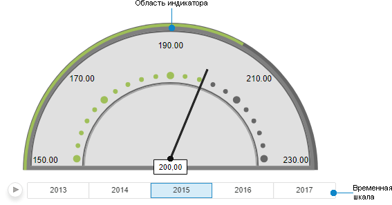

Индикатор содержит:

	- Временную шкалу. Предназначена
	 для отображения изменения данных с течением времени. Может быть отключена
	 с помощью вкладки боковой панели «[Спидометр](Panels/Speedometer.htm)».

	- Область индикатора.
	 Содержит:

		- Шкалы.
		 Предназначены для отображения значений индикатора в графическом
		 и числовом виде. Индикатор состоит из трёх шкал:

			- Scale1. Цветовая
			 шкала, которая по умолчанию состоит из трёх секторов.

[Секторы
 шкалы Scale1](javascript:TextPopup(this))

	В состав шкалы Scale1
	 входят:

					- Сектор №0.
					 Визуально выделяет область значений индикатора:

	

					- Сектор №1.
					 Служит визуальной границей области значений индикатора:

	

					- Сектор №2.
					 Визуально выделяет область допустимых значений индикатора:

	

	При наложении секторов шкала Scale1
	 имеет вид:

	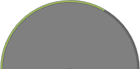

			- Scale2. Дополнительная
			 цветовая шкала. По умолчанию является фоном для шкалы-указателя
			 и состоит из четырёх секторов.

[Секторы
 шкалы Scale2](javascript:TextPopup(this))

	В состав шкалы Scale2
	 входят:

					- Сектор №0.
					 Визуально выделяет область значений шкалы-указателя:

	

					- Сектор №1.
					 Визуально разделяет область значений шкалы-указателя:

	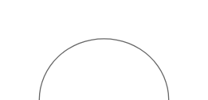

					- Сектор №2.
					 Визуально разделяет Scale1
					 и Scale2:

	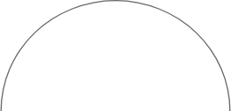

					- Сектор №3.
					 Визуально разделяет область значений шкалы-указателя:

	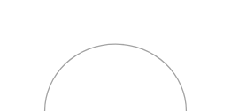

	При наложении секторов шкала Scale2
	 имеет вид:

	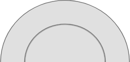

			- Scale3. Шкала-указатель.
			 По умолчанию включает отображение значений измерения в виде
			 маркированного интервала и числовых значений, а также указание
			 текущего значения измерения с помощью стрелки.

[Элементы
 шкалы Scale3](javascript:TextPopup(this))

	Шкала Scale3
	 включает элементы:

					- Стрелка.
					 Показывает текущее значение индикатора:

	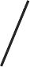

					- Маркированный
					 интервал. Визуально отображает шкалу значений
					 индикатора:

	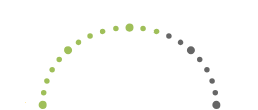

					- Отображаемые
					 значения индикатора. Показывает отображаемые
					 значения индикатора от минимального до максимального:

	

	При наложении всех элементов шкала Scale3 имеет вид:

	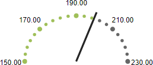

		- Центр индикатора.
		 Предназначен для отображения центра вращения и указателя текущего
		 значения.

[Элементы
 центра индикатора](javascript:TextPopup(this))

	Центр индикатора включает элементы:

				- Центр вращения.
				 Предназначен для отображения места откуда выходит стрелка:

	

				- Указатель текущего
				 значения. Отображает текущее значение индикатора
				 в числовом виде:

	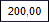

	При наложении всех элементов центр индикатора
	 имеет вид:

	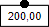

## Операции с индикатором

Для визуализатора «Индикатор»
 доступны все операции с объектами, приведенные в разделах «[Построение
 аналитической панели](../../Document/Work.htm)» и «[Вставка и настройка
 визуализаторов](Gadgets.htm)».

Примечание.
 Обратите внимание, что экспорт визуализатора «Индикатор»
 недоступен.

## Настройка индикатора

Настройка индикатора осуществляется с помощью группы вкладок «Формат» боковой панели.

Для этого выполните шаги:

	- Задайте основные параметры индикатора помощью вкладки боковой
	 панели «[Спидометр](Panels/Speedometer.htm)».
	 Для этого настройте отображение временной шкалы, отступы индикатора
	 от внутренних краев визуализатора, заливку фона индикатора, границы
	 и прозрачность индикатора.

	- Выполните поочередную настройку шкал:

		- Scale1 и Scale2:

			- Задайте параметры шкалы
			 с помощью вкладки боковой панели «[Шкала](Panels/Scale.htm)».

			- Задайте параметры секторов
			 шкал с помощью вкладки боковой панели «[Секторы](Panels/Sectors.htm)».

Примечание.
 Количество секторов в составе шкал может быть изменено с помощью вкладки
 боковой панели «[Секторы](Panels/Sectors.htm)».

		- Scale3:

			- Задайте параметры шкалы с помощью вкладки боковой панели
			 «[Шкала](Panels/Scale.htm)».

			- Настройте динамическую подсветку индикаторов с помощью
			 вкладки боковой панели «[Динамическая подсветка](Panels/DynamicHighlight.htm)».

			- Задайте параметры указателя с помощью вкладки боковой
			 панели «[Стрелка](Panels/Arrow.htm)».

Примечание.
 Настройка секторов для шкалы Scale3
 недоступна.

	- Установите настройки центра вращения и указателя текущего значения
	 с помощью вкладки боковой панели «[Центр](Panels/Center.htm)».

См. также:

[Вставка и
 настройка визуализаторов](Gadgets.htm) | [Как
 настроить визуализатор «Индикатор»?](../../FAQ/Indicator_example.htm)

		Справочная
		 система на версию 10.9
		 от 18/08/2025,
		 © ООО «ФОРСАЙТ»,
