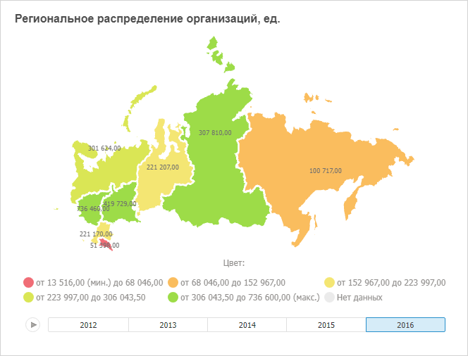

# Настройка визуализатора «Карта»

Настройка визуализатора «Карта»
-

# Настройка визуализатора «Карта»

Визуализатор «Карта» предназначен
 для отображения картографических данных. Доступно использование карт продукта
 «Форсайт. Аналитическая платформа»,
 в веб-приложении доступно использование внешних картографических сервисов,
 таких как Google Maps, Bing и т.д.

Важно. Перед
 работой с визуализатором убедитесь в соблюдении системных требований к
 [клиентскому
 компьютеру](Setup.chm::/03_DB_Server_Config/Setup_DB_ServerSysReq.htm#client) для настольного приложения и к [BI-серверу](Setup.chm::/03_DB_Server_Config/Setup_DB_ServerSysReq.htm#bi)
 для веб-приложения. В веб-приложении поддержка визуализаторов осуществляется,
 если BI-сервер установлен на ОС Windows 7 и выше. Внешний вид визуализатора
 может отличаться в зависимости от используемых графических библиотек DirectX
 11 или OpenGL 3.1.

Для вставки визуализатора используйте:

	- команду «Карта» в раскрывающемся
	 меню кнопки «Визуализаторы»
	 на вкладке ленты «Главная»;

	- кнопку «Карта» в группе
	 «Визуализаторы» на вкладке
	 ленты «Вставка»;

	- команду «Карта» в раскрывающемся
	 меню пункта «Новый блок» в
	 контекстном меню аналитической панели.

Затем задайте [источник данных](Panels/Select_DataSource.htm)
 для карты. Если для выбранного источника не задана карта и в репозитории
 отсутствует карта, [используемая
 по умолчанию](UiNav.chm::/02_Navigator/Repo_Default.htm), то будет отображен диалог для выбора [топоосновы](UiMaps.chm::/Common/Topobase.htm)
 из репозитория. Выберите топооснову, которая будет использоваться для
 построения карты в визуализаторе.

Пример визуализатора «Карта»:

## Операции с картой

Для визуализатора «Карта» доступны
 все операции с объектами, приведенные в разделах «[Построение
 аналитической панели](../../Document/Work.htm)» и «[Вставка и настройка
 визуализаторов](Gadgets.htm)».

Основные возможности, доступные для визуализатора:

	- [детализация/обобщение
	 данных](UiMaps.chm::/Configure/Advanced_Features.htm#drilldown);

	- работа в [3D-режиме](UiMaps.chm::/Configure/MapConfigure.htm#3d);

	- отображение [временной
	 шкалы](UiMaps.chm::/Configure/MapConfigure.htm#timeline_animation) и воспроизведение анимации на карте;

	- подключение [внешних
	 картографических сервисов](UiMaps.chm::/Configure/Advanced_Features.htm#externalservices);

	- гибкая настройка [легенды цвета](UiMaps.chm::/Legend/SetupLegend.htm),
	 [легенды
	 объема](UiMaps.chm::/Configure/Panel_Height.htm)
	 и [всплывающих
	 подсказок](UiMaps.chm::/Configure/Tooltips.htm);

	- [заливка
	 территорий](UiMaps.chm::/Configure/MapConfigure.htm#fill)
	 карты по различным метрикам и другие возможности.

Более подробное описание возможностей
 приведено в разделе «[Настройка карты](UiMaps.chm::/Configure/MapConfigure.htm)».

См. также:

[Вставка и
 настройка визуализаторов](Gadgets.htm)

		Справочная
		 система на версию 10.9
		 от 18/08/2025,
		 © ООО «ФОРСАЙТ»,
