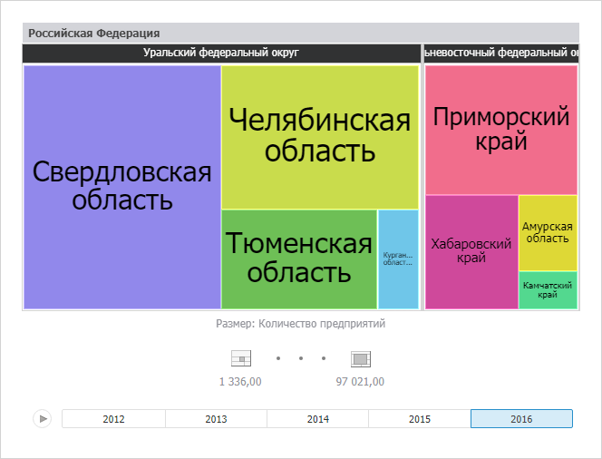

# Настройка визуализатора «Плоское дерево»

Настройка визуализатора «Плоское дерево»
-

# Настройка визуализатора «Плоское дерево»

Визуализатор предназначен для отображения иерархических данных в виде
 плоского дерева.

Плоское дерево - это способ
 отображения иерархических данных в виде набора вложенных прямоугольников.
 Каждой ветке иерархии соответствует прямоугольник, который состоит из
 меньших прямоугольников, являющихся подветками. Площадь каждого прямоугольника
 пропорциональна значению соответствующего элемента иерархии. Прямоугольники
 с наибольшей площадью располагаются в левой верхней части визуализатора,
 с наименьшей - в правой нижней. Цвет прямоугольника также определяется
 значением элемента иерархии.

Важно. Перед
 работой с визуализатором убедитесь в соблюдении системных требований к
 [клиентскому
 компьютеру](Setup.chm::/03_DB_Server_Config/Setup_DB_ServerSysReq.htm#client) для настольного приложения и к [BI-серверу](Setup.chm::/03_DB_Server_Config/Setup_DB_ServerSysReq.htm#bi)
 для веб-приложения. В веб-приложении поддержка визуализаторов осуществляется,
 если BI-сервер установлен на ОС Windows 7 и выше. Внешний вид визуализатора
 может отличаться в зависимости от используемых графических библиотек DirectX
 11 или OpenGL 3.1.

Плоское дерево позволяет отобразить для иерархических данных наборы
 из двух значений:

	- 1-е значение определяет цвет прямоугольника;

	- 2-е значение определяет площадь прямоугольника.

Преимущества плоского дерева:

	- позволяет выявить взаимосвязь между двумя показателями в иерархической
	 структуре данных;

	- позволяет эффективно использовать пространство;

	- позволяет четко отображать на экране много элементов одновременно.

Для вставки визуализатора используйте:

	- команду «Плоское дерево»
	 в раскрывающемся меню кнопки «Визуализаторы»
	 на вкладке «Главная» ленты
	 инструментов;

	- кнопку «Плоское дерево»
	 в группе «Визуализаторы» на
	 вкладке «Вставка» ленты инструментов;

	- команду «Плоское дерево»
	 в раскрывающемся меню пункта «Новый
	 блок» в контекстном меню аналитической панели.

Затем задайте [источник данных](Panels/Select_DataSource.htm)
 для плоского дерева и [настройте
 измерения](UiSelection.chm::/Selection/Dimension_type.htm).

Пример визуализатора «Плоское дерево»:

## Операции с плоским деревом

Для визуализатора «Плоское дерево»
 доступны все операции с объектами, приведенные в разделах «[Построение
 аналитической панели](../../Document/Work.htm)» и «[Вставка и настройка
 визуализаторов](Gadgets.htm)».

### Основные операции, доступные для плоского дерева

[Настройка
 измерения метрик](javascript:TextPopup(this))

	[Сопоставьте
	 элементы](UiSelection.chm::/Selection/Dimension_type.htm#metric) измерения метрик и следующие характеристики
	 плоского дерева:

		- Цвет заливки прямоугольников.
		 Установите переключатель «Цвет»
		 на вкладке измерения и отметьте элемент, по значениям которого
		 будут закрашиваться прямоугольники.

		- Размер прямоугольников.
		 Установите переключатель «Размер»
		 на вкладке измерения и отметьте элемент, по значениям которого будет
		 определяться размер прямоугольников.

	Плоское дерево будет перестроено по заданным характеристикам.

[Настройка
 заливки прямоугольников](javascript:TextPopup(this))

	Примечание.
	 Возможность доступна, если в [измерении метрик](UiSelection.chm::/Selection/Dimension_type.htm) задан элемент, определяющий цвет заливки
	 прямоугольников.

Используйте вкладку «[Цвет](UiMaps.chm::/Configure/Color.htm)»
 на боковой панели.

Настройка выполняется аналогично настройке заливки для визуализатора
 «[Карта](Map.htm)».

[Настройка
 размера прямоугольников](javascript:TextPopup(this))

	Примечание.
	 Возможность доступна, если в [измерении метрик](UiSelection.chm::/Selection/Dimension_type.htm) задан элемент, определяющий размер прямоугольников.

Используйте вкладку «[Размер](UiVisualizators.chm::/BubbleTree/Size.htm)»
 на боковой панели.

[Настройка
 всплывающих подсказок](javascript:TextPopup(this))

Для настройки всплывающих подсказок используйте вкладку «[Подсказки](UiVisualizators.chm::/BubbleChart/Tooltip.htm)»
 на боковой панели.

Настройка выполняется аналогично настройке подсказок для [пузырьковой
 диаграммы](Bubbles.htm).

[Настройка
 легенды цвета и размера](javascript:TextPopup(this))

Для настройки оформления легенды используйте вкладки боковой панели
 [«Легенда цвета»/«Легенда
 размера»](UiMaps.chm::/Legend/SetupLegend.htm).

Настройка выполняется аналогично настройке легенды визуализатора «[Карта](Map.htm)».

[Детализация/обобщение
 данных](javascript:TextPopup(this))

	Для детализации данных щелкните по прямоугольнику-потомку, для обобщения
	 - по прямоугольнику-родителю. Визуализатор будет перестроен в соответствии
	 с иерархией [измерения
	 объектов наблюдения](UiSelection.chm::/Selection/Dimension_type.htm).

[Настройка
 стиля плоского дерева](javascript:TextPopup(this))

	Для настройки стиля плоского дерева используйте вкладку «Плоское
	 дерево» ленты инструментов.

	Настройка выполняется аналогично настройке [стиля](UiVisualizators.chm::/BubbleChart/BubbleChart_Style.htm)
	 визуализатора «Пузырьковая диаграмма».

См. также:

[Вставка и
 настройка визуализаторов](Gadgets.htm)

		Справочная
		 система на версию 10.9
		 от 18/08/2025,
		 © ООО «ФОРСАЙТ»,
