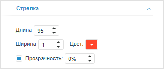

# Настройка стрелки

Настройка стрелки
-

# Настройка стрелки

Для настройки стрелки индикатора предназначена вкладка «Стрелка»,
 расположенная на боковой панели. Стрелка указывает на текущее значение
 шкалы, отображаемое индикатором. Для индикатора может быть создана только
 одна стрелка, привязанная к одной шкале.

[Для отображения
 вкладки](javascript:TextPopup(this))

		- Убедитесь, что боковая панель отображается.

		- В рабочей области выделите индикатор.

		- На вкладке боковой панели «[Шкала](Scale.htm)» выберите шкалу, для которой
		 предназначена стрелка. Как правило, стрелка задана для последней
		 шкалы.

		- Установите на боковой панели переключатель «Формат»
		 и перейдите на вкладку «Стрелка».

Задайте следующие параметры стрелки:

	- Длина. Длина стрелки;

	- Ширина. Ширина стрелки;

	- Цвет. Цвет стрелки;

	- Прозрачность. Параметры
	 прозрачности стрелки. По умолчанию флажок установлен и доступна настройка
	 степени прозрачности стрелки: 100% соответствует полной прозрачности
	 (стрелка станет невидимой), 0% соответствует полной непрозрачности.

См. также:

[Настройка визуализатора «Индикатор»](../Indicator.htm)

		Справочная
		 система на версию 10.9
		 от 18/08/2025,
		 © ООО «ФОРСАЙТ»,
