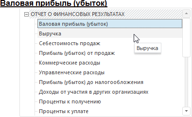
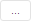
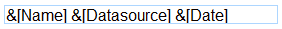
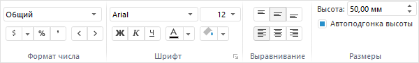
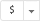
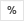
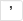

# Настройка заголовка визуализатора

Настройка заголовка визуализатора
-

# Настройка заголовка визуализатора

По умолчанию заголовок отображается в режиме элемента управления и отображается
 как гиперссылка, при нажатии на которую открывается иерархический список
 для выбора элемента измерения. Например:

Совет. Если требуется
 использовать заголовок отдельно от визуализатора, то используйте блок
 «[Текст](../../Other/Text.htm)».
 Настройка блока «[Текст](../../Other/Text.htm)»
 выполняется аналогично настройке заголовка.

[Для
 отображения/скрытия заголовка](javascript:TextPopup(this))

		- В рабочей области выделите визуализатор, для которого необходим
		 заголовок.

		- Убедитесь, что для визуализатора задан [источник
		 данных](Select_DataSource.htm).

		- Установите/снимите флажок «Заголовок»
		 в контекстном меню визуализатора.

	В выбранном визуализаторе будет отображен заголовок.

[Для
 выбора режима отображения заголовка](javascript:TextPopup(this))

	В настольном приложении заголовок может отображаться в двух режимах:

		- Простой. Заголовок
		 отображается как текст;

		- Элемент управления.
		 Заголовок отображается как гиперссылка, при нажатии на которую
		 открывается иерархический список для выбора элемента измерения.
		 Режим выбран по умолчанию.

	Примечание.
	 В веб-приложении заголовок всегда отображается в режиме элемента управления.

	Для выбора режима отображения заголовка:

		- В рабочей области выделите визуализатор, для которого отображается
		 заголовок.

		- Установите переключатель, соответствующий режиму, в раскрывающемся
		 меню кнопки  «Заголовок» на вкладке «Заголовок» ленты инструментов.

	Заголовок будет отображен в выбранном режиме.

[Для
 создания мультиязычного заголовка](javascript:TextPopup(this))

	Заголовок может поддерживать несколько языков пользовательского
	 интерфейса, например, русский и английский. Подобные заголовки называются
	 мультиязычными. Для создания мультиязычного заголовка:

		- Дважды щелкните по заголовку. В конце заголовка будет отображена
		 дополнительная кнопка .

		- Нажмите кнопку . Будет открыт диалог
		 «Переводы». Для получения
		 подробной информации о работе с данным диалогом обратитесь к разделу
		 «[Перевод
		 элементов аналитических панелей на другие языки](UiNav.chm::/Multilanguage/Multilanguage_tuning.htm)».

		- Задайте перевод заголовка на другие языки.

	Примечание.
	 Если заголовок является мультиязычным, то настройка заголовка выполняется
	 для текущего [языка
	 репозитория](setup.chm::/setup_titlepage.htm).

## Настройка структуры заголовка

Для настройки структуры заголовка:

	- Переведите заголовок в режим редактирования. Для этого дважды
	 щёлкните в пустое место заголовка. Составляющие части заголовка будут
	 представлены в виде шаблонов:

В настольном приложении для настройки дополнительных
 параметров заголовка, например, способа отметки, выполните команду «Параметры редактора» в контекстном
 меню заголовка в режиме редактирования. Будет отображен диалог «[Параметры
 редактора](UiNav.Chm::/GUI/ValueEditorParameters.htm#dimension)».
 Данная возможность недоступна для блока «[Текст](../../Other/Text.htm)».

	- Добавьте текст вручную или с помощью подстановок. Подстановки
	 позволяют быстро вставить в заголовок определенный текст. Для вставки
	 подстановок используйте кнопки в группе «Вставка»
	 на вкладке «Заголовок» ленты
	 инструментов:

Совет.
 Для получения более подробной информации о работе с подстановками см. раздел
 «[Использование подстановок в заголовке](Substitution.htm)».

Для сохранения изменений и выхода из режима редактирования нажмите основной
 кнопкой мыши вне панели заголовка.

## Настройка оформления заголовка

Для настройки внешнего вида заголовка используйте группы команд «Формат числа», «Шрифт»,
 «Выравнивание», «Размеры»,
 расположенные на вкладке «Заголовок»
 ленты инструментов:

Группа команд «Выравнивание»
 доступна только в настольном приложении.

Доступны следующие настройки:

[Формат
 числа](javascript:TextPopup(this))

	Примечание.
	 Возможность доступна только для [подстановки](Substitution.htm)
	 «Значение».

	Для настройки формата числа выделите подстановку «Значение»
	 и используйте группу «Формат числа».

	В раскрывающемся списке выберите один из поддерживаемых
	 форматов данных.

	Для быстрой настройки формата данных используйте кнопки:

		-  - преобразование в денежный формат.
		 Для выбора валюты используйте раскрывающееся меню кнопки;

		-  - преобразование в процентный
		 формат;

		-  - преобразование в числовой формат и
		 отображение разделителя групп разрядов с двумя десятичными знаками
		 после запятой;

		-  - уменьшение разрядности числа. Применяется
		 для отображения менее точных значений;

		-  - увеличение разрядности числа.
		 Применяется для отображения более точных значений.

[Шрифт
 заголовка](javascript:TextPopup(this))

	Для настройки шрифта используйте элементы, расположенные в группе
	 «Шрифт»:

		- Шрифт. Выберите
		 один из шрифтов, установленных в операционной системе;

		- Размер шрифта. Установите
		 требуемый размер шрифта. Размер задаётся в пунктах, и его можно
		 выбрать из раскрывающегося списка или ввести вручную. Диапазон
		 допустимых значений: [1, 72];

		- Начертание шрифта.
		 Нажмите кнопки, задающие начертание шрифта:

			- Ж. Полужирное
			 начертание;

			- К. Курсивное
			 начертание;

			- Ч. Подчеркивание
			 текста.

	При нажатой кнопке будет использоваться
	 соответствующий стиль начертания. Доступно использование нескольких
	 стилей одновременно, например, нажатие кнопок «Ж»
	 и «К» даёт полужирное курсивное
	 начертание;

		- Цвет шрифта. Выберите
		 цвет шрифта в раскрывающейся палитре цветов;

		- Цвет фона. Выберите
		 цвет фона в раскрывающейся палитре цветов. Возможность доступна
		 только в настольном приложении.

	Совет. В настольном
	 приложении для дополнительной настройки шрифта заголовка используйте
	 вкладку «[Шрифт](UiNav.chm::/GUI/Format/UiReport_Table_Attribute_Type.htm)» в диалоге
	 «Формат». Для отображения
	 диалога нажмите кнопку , расположенную в правом
	 нижнем углу группы «Шрифт»
	 на вкладке ленты инструментов, или выполните команду «Формат»
	 в контекстном меню заголовка, находящегося в режиме редактирования.

	Оформление может быть применено ко всему заголовку или к его частям.

[Выравнивание
 текста заголовка](javascript:TextPopup(this))

	Для настройки выравнивания используйте кнопки в группе команд «Выравнивание» для горизонтального
	 и вертикального выравнивания.

[Высота
 заголовка](javascript:TextPopup(this))

	Примечание.
	 Возможность доступна только для заголовков.

	Для задания точной высоты заголовка:

		- Снимите флажок «Автоподгонка
		 высоты».

		- Задайте значение высоты в поле «Высота».

	Для настройки автоматического подбора высоты:

		- Установите флажок «Автоподгонка
		 высоты».

		- Задайте максимальное значение для высоты заголовка в поле
		 «Высота».

См. также:

[Вставка
 и настройка визуализаторов](../Gadgets.htm)

		Справочная
		 система на версию 10.9
		 от 18/08/2025,
		 © ООО «ФОРСАЙТ»,
