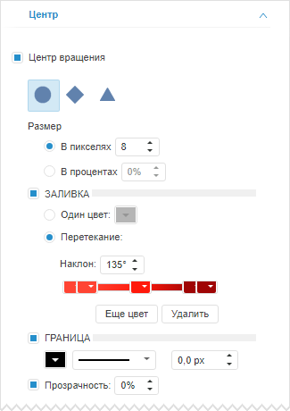
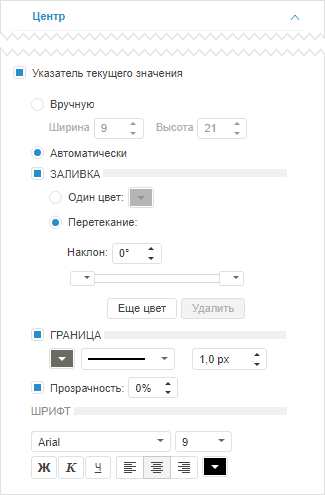

# Настройка центра индикатора

Настройка центра индикатора
-

# Настройка центра индикатора

Для настройки центра индикатора предназначена вкладка «Центр»,
 расположенная на боковой панели.

[Для отображения
 вкладки](javascript:TextPopup(this))

		- Убедитесь, что боковая панель отображается.

		- В рабочей области выделите индикатор.

		- Установите на боковой панели переключатель «Формат»
		 и перейдите на вкладку «Центр».

Центр индикатора состоит из следующих элементов: центр вращения и указатель
 текущего значения. Элемент отображается, если на вкладке «Центр»
 установлен флажок, соответствующий элементу.

Центр вращения - это то место откуда выходит стрелка, а указатель текущего
 значения расположен под центром вращения и отображает текущее значение
 измерения в числовом виде.

## Настройка центра вращения

Параметры, предназначенные для настройки центра вращения:

Установите флажок «Центр вращения»
 и выберите форму центра вращения. Также задайте следующие параметры:

	- Специальный размер.
	 Параметры размера центра вращения. По умолчанию флажок установлен
	 и доступна настройка размера. Задайте размер центра в пикселях или
	 процентах;

	- Заливка. Параметры заливки
	 фона центра вращения. По умолчанию флажок снят и заливка фона не применяется.
	 Для настройки заливки установите флажок и установите переключатель,
	 соответствующий способу заливки:

	-

		- Один цвет. Заливка
		 фона выполняется одним цветом. Укажите цвет фона в соответствующей
		 палитре цветов;

		- Перетекание. Заливка
		 фона выполняется с помощью градиента. Для задания угла наклона
		 градиента используйте поле «Наклон».

		Для работы с цветами градиента предназначены передвижные палитры
		 цветов. Для изменения доли цвета в градиенте передвиньте соответствующую
		 палитру цветов.

		Для добавления нового цвета используйте кнопку «Еще
		 цвет», для удаления текущего - кнопку «Удалить».

	- Граница. Параметры границы
	 центра вращения. По умолчанию флажок снят и граница отсутствует. Для
	 отображения границы установите флажок и задайте в соответствующих
	 полях следующие параметры: тип, толщину и цвет линии границы;

	- Прозрачность. Параметры
	 прозрачности центра вращения. По умолчанию флажок установлен и доступна
	 настройка степени прозрачности центра вращения: 100% соответствует
	 полной прозрачности (центр станет невидимым), 0% соответствует полной
	 непрозрачности.

## Настройка указателя текущего значения

Параметры, предназначенные для настройки указателя текущего значения:

Установите флажок «Указатель текущего
 значения» и задайте следующие параметры:

	- Способ задания размера указателя:

	-

		- Вручную. Укажите
		 ширину и высоту указателя в соответствующих полях;

		- Автоматически. Размер
		 указателя определяется автоматически;

	- Оформление указателя.
	 Используйте группы параметров «Заливка»,
	 «Граница» и «Прозрачность».
	 Работа с ними аналогична работе с одноименными параметрами при настройке
	 центра вращения;

	- Параметры подписи указателя.
	 Используйте группу параметров «Шрифт».
	 Укажите шрифт, размер и цвет шрифта, способ начертания и выравнивания
	 надписи в соответствующих полях.

См. также:

[Настройка визуализатора «Индикатор»](../Indicator.htm)

		Справочная
		 система на версию 10.9
		 от 18/08/2025,
		 © ООО «ФОРСАЙТ»,
