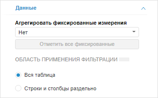

# Фильтрация и преобразование данных

Фильтрация и преобразование данных
-

# Фильтрация и преобразование данных

Для фильтрации и преобразования данных, отображаемых визуализатором,
 предназначены вкладки «Данные»,
 расположенные на боковой панели и на ленте инструментов.

Фильтрация и преобразование применяются к данным в таблице, а на основе
 таблицы строятся все остальные визуализаторы.

[Для отображения
 вкладки «Данные» на боковой панели](javascript:TextPopup(this))

		- Убедитесь, что боковая панель отображается.

		- В рабочей области выделите визуализатор, для которого задан
		 источник данных.

		- Установите на боковой панели переключатель «Данные».

		- Перейдите на вкладку «Данные».

Операции, выполняемые с помощью вкладки «Данные»
 на ленте инструментов:

	- [преобразование
	 данных](UiAnalyticalArea.chm::/Analysis/Convert_data.htm);

	- [ранжирование
	 данных](UiAnalyticalArea.chm::/Analysis/Ranking_data.htm).

С помощью вкладки «Данные» на
 боковой панели укажите область применения [фильтрации](UiAnalyticalArea.chm::/Working_with_table_data/Filtering.htm):
 ко всему визуализатору или отдельно к строкам и столбцам.

Примечание.
 Данная настройка влияет на настройку фильтрации у всех визуализаторов.

См. также:

[Выбор
 и настройка источника данных визуализатора](Select_DataSource.htm)

		Справочная
		 система на версию 10.9
		 от 18/08/2025,
		 © ООО «ФОРСАЙТ»,
