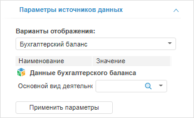
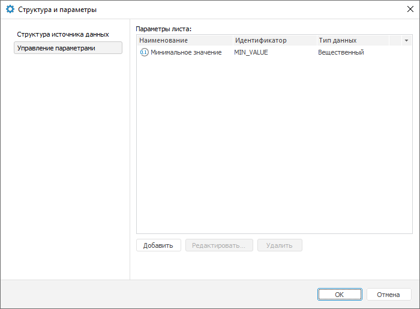

# Управление параметрами источника данных

Управление параметрами источника данных
-

# Управление параметрами источника данных

Параметры позволяют динамически управлять содержимым визуализаторов.

Для управления параметрами источников данных для визуализаторов используйте
 вкладку «Параметры источников данных»
 на боковой панели.

[Для отображения
 вкладки](javascript:TextPopup(this))

		- Убедитесь, что боковая панель отображается.

		- В рабочей области выделите визуализатор, для которого задан
		 источник данных.

		- Установите на боковой панели переключатель «Данные».

		- Перейдите на вкладку «Параметры
		 источников данных».

В зависимости от источника данных на вкладке доступны параметры:

[Варианты отображения](javascript:TextPopup(this))

	В раскрывающемся списке «Варианты
	 отображения» выберите набор данных, который будет отображаться
	 в визуализаторе. Доступные варианты зависят от типа источника данных:

		- стандартный куб.
		 Доступны [варианты
		 агрегации](UiNavObj.chm::/cube/createcube/master_standart/uimd_cube_createcube_master_standart_7.htm), настроенные при создании куба;

		- вычисляемый куб.
		 Доступны следующие варианты, в которых N
		 - наименование вычисляемого куба:

			- N.
			 Данные куба;

			- ФормулыN. Данные
			 куба, вычисленные по формулам, заданным в [редакторе
			 формул для вычисляемого куба](UiNavObj.chm::/equation_editor/UiMd_Equation_editor_CalculationCube.htm);

		- база данных временных рядов.
		 Доступны следующие варианты, в которых N
		 - наименование базы данных временных рядов:

			- Атрибуты N. Данные
			 временных рядов по состоянию на последнюю ревизию по сценарию
			 «Факт» с дополнительным
			 измерением «Атрибуты».
			 В качестве элементов измерение содержит все [атрибуты](UiNavObj.chm::/TimeSeriesDatabase/TS_Attributes.htm)
			 уровня рядов и уровня наблюдений, кроме системных атрибутов
			 и атрибутов, имеющих [множественные
			 значения](UiNavObj.chm::/TimeSeriesDatabase/TS_Attributes.htm#attr).

			Если атрибут является ссылкой на справочник, то для него в
			 качестве дочерних элементов будут отображаться все атрибуты
			 используемого справочника.

			Редактирование значений доступно только для атрибутов наблюдений;

			- Полные данные N. Данные
			 временных рядов с дополнительными измерениями «Ревизии»
			 и «Сценарии». Измерение
			 «Ревизии» дает доступ
			 к данным временных рядов по состоянию на различные ревизии.
			 Измерение «Сценарии»
			 дает доступ к данных временных рядов по различным сценариям.

			Редактирование значений недоступно;

			- Сценарные данные N. Данные
			 временных рядов по состоянию на последнюю ревизию с дополнительным
			 измерением «Сценарии».
			 Измерение «Сценарии»
			 дает доступ к данных временных рядов по различным сценариям;

	Примечание.
	 Вариант «Сценарные данные N» доступен,
	 если база данных временных рядов поддерживает сценарии. Для получения
	 подробной информации обратитесь к описанию [IRubricator.HasScenarioDimension](kecubes.chm::/Interface/IRubricator/IRubricator.HasScenarioDimension.htm).

			- Актуальные данные N. Данные
			 временных рядов по состоянию на последнюю ревизию по сценарию
			 «Факт»;

			- N.
			 Данные временных рядов по сценарию «Факт»
			 с дополнительным измерением «Ревизии».
			 Измерение «Ревизии»
			 дает доступ к данным временных рядов по состоянию на различные
			 ревизии.

			Редактирование значений недоступно.

	Примечание.
	 Дополнительные измерения отображаются в группе вкладок «[Отметка](UiSelection.chm::/Selection/Dimension.htm)»
	 на боковой панели.

[Параметры](javascript:TextPopup(this))

	В области «Параметры» задайте
	 значения параметров источника данных.

	Примечание.
	 Параметры доступны, если источником данных является параметрический
	 куб или в рабочей области выделен визуализатор, содержащий [параметры](DataSource_param.htm#params).

	Для обновления данных визуализатора в соответствии с заданными значениями
	 нажмите кнопку «Применить параметры».

	Если в качестве параметра выбран [раскрывающийся
	 список справочника](UiNav.chm::/GUI/ValueEditorParameters.htm#dimension), настроенный на календарное
	 измерение, то при работе с параметром будет доступен выбор режима
	 отметки: «Только по элементам»,
	 «Только по уровням» или «По элементам и уровням». Задание
	 режима отметки выполняется на вкладке «[Структура источника данных](../DS_structure.htm)»
	 окна «Структура и параметры». Работа с
	 отметкой в таком параметре аналогична работе с [отметкой
	 элементов календарного измерения](UiSelection.chm::/Selection/Selection_of_the_CalendarDimension_elements.htm).

## Управление параметрами визуализатора

Параметры предназначены для динамического управления данными, отображаемыми
 в визуализаторе.

Для создания и редактировании параметров активного визуализатора используйте
 вкладку «Управление параметрами»
 в диалоге «Структура и параметры».

[Для отображения
 вкладки](javascript:TextPopup(this))

		- Нажмите кнопку  «Структура
		 и параметры» на вкладке «Данные»
		 на ленте инструментов. Будет открыт диалог «Структура
		 и параметры».

	Примечание.
	 Кнопка доступна, если в рабочей
	 области выделен визуализатор, содержащий источник данных.

		- Перейдите на вкладку «Управление
		 параметрами».

Операции с параметрами:

	- Добавление параметра.
	 Нажмите кнопку «Добавить».
	 Будет открыт диалог «Свойства параметра
	 объекта», в котором задайте требуемые настройки параметра;

	- Редактирование параметра.
	 Выберите требуемый параметр и нажмите кнопку «Редактировать».
	 Будет открыт диалог «Свойства параметра
	 объекта», в котором измените требуемые настройки параметра;

	- Редактирование значения параметра.
	 Перейдите на вкладку «[Параметры
	 источников данных](DataSource_param.htm)» на боковой панели и задайте требуемое
	 значение параметра;

	- Удаление параметра.
	 Выберите требуемый параметр и нажмите кнопку «Удалить».
	 Будет запрошено подтверждение выполняемого действия.

См. также:

[Выбор
 и настройка источника данных визуализатора](Select_DataSource.htm)

		Справочная
		 система на версию 10.9
		 от 18/08/2025,
		 © ООО «ФОРСАЙТ»,
