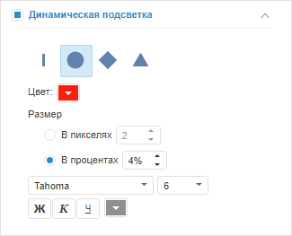
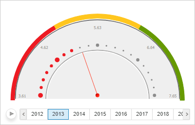

# Настройка динамической подсветки

Настройка динамической подсветки
-

# Настройка динамической подсветки

Динамическая подсветка позволят отображать текущее значение не только
 с помощью стрелки, но и с помощью выделения на шкале.

Для настройки динамической подсветки текущего значения предназначена
 вкладка «Динамическая подсветка»
 на боковой панели.

[Для отображения
 вкладки](javascript:TextPopup(this))

		- Убедитесь, что боковая панель отображается.

		- В рабочей области выделите индикатор.

		- На вкладке боковой панели «[Шкала](Scale.htm)» выберите шкалу, для которой
		 предназначена динамическая подсветка. Как правило, подсветка задана
		 для последней шкалы.

		- Установите на боковой панели переключатель «Формат»
		 и перейдите на вкладку «Динамическая
		 подсветка».

Установите флажок «Динамическая подсветка»
 и выберите форму делений шкалы для значений, которые меньше текущего значения
 индикатора. Также задайте следующие параметры делений:

	- Цвет. Цвет делений;

	- Размер. Размер делений;

	- Параметры шрифта для подписей
	 делений. Укажите используемый шрифт и его параметры: размер,
	 начертание и цвет.

Пример индикатора с динамической подсветкой:

См. также:

[Настройка визуализатора «Индикатор»](../Indicator.htm)

		Справочная
		 система на версию 10.9
		 от 18/08/2025,
		 © ООО «ФОРСАЙТ»,
