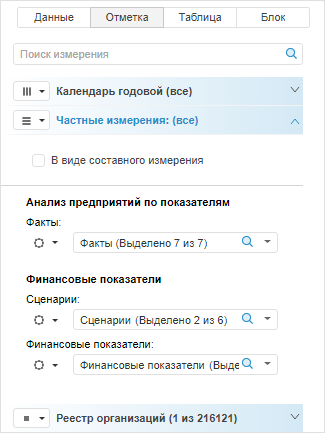
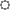
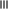
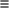
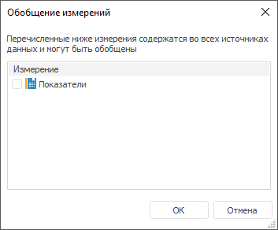

# Управление данными нескольких источников

Управление данными нескольких источников
-

# Управление данными нескольких источников

Если визуализатор использует несколько [источников
 данных](Select_DataSource.htm), то все измерения источников разделяются на следующие группы:

	- общие измерения. Измерения,
	 содержащиеся во всех источниках данных;

	- частные измерения. Уникальные
	 измерения источника и измерения, содержащиеся не во всех источниках
	 данных.

Изначально при настройке отображения данных из нескольких источников
 отметка в общих измерениях и отметка в частных измерениях из первого источника
 соответствует отметке, настроенной в используемых источниках. Отметка
 в частных измерениях второго и последующих источников соответствует отметке
 из сохранённых представлений используемых источников.

При перемещении измерения из общего в частные отметка во всех частных
 измерениях будет соответствовать отметке в общих измерениях, при перемещении
 измерения из частного в фиксированные будет отмечен только первый элемент.

Для управления измерениями источников данных используйте группу вкладок
 «[Отметка](UiSelection.chm::/Selection/Dimension.htm)»:
 общие измерения отображаются на отдельных вкладках, частные - на вкладке
 «Частные измерения». Например:

Для [работы
 с элементами](UiSelection.chm::/Selection/Dimension.htm)
 частного измерения используйте кнопку 
 «Настройки» или команды контекстного
 меню.

## Операции с частными измерениями

[Фиксация частного
 измерения](javascript:TextPopup(this))

	Для фиксации частного измерения:

		- Нажмите кнопку  «Настройки»,
		 соответствующую фиксируемому измерению.

		- Установите переключатель «В
		 фиксированных частных».

	Измерение будет зафиксировано. Для работы с ним будет отображена
	 вкладка «Фиксированные частные измерения».
	 Работа с данной вкладкой аналогична работе со вкладкой «Частные
	 измерения».

[Снятие фиксации
 частного измерения](javascript:TextPopup(this))

	Для работы с зафиксированными частными измерениями используйте вкладку
	 «Фиксированные частные измерения».

	Для снятия фиксации частного измерения:

		- Нажмите кнопку  «Настройки»,
		 соответствующую зафиксированному измерению.

		- Установите переключатель «В
		 частных».

	С измерения будет снята фиксация. Для работы со свободными частными
	 измерениями используйте вкладку «Частные
	 измерения».

[Создание составного
 измерения](javascript:TextPopup(this))

	Составное измерение - это измерение, состоящее из элементов, отмеченных
	 в частных измерениях.

	Для создания составного измерения:

		- Отметьте требуемые элементы
		 составных измерений.

		- Установите флажок «В
		 виде составного измерения».

	Составное измерение будет сформировано на основе отмеченных элементов.
	 Данное изменение будет отображено вкладке «Частные
	 измерения». Работа с элементами составного измерения аналогична
	 работе с элементами [стандартных
	 измерений](UiSelection.chm::/Selection/Dimension.htm).

[Удаление составного
 измерения](javascript:TextPopup(this))

	Для удаления составного измерения снимите флажок «В
	 виде составного измерения». На вкладке «Частные
	 измерения» будет отображен список частных измерений.

[Перенос
 измерения из общих в частные](javascript:TextPopup(this))

	Частное измерение может быть создано на основе общего измерения.

	Примечание.
	 Возможность доступна, если источники данных содержат несколько общих
	 измерений.

	Для создания частного измерения на основе общего:

		- Нажмите кнопку с пиктограммой ( «По столбцам»,  «По
		 строкам» или 
		 «Фиксированные»), расположенную
		 слева от наименования измерения.

		- В раскрывшемся меню кнопки выберите пункт «В
		 частных измерениях».

	Выбранное измерение будет преобразовано в частное и перемещено на
	 вкладку «Частные измерения».

[Перенос
 измерения из частных в общие](javascript:TextPopup(this))

	Частное измерение может быть перенесено в список общих. Для этого:

		- Нажмите кнопку  «Настройки».

		- В раскрывшемся меню кнопки выберите пункт «В
		 общих».

	Выбранное измерение будет преобразовано в общее и перемещено на
	 отдельную вкладку.

	При переносе частного измерения в общие оно размещается в том же
	 положении ( «По
	 столбцам»,  «По
	 строкам» или 
	 «Фиксированные»), в котором
	 размещены частные измерения.

[Создание частного
 измерения](javascript:TextPopup(this))

	Частное измерение может быть создано на основе общего измерения.
	 Возможность доступна, если источники данных содержат несколько общих
	 измерений.

	Для создания частного измерения на основе общего:

		- Нажмите кнопку управления, расположенную слева от наименования
		 измерения.

		- В отобразившемся меню выберите пункт «В
		 частных измерениях».

	Выбранное измерение будет преобразовано в частное и перемещено на
	 вкладку «Частные измерения».

[Обобщение
 измерений](javascript:TextPopup(this))

	Обобщение - это исключение общего измерения из частных измерений.
	 Возможность доступна, если какое-либо общее измерение было преобразовано
	 в частное измерение.

	Для обобщения измерений:

		- Нажмите кнопку управления, расположенную слева от наименования
		 вкладки «Частные измерения».

		- В отобразившемся меню выберите пункт «В
		 общие измерения». Будет открыт диалог со списком измерений,
		 которые могут быть преобразованы в общие. Например:

	

	Отметьте требуемые измерения.

	Выбранные измерения будут обобщены.

См. также:

[Выбор
 и настройка источника данных визуализатора](Select_DataSource.htm)

		Справочная
		 система на версию 10.9
		 от 18/08/2025,
		 © ООО «ФОРСАЙТ»,
