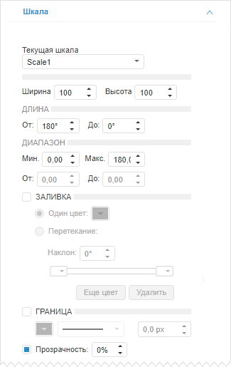
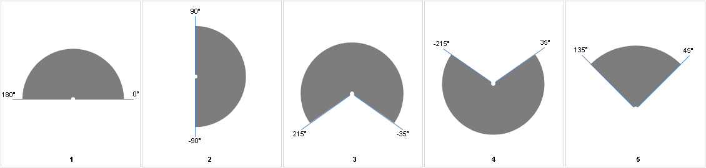
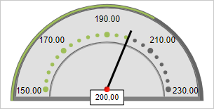
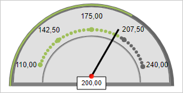
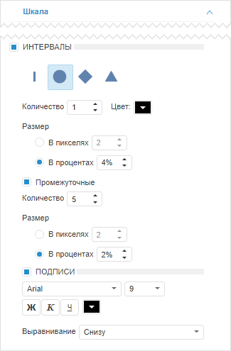

# Настройка шкал

Настройка шкал
-

# Настройка шкал

Для настройки шкал индикатора предназначена вкладка «Шкала»,
 расположенная на боковой панели.

[Для отображения
 вкладки](javascript:TextPopup(this))

		- Убедитесь, что боковая панель отображается.

		- В рабочей области выделите индикатор.

		- Установите на боковой панели переключатель «Формат»
		 и перейдите на вкладку «Шкала».

Настройка шкалы выполняется в несколько этапов:

	- Настройка основных параметров шкалы.

	- Настройка интервалов шкалы.

## Настройка основных параметров шкалы

Параметры, предназначенные для настройки основных параметров шкалы:

В раскрывающемся списке «Текущая шкала»
 выберите настраиваемую шкалу и задайте её основные параметры:

	- Ширина. Высота.
	 Укажите ширину и высоту шкалы относительно ширины и высоты индикатора.
	 Значение в диапазоне [1, 100]. Ширина и высота для каждой шкалы
	 указывается отдельно;

	- Длина. Укажите длину
	 шкалы в градусах. Задайте значения в полях «От»
	 и «До» в диапазоне [-360;
	 360]. Сумма абсолютных значений полей «От»
	 и «До» не должна превышать
	 360 градусов. Отрисовка шкалы выполняется по часовой стрелке.

[Пример](javascript:TextPopup(this))

	Примечание.
	 При вводе отрицательного значения в поле «От»,
	 оно автоматически пересчитывается в его положительное значение по
	 формуле: 360°- α, где α - введённое значение в поле «От».

	Например:

			- Введено в поле «От»
			 значение 180 градусов и в поле «До»
			 значение 0 градусов.

			- Введено в поле «От»
			 значение 90 градусов и в поле «До»
			 значение -90 градусов.

			- Введено в поле «От»
			 значение 215 градусов и в поле «До»
			 значение -35 градусов.

			- Введено в поле «От»
			 значение 35 градусов и в поле «До»
			 значение -215 градусов.

			- Введено в поле «От»
			 значение 135 градусов и в поле «До»
			 значение 45 градусов.

	Ниже слева направо представлены результаты
	 примеров задания длины шкалы:

	

	- Диапазон.
	 Укажите диапазон значений шкалы. Настройка работает совместно с [настройкой интервалов](Scale.htm#setting_up_scale_intervals).

		- «Мин.» и «Макс.». Введите минимальное
		 и максимальное значения в полях «Мин.»
		 и «Макс.». По умолчанию:

			-  для Scale1 устанавливаются
			 значения в диапазоне [0, 180];

			- для Scale2 устанавливаются
			 значения в диапазоне [0, 180];

			- для Scale3 устанавливаются
			 числовые значения индикатора от минимального до максимального;

		- «От» и «До».
		 Для ограничения диапазона значений шкалы введите начальное и конечное
		 значения в полях «От»
		 и «До». По умолчанию устанавливаются
		 значения в диапазоне от минимального до максимального значения.

[Пример](javascript:TextPopup(this))

	Рассмотрим задание значений параметра
	 «Диапазон» для шкалы Scale3. По умолчанию значения индикатора
	 находятся в диапазоне от [150; 230], который соответствует диапазону
	 значений измерения от минимального до максимального:

	

	Например:

			- в полях «Мин.»
			 и «Макс.» задан
			 диапазон [100, 250];

			- в полях «От»
			 и «До» задан диапазон
			 [110, 240].

	В результате индикатор имеет вид:

	

	- Заливка.
	 Параметры заливки фона шкалы. По умолчанию флажок снят и заливка фона
	 не применяется. Для настройки заливки установите флажок и установите
	 переключатель, соответствующий способу заливки:

	-

		- Один цвет. Заливка
		 фона выполняется одним цветом. Укажите цвет фона в соответствующей
		 палитре цветов;

		- Перетекание. Заливка
		 фона выполняется с помощью градиента. Для задания угла наклона
		 градиента используйте поле «Наклон».

		Для работы с цветами градиента предназначены передвижные палитры
		 цветов. Для изменения доли цвета в градиенте передвиньте соответствующую
		 палитру цветов.

		Для добавления нового цвета используйте кнопку «Еще
		 цвет», для удаления текущего - кнопку «Удалить».

	- Граница.
	 Параметры границы шкалы. По умолчанию флажок снят и граница отсутствует.
	 Для отображения границы установите флажок и задайте в соответствующих
	 полях следующие параметры: тип, толщину и цвет линии границы;

	- Прозрачность.
	 Параметры прозрачности шкалы. По умолчанию флажок установлен и доступна
	 настройка степени прозрачности шкалы: 100% соответствует полной прозрачности
	 (шкала станет невидимой), 0% соответствует полной непрозрачности.

## Настройка интервалов шкалы

Параметры, предназначенные для настройки интервалов шкалы:

Установите флажок «Интервалы»
 и выберите форму основных делений. Также задайте следующие параметры:

	- Количество. Укажите
	 количество основных делений;

	- Цвет. Укажите цвет основных
	 делений;

	- Размер. Задайте размер
	 основных делений в пикселях или процентах;

	- Промежуточные. Параметры
	 промежуточных делений шкалы. Для отображения промежуточных делений
	 установите флажок и задайте количество, цвет и размер делений;

	- Подписи. Параметры подписей
	 для делений шкалы. Для отображения подписей установите флажок и задайте
	 в соответствующих полях параметры подписей: шрифт, размер и цвет шрифта,
	 способ начертания и выравнивание подписей.

См. также:

[Настройка визуализатора «Индикатор»](../Indicator.htm)

		Справочная
		 система на версию 10.9
		 от 18/08/2025,
		 © ООО «ФОРСАЙТ»,
