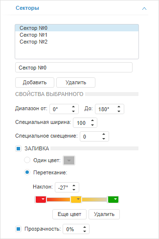

# Настройка секторов

Настройка секторов
-

# Настройка секторов

Для настройки секторов индикатора предназначена вкладка «Секторы», расположенная на боковой
 панели. Секторы позволяют визуально выделить диапазоны значений шкалы
 индикатора. Для каждой шкалы может быть создан отдельный набор секторов.

[Для отображения
 вкладки](javascript:TextPopup(this))

		- Убедитесь, что боковая панель отображается.

		- В рабочей области выделите индикатор.

		- На вкладке боковой панели «[Шкала](Scale.htm)» выберите шкалу, для которой
		 настраиваются секторы.

		- Установите на боковой панели переключатель «Формат»
		 и перейдите на вкладку «Секторы».

На вкладке отображается список секторов индикатора:

Для добавления сектора нажмите кнопку «Добавить»,
 для удаления выбранного сектора - кнопку «Удалить».
 Для редактирования наименования выбранного сектора используйте поле, расположенное
 ниже списка секторов.

Для каждого сектора доступны следующие параметры:

	- Диапазон. Задайте начальное
	 и конечное значение сектора в градусах. Значение в диапазоне
	 [1, 180];

	- Специальная ширина.
	 Укажите ширину сектора. Значение в диапазоне [1, 100];

	- Специальное смещение.
	 Укажите смещение сектора от внешней границы индикатора к его центру.
	 Значение смещения задается в процентах;

	- Заливка. Параметры заливки
	 сектора. По умолчанию флажок снят и заливка фона не применяется. Для
	 настройки заливки установите флажок и установите переключатель, соответствующий
	 способу заливки:

	-

		- Один цвет. Заливка
		 фона выполняется одним цветом. Укажите цвет фона в соответствующей
		 палитре цветов;

		- Перетекание. Заливка
		 фона выполняется с помощью градиента. Для задания угла наклона
		 градиента используйте поле «Наклон».

		Для работы с цветами градиента предназначены передвижные палитры
		 цветов. Для изменения доли цвета в градиенте передвиньте соответствующую
		 палитру цветов.

		Для добавления нового цвета используйте кнопку «Еще
		 цвет», для удаления текущего - кнопку «Удалить».

	- Прозрачность. Параметры
	 прозрачности сектора. По умолчанию флажок установлен и доступна настройка
	 степени прозрачности сектора: 100% соответствует полной прозрачности
	 (сектор станет невидимым), 0% соответствует полной непрозрачности.

См. также:

[Настройка визуализатора «Индикатор»](../Indicator.htm)

		Справочная
		 система на версию 10.9
		 от 18/08/2025,
		 © ООО «ФОРСАЙТ»,
