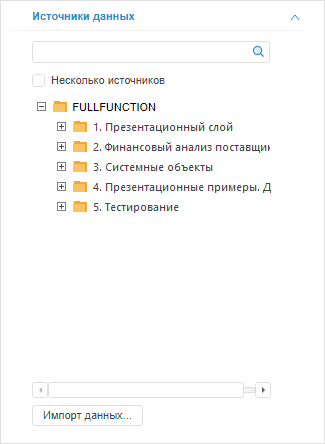

# Выбор и настройка источника данных визуализатора

Выбор и настройка источника данных визуализатора
-

# Выбор и настройка источника данных
 визуализатора

Для выбора и настройки источника данных визуализатора предназначена
 вкладка «Источники данных» на
 боковой панели.

В качестве источников данных доступны кубы, дочерние кубы контейнера
 моделирования и базы данных временных рядов. Внешние источники данных
 могут быть добавлены с помощью [мастера
 импорта данных](UiNavObj.chm::/Data_import_wizard/Data_import_wizard.htm).

[Для отображения
 вкладки](javascript:TextPopup(this))

		- Убедитесь, что боковая панель отображается.

		- Выделите визуализатор в рабочей области.

		- Установите на боковой панели переключатель «Данные».

		- Перейдите на вкладку «Источники
		 данных».

На вкладке отображаются все доступные для визуализатора источники
 данных, расположенные в репозитории. Например:

Выберите требуемый источник в дереве объектов. Для выбранного источника
 доступно:

	- задание значений параметров.
	 Используйте вкладку «[Параметры
	 источников данных](DataSource_param.htm)» на боковой панели;

	- управление измерениями.
	 Используйте группу вкладок «[Отметка](UiSelection.chm::/Selection/Dimension.htm)»
	 боковой панели.

Если выбранный источник данных уже используется в другом визуализаторе,
 то измерения визуализаторов могут быть синхронизированы. Это позволит
 управлять отметкой сразу в нескольких визуализаторах. Для настройки параметров
 синхронизации измерений используйте вкладку «[Синхронизация измерений](../../Dimension_links.htm)».

Дополнительные операции:

[Выбор
 типа загружаемых данных](javascript:TextPopup(this))

	Источники могут содержать два типа данных: непосредственно данные
	 источника и данные сохраненного представления. Сохраненное представление
	 содержит пользовательские настройки отображения. Например: отображаемые
	 элементы измерений, настройки диаграммы, параметры подписей и т.д.

	Для выбора типа загружаемых данных используйте переключатели в контекстном
	 меню источника на боковой панели:

		- Использовать только данные
		 источника. В визуализатор загружаются только данные источника;

		- Использовать данные источника
		 и сохраненную отметку. В визуализатор загружаются данные
		 источника и параметры отметки измерений источника, настроенные
		 пользователем. Если параметры отметки отсутствуют, то загружаются
		 только данные источника;

		- Использовать данные и сохраненное
		 представление источника. В визуализатор загружается сохранённое
		 представление. Если сохранённое представление отсутствует, то
		 загружаются только данные источника.

[Отображение
 в визуализаторе данных из нескольких источников](javascript:TextPopup(this))

	Примечание.
	 Данные из нескольких источников можно отобразить в одном визуализаторе,
	 если все источники имеют хотя бы одно общее измерение.

	Чтобы выбрать несколько источников данных:

		- установите флажок «Несколько
		 источников» на вкладке «Источники
		 данных» и выберите требуемые источники;

		- в навигаторе объектов выберите несколько источников (кубов
		 или БД временных рядов) и выполните команду контекстного меню
		 «Открыть с помощью > Конструктор
		 аналитических панелей».

	Особенности работы с измерениями нескольких источников приведены
	 в разделе «[Управление данными нескольких
	 источников](Multiply_src.htm)».

[Добавление
 внешнего источника данных](javascript:TextPopup(this))

	Нажмите кнопку «Импорт данных».
	 Будет открыто окно [мастера
	 импорта данных](UiNavObj.chm::/Data_import_wizard/Data_import_wizard.htm).

	C помощью мастера импорта доступны следующие источники данных:

		- файлы Microsoft Excel (*.xls, *.xlsx);

		- базы данных Microsoft Access (*.mdb);

		- файлы в формате XML (*.xml);

		- текстовые файлы (*.txt);

		- объекты репозитория:

		-

			- таблицы;

			- журналы ETL.

[Редактирование
 источника данных](javascript:TextPopup(this))

	Примечание.
	 Возможность доступна только в настольном приложении.

	Для редактирования объекта, являющегося источником данных, выполните
	 команду «Редактировать» в
	 контекстном меню источника данных.

	Примечание.
	 Редактирование источника данных [может
	 быть отключено](UiLib.chm::/Interface/IUiCommandActionCustomize/IUiCommandActionCustomize.htm) используя встроенный язык программирование
	 Fore.

[Поиск
 источников данных](javascript:TextPopup(this))

	В инструменте «Аналитические панели»
	 доступны следующие режимы поиска:

		- стандартный поиск источников данных по их наименованию;

		- BI-поиск источников данных по их содержимому.

	Подробнее см. раздел «[Поиск
	 источников данных](../DataSource_Search.htm)».

[Повторная
 загрузка данных в источник](javascript:TextPopup(this))

	Если в качестве источника данных указан куб, который был создан
	 в процессе импорта, то для источника доступна повторная загрузка данных.
	 Для загрузки данных выполните команду «Выполнить
	 задачу ETL» в контекстном меню выбранного источника.

	В результате данные в источник будут повторно загружены с помощью
	 задачи ETL.

	Для редактирования задачи ETL выполните команду «Редактировать
	 задачу ETL» в контекстном меню выбранного источника.

	В результате откроется окно редактирования [задачи
	 ETL](UiETL.chm::/desktop/01_General_Info/UiETL_General.htm).

	Если в качестве источника данных указан куб, в который был произведен
	 импорт, то для него будут доступны несколько задач ETL:

		- задача, созданная в результате построения куба;

		- задачи, созданные в результате импорта данных в куб.

	Примечание.
	 В веб-приложении доступно только выполнение задачи ETL.

Подробное описание принципов работы
 с измерениями источника данных приведено в разделе «[Работа с измерениями](UiSelection.chm::/Selection/Dimension.htm)».

См. также:

[Вставка
 и настройка визуализаторов](../Gadgets.htm)

		Справочная
		 система на версию 10.9
		 от 18/08/2025,
		 © ООО «ФОРСАЙТ»,
