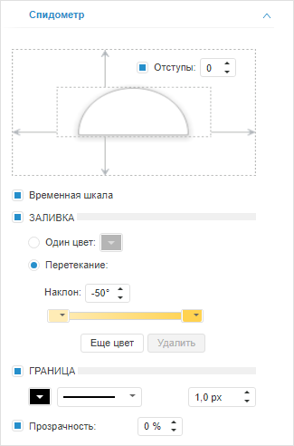

# Настройка основных параметров индикатора

Настройка основных параметров индикатора
-

# Настройка основных параметров индикатора

Для настройки основных параметров индикатора предназначена вкладка
 «Спидометр», расположенная на
 боковой панели.

[Для отображения
 вкладки](javascript:TextPopup(this))

		- убедитесь, что боковая панель отображается.

		- в рабочей области выделите индикатор.

		- установите на боковой панели переключатель «Формат»
		 и перейдите на вкладку «Спидометр».

Задайте следующие параметры:

	- Отступы. Параметры отступа
	 индикатора от внутренних краев визуализатора. По умолчанию флажок
	 снят и внутренние отступы не используются. Для задания размера внутренних
	 отступов установите флажок и укажите размер отступов;

	- Временная шкала. Параметры
	 временной шкалы. Временная шкала доступна, если в [календарном
	 измерении](UiSelection.chm::/Selection/Dimension_type.htm) визуализатора отмечено несколько элементов.

	По умолчанию флажок установлен и временная шкала отображается. Для
	 скрытия шкалы снимите флажок;

	- Заливка. Параметры заливки
	 фона индикатора. По умолчанию флажок снят и заливка фона не применяется.
	 Для настройки заливки установите флажок и установите переключатель,
	 соответствующий способу заливки:

	-

		- Один цвет. Заливка
		 фона выполняется одним цветом. Укажите цвет фона в соответствующей
		 палитре цветов;

		- Перетекание. Заливка
		 фона выполняется с помощью градиента. Для задания угла наклона
		 градиента используйте поле «Наклон».

		Для работы с цветами градиента предназначены передвижные палитры
		 цветов. Для изменения доли цвета в градиенте передвиньте соответствующую
		 палитру цветов.

		Для добавления нового цвета используйте кнопку «Еще
		 цвет», для удаления текущего - кнопку «Удалить»;

	- Граница. Параметры границы
	 индикатора. По умолчанию флажок снят и граница отсутствует. Для отображения
	 границы установите флажок и задайте в соответствующих полях следующие
	 параметры: тип, толщину и цвет линии границы;

	- Прозрачность. Параметры
	 прозрачности индикатора. По умолчанию флажок установлен и доступна
	 настройка степени прозрачности индикатора: 100% соответствует полной
	 прозрачности (индикатор станет невидимым), 0% соответствует полной
	 непрозрачности.

См. также:

[Настройка визуализатора «Индикатор»](../Indicator.htm)

		Справочная
		 система на версию 10.9
		 от 18/08/2025,
		 © ООО «ФОРСАЙТ»,
