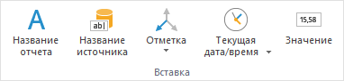
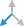

# Использование подстановок в заголовке

Использование подстановок в заголовке
-

# Использование подстановок в заголовке

Подстановки в заголовок могут быть вставлены с помощью кнопок на ленте
 инструментов или введены вручную с помощью шаблонов.

## Вставка подстановок с помощью ленты инструментов

Подстановки находятся на ленте инструментов в группе «Вставка».
 При работе с заголовком [визуализатора](Caption.htm) группа
 располагается на вкладке «Заголовок»,
 при работе с блоком «[Текст](../../Other/Text.htm)»
 - на вкладке «Текст».

Доступные подстановки:

	- название отчета;

	- название источника;

	- отметка. Позволяет создать
	 в заголовке [элемент управления](../../Controls/List.htm),
	 основанный на измерении или метрике визуализатора.

	Для вставки текущей отметки по всем фиксированным измерения нажмите
	 кнопку  «Отметка».

	Для вставки отметки определенного измерения или метрики нажмите нижнюю
	 часть кнопки  «Отметка». Будет отображено меню,
	 содержащее следующие группы:

		- Справочники/Измерения.
		 Содержит список измерений, доступных для использования в заголовке
		 в качестве элементов управления;

Примечание.
 Если в качестве измерения в подстановке выбрано календарное измерение,
 то при работе с подстановкой будет доступен выбор режима отметки: «Только по элементам», «Только
 по уровням» или «По элементам
 и уровням». Задание режима отметки выполняется на вкладке «[Структура
 источника данных](../DS_structure.htm)» окна «Структура
 и параметры». Работа с отметкой в такой подстановке аналогична
 работе с [отметкой
 элементов календарного измерения](UiSelection.chm::/Selection/Selection_of_the_CalendarDimension_elements.htm).

		- Метрики. Группа
		 содержит список возможных метрик, доступных для использования
		 в заголовке в качестве элементов управления. Группа доступна только
		 для визуализатора, в котором заданы метрики;

	- текущая
	 дата/время. Для вставки текущей даты нажмите кнопку  «Текущая дата/время». Для вставки
	 текущего времени нажмите нижнюю часть кнопки  «Текущая дата/время» и выполните
	 команду «Текущее время»;

	- значение. Значение,
	 полученное при фиксации всех измерений в источнике данных визуализатора.

## Вставка подстановок с помощью шаблонов

Шаблоны вводятся с помощью клавиатуры.

Доступные шаблоны:

	- &[Name]. Наименование
	 отчета;

	- &[Datasource]. Наименование
	 источника данных;

	- &[Selection]. Текущая
	 отметка по всем фиксированным измерениям;

	- &[Date]. Текущая
	 дата;

	- &[Time]. Текущее
	 время;

	- &[Value]. Значение,
	 полученное при фиксации всех измерений в источнике данных визуализатора;

	- &[EXPRESSION:<e>].
	 Значение, вычисленное по заданному выражению, где e
	 - это выражение. В качестве выражения могут выступать:

		- формула. Допускается
		 использование арифметических и логических функций, аналогичных
		 используемым в [редакторе
		 выражения](UiNav.chm::/GUI/Expression_editor_func.htm). Например: &[EXPRESSION:Average(1,2,3)];

		- функция, рассчитываемая
		 модулем Fore. Функция указывается в следующем формате:
		 <Идентификатор модуля>.<Идентификатор
		 функции>. Например, функция «Func»,
		 содержащаяся в модуле «TESTEXPR»:
		 &[EXPRESSION:TESTEXPR.Func];

	- &[Dimensions.<id>].
	 Текущая отметка заданного измерения, где id
	 - это идентификатор требуемого измерения. Например: &[Dimensions.CALENDAR];

	- &[<v>.Metric.<m>].
	 Текущая отметка заданной метрики, где v
	 - это визуализатор, а m -
	 метрика визуализатора. Например: &[Grid.Metric.FontSize].
	 Шаблон доступен только для визуализатора, в котором заданы метрики.

[Доступные
 визуализаторы и их метрики](javascript:TextPopup(this))

			- Grid. Визуализатор
			 «Таблица». Метрики:

				- Value. Значение;

				- BackgroundColor.
				 Цвет фона;

				- FontColor.
				 Цвет шрифта;

				- FontSize.
				 Размер шрифта;

			- Map. Визуализатор
			 «Карта». Метрики:

				- Color. Цвет
				 территории;

				- Depth. Объем
				 территории;

				- Bar. Значение,
				 по которому строится столбиковая диаграмма;

				- Pie. Значение,
				 по которому строится круговая диаграмма;

				- MarkerColor.
				 Цвет маркера геолокации;

				- ArrowColor.
				 Цвет стрелок между территориями;

				- ArrowThickness.
				 Толщина стрелок;

			- BubbleChart.
			 Визуализатор «Пузырьковая
			 диаграмма». Метрики:

				- X. Значение,
				 отображаемое по оси X;

				- Y. Значение,
				 отображаемое по оси Y;

				- Radial.
				 Размер пузырька;

				- Color. Цвет
				 пузырька;

			- BubbleTree.
			 Визуализатор «Пузырьковое
			 дерево». Метрики:

				- Color. Цвет
				 пузырьков;

				- Size. Размер
				 пузырьков;

			- TreeMap. Визуализатор
			 «Плоское дерево».
			 Метрики:

				- Color. Цвет
				 прямоугольников;

				- Size. Размер
				 прямоугольников.

См. также:

[Настройка заголовка визуализатора](Caption.htm)
 | [Вставка текста с дополнительными возможностями](../../Other/Text.htm)

		Справочная
		 система на версию 10.9
		 от 18/08/2025,
		 © ООО «ФОРСАЙТ»,
