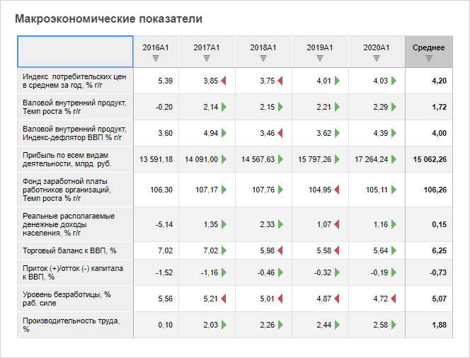

# Настройка визуализатора «Таблица»

Настройка визуализатора «Таблица»
-

# Настройка визуализатора «Таблица»

Визуализатор «Таблица» предназначен
 для отображения данных в табличном виде.

Для вставки визуализатора используйте:

	- команду «Таблица» в
	 раскрывающемся меню кнопки «Визуализаторы»
	 на вкладке ленты «Главная»;

	- кнопку «Таблица» в группе
	 «Визуализаторы» на вкладке
	 ленты «Вставка»;

	- команду «Таблица» в
	 раскрывающемся меню пункта «Новый
	 блок» в контекстном меню аналитической панели.

Затем задайте [источник данных](Panels/Select_DataSource.htm)
 для таблицы.

Пример визуализатора «Таблица»:

## Операции с таблицей

Для визуализатора «Таблица»
 доступны все операции с объектами, приведенные в разделах «[Построение
 аналитической панели](../../Document/Work.htm)» и «[Вставка и настройка
 визуализаторов](Gadgets.htm)».

Для отображения вкладок боковой панели, предназначенных для настройки
 таблицы, выполните команду контекстного меню «Таблица
 > Настройка».

### Основные операции, доступные для таблицы

	- [Выделение
	 элементов таблицы](UiAnalyticalArea.chm::/Select_areas.htm).

	- [Настройка
	 общих параметров таблицы](UiAnalyticalArea.chm::/Parameters/Parameters.htm).

	- [Настройка
	 внешнего вида таблицы](UiAnalyticalArea.chm::/TableView/TableView.htm).

	- [Управление
	 данными таблицы](UiAnalyticalArea.chm::/Working_with_table_data/Working_with_table_data.htm).

	- [Редактирование
	 и сохранение данных](UiAnalyticalArea.chm::/Working_with_table_data/Edit_and_save_data.htm).

	- [Настройка
	 гиперссылок в таблице](UiAnalyticalArea.chm::/Hyperlinks/Working_with_hyperlinks.htm).

	- [Управление
	 измерениями в таблице](UiAnalyticalArea.chm::/Work_with_dimensions/Work_with_dimensions.htm).

	- [Анализ
	 данных в таблице](UiAnalyticalArea.chm::/Analysis/Data_analysis_in_a_table.htm).

	- [Расчет
	 итоговых значений](UiAnalyticalArea.chm::/Totals/Calculate_totals.htm).

	- [Прикрепление
	 вложений](UiAnalyticalArea.chm::/Attachments.htm).

См. также:

[Вставка и
 настройка визуализаторов](Gadgets.htm)

		Справочная
		 система на версию 10.9
		 от 18/08/2025,
		 © ООО «ФОРСАЙТ»,
