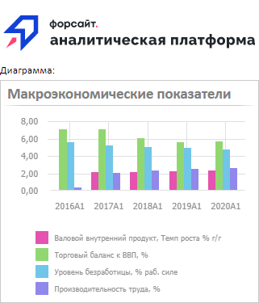
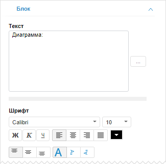

# Создание надписи

Создание надписи
-

# Создание надписи

Надпись позволяет разместить различные текстовые данные в аналитической
 панели.

Для вставки надписи используйте:

	- команду «Надпись» в
	 раскрывающемся меню кнопки «Другое»
	 на вкладке ленты «Главная»;

	- кнопку «Надпись» в группе
	 «Другое» на вкладке ленты
	 «Вставка»;

	- команду «Надпись» в
	 раскрывающемся меню пункта «Новый
	 блок» в контекстном меню аналитической панели.

Пример блоков «[Рисунок](Picture.htm)»,
 «Надпись» и «[Визуализатор](../Gadgets/Gadgets.htm)»:

Для настройки параметров блока используйте вкладки «Блок»
 и «Команда» на боковой панели.

[Для отображения
 вкладок](javascript:TextPopup(this))

		- Убедитесь, что боковая панель отображается.

		- Выделите блок на рабочей области.

		- Перейдите на требуемую вкладку.

## Настройка базовых параметров

Для настройки базовых параметров надписи используйте вкладку «[Блок](../../Document/Block_BaseProps.htm)»
 на боковой панели:

Помимо параметров, доступных для всех объектов в аналитической панели,
 для надписи также доступны дополнительные настройки:

	- Текст. Укажите текст
	 надписи;

	- Шрифт. Настройте параметры
	 оформления текста надписи: шрифт, выравнивание, начертание, цвет и
	 ориентацию.

[Параметры
 шрифта](javascript:TextPopup(this))

			- Шрифт. Выберите
			 один из шрифтов, установленных в операционной системе;

			- Размер шрифта.
			 Установите требуемый размер шрифта. Размер задаётся в пунктах,
			 и его можно выбрать из раскрывающегося списка или ввести вручную.
			 Диапазон допустимых значений: [1, 72];

			- Начертание надписи.
			 Нажмите кнопки, задающие начертание шрифта:

				- Ж. Полужирное
				 начертание;

				- К. Курсивное
				 начертание;

				- Ч. Подчеркивание
				 текста.

	При нажатой кнопке будет использоваться
	 соответствующий стиль начертания. Доступно использование нескольких
	 стилей одновременно, например, нажатие кнопок «Ж»
	 и «К» даёт полужирное курсивное
	 начертание;

			- Горизонтальное выравнивание
			 надписи. Задайте выравнивание надписи относительно
			 её границ:

				-  По левому краю. По умолчанию;

				-  По центру;

				-  По правому краю;

				-  По ширине;

			- Цвет шрифта.
			 Выберите цвет шрифта в раскрывающейся палитре цветов. Для
			 установки нового цвета шрифта перейдите на вкладку «Спектр» в палитре цветов
			 и выберите цвет в расширенной палитре;

			- Вертикальное выравнивание
			 надписи. Задайте выравнивание надписи относительно
			 её границ:

				-  По
				 верхнему краю. По умолчанию;

				-  По
				 центру;

				-  По
				 нижнему краю;

			- Ориентация текста надписи.
			 Задайте ориентацию текста:

				-  Горизонтальная
				 ориентация слева направо. По умолчанию;

				-  Вертикальная
				 ориентация сверху вниз;

				-  Вертикальная
				 ориентация снизу вверх.

## Управление командами

Для управления действием, выполняемым при нажатии надписи, используйте
 вкладку «[Команда](../Controls/Button.htm#button_items_control)»
 на боковой панели:

Для надписи доступны те же команды, что и для элемента управления «[Кнопка](../Controls/Button.htm)».

Если для надписи задана команда, то текст надписи становится подчёркнутым
 и при наведении мыши на надпись указатель принимает следующий вид: .

См. также:

[Вставка надписей,
 иллюстраций и HTML-контента](Other.htm)

		Справочная
		 система на версию 10.9
		 от 18/08/2025,
		 © ООО «ФОРСАЙТ»,
