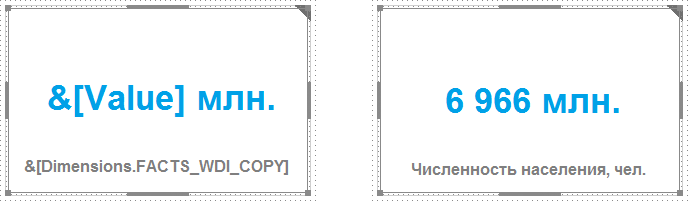

# Вставка текста с дополнительными возможностями

Вставка текста с дополнительными возможностями
-

# Вставка текста с дополнительными возможностями

Блок «Текст» позволяет вставить
 форматированный текст с возможностью настройки элементов управления и
 вычисления значений.

Для добавления блока используйте:

	- команду «Текст» в раскрывающемся
	 меню кнопки «Другое» на вкладке
	 ленты «Главная»;

	- кнопку «Текст» в группе
	 «Другое» на вкладке ленты
	 «Вставка»;

	- команду «Текст» в раскрывающемся
	 меню пункта «Новый блок» в
	 контекстном меню аналитической панели.

После вставки блока задайте его [источник
 данных](../Gadgets/Panels/Select_DataSource.htm). Все измерения выбранного источника будут зафиксированы. Изменение
 расположения измерения недоступно.

По умолчанию блок работает в режиме элемента управления и отображается
 как гиперссылка, при нажатии на которую открывается иерархический список
 для выбора элемента измерения. В блоке также можно использовать [подстановки](../Gadgets/Panels/Substitution.htm),
 например:

Для работы с блоком предназначена вкладка «Текст»
 на ленте инструментов. Настройка текста аналогична настройке [заголовка
 визуализатора](../Gadgets/Panels/Caption.htm).

См. также:

[Вставка
 и настройка интерактивных элементов управления](../Controls/Controls.htm)

		Справочная
		 система на версию 10.9
		 от 18/08/2025,
		 © ООО «ФОРСАЙТ»,
