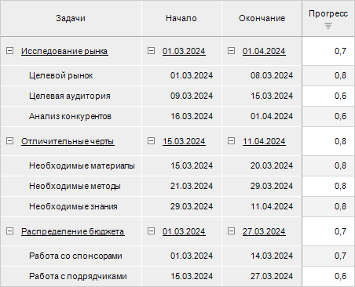
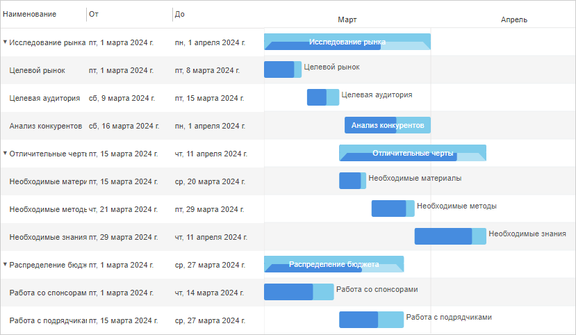
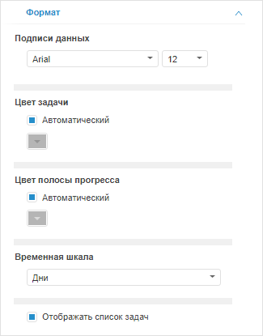

# Настройка диаграммы Ганта

Настройка диаграммы Ганта
-

# Настройка диаграммы Ганта

Плагин «Диаграмма Ганта» предназначен
 для отображения данных в виде гистограммы, которая позволяет выполнять
 календарно-сетевое планирование.

Календарно-сетевое планирование – это инструмент составления плана реализации
 проекта и анализа сроков выполнения задач для оптимизации общей продолжительности
 реализации проекта. Сетевое планирование позволяет составить наилучший
 план выполнения задач по проекту в ограниченные сроки и определить задачи,
 которые являются критическими и негативно влияют на общую календарную
 продолжительность проекта.

Проект – это система взаимосвязанных задач, ограниченных сроком выполнения
 и определяющих цель проекта.

Примечание.
 Плагин доступен только в веб-приложении.

Для вставки плагина:

	- Выполните одно из действий:

		- выполните команду  «Диаграмма
		 Ганта» в раскрывающемся меню кнопки 
		 «Плагины» на вкладке ленты
		 «Главная» или «Вставка»;

		- выполните команду «Новый
		 блок > Плагины > Диаграмма Ганта» в контекстном
		 меню аналитической панели.

	- Выберите [источник данных](Plugins.htm#select_ds)
	 на вкладке «Отчёт» боковой
	 панели. На вкладке отображаются все доступные для плагина источники
	 данных, расположенные в репозитории. Для выбора или смены источника
	 данных выберите соответствующий объект в дереве объектов.

В качестве источника данных используется
 экспресс-отчёт. При построении экспресс-отчёта учитывайте следующие особенности:

		- убедитесь, что в источнике данных содержится измерение с
		 данными по задачам и срокам их выполнения. Для определения сроков
		 выполнения в измерении должно содержаться два дополнительных [атрибута](uinavobj.chm::/reference_book/Master_RDS_reference_book/Attributes.htm)
		 «Начало» (START_DATE)
		 и «Окончание» (END_DATE)
		 с типом данных «Дата»
		 или «Дата и время»;

		- расположите измерение с задачами [по
		 строкам](UiSelection.chm::/Selection/Dimension.htm#variant_of_location) и [включите
		 отображение](UiSelection.chm::/Selection/Element_Names.htm#user) атрибутов «Начало»,
		 «Окончание»;

		- используйте только один факт. Значения факта определяют
		 прогресс выполнения задачи в процентах. Диапазон допустимых значений:
		 [0, 1]. Для указания продолжительности выполнения задачи в днях
		 используйте формулу: <количество
		 выполненных дней>*100/<длительность
		 задачи в днях>. Например, длительность задачи 5 дней,
		 продолжительность выполнения задачи 3 дня, в результате значение факта
		 будет 0,6 - 60%.

Пример экспресс-отчёта с данными для плагина:

После выполнения действий плагин будет вставлен в аналитическую панель
 отдельным объектом.

Пример аналитической панели с плагином «Диаграмма
 Ганта»:

## Операции с диаграммой Ганта

Для диаграммы Ганта доступны все операции с объектами, приведённые в
 разделе «[Построение аналитической панели](../../Document/Work.htm)».

Для настройки оформления плагина «Диаграмма
 Ганта» используйте вкладку «Формат»
 на боковой панели. Для отображения вкладки:

	- Убедитесь, что боковая панель отображается.

	- В рабочей области выберите плагин «Диаграмма
	 Ганта».

	- Перейдите на вкладку «Формат».

Задайте параметры:

	- Подписи данных. Задайте
	 настройки шрифта:

		- Шрифт. Выберите
		 один из шрифтов, установленных в операционной системе, в раскрывающемся
		 списке;

		- Размер шрифта. Установите
		 требуемый размер шрифта. Размер задаётся в пунктах, и его можно
		 выбрать в раскрывающемся списке или ввести вручную. Диапазон допустимых
		 значений: [1, 72];

	- Цвет задачи/полосы прогресса.
	 Выберите способ заливки цвета задачи и полосы прогресса:

		- Автоматический.
		 Снимите флажок для выбора цвета вручную. По умолчанию флажок установлен
		 и используется автоматически подобранный цвет;

		- Ручной. Выберите
		 цвет в раскрывающейся палитре цветов, если флажок «Автоматический»
		 снят;

	- Временная шкала. Выберите
	 способ отображения динамики прогресса по времени:

		- Годы;

		- Кварталы;

		- Месяцы;

		- Дни. По умолчанию;

	- Отображать список задач.
	 Снимите флажок для скрытия списка задач в плагине. По умолчанию флажок
	 установлен и список задач отображается.

См. также:

[Вставка и
 настройка плагинов](Plugins.htm)

		Справочная
		 система на версию 10.9
		 от 18/08/2025,
		 © ООО «ФОРСАЙТ»,
