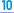
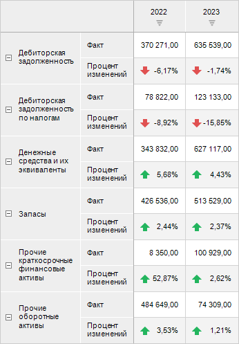
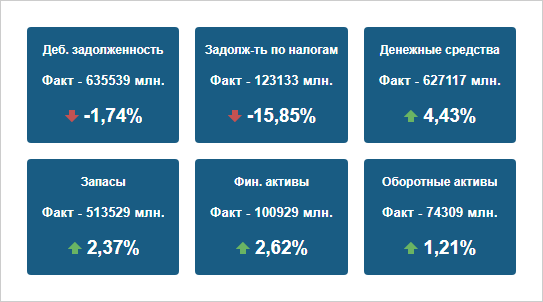
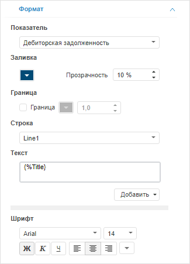

# Настройка индикатора

Настройка индикатора
-

# Настройка индикатора

Плагин «Индикатор» предназначен
 для отображения данных в виде отдельных ключевых показателей.

Примечание.
 Плагин доступен только в веб-приложении.

Для вставки плагина:

	- Выполните одно из действий:

		- выполните команду  «Индикатор»
		 в раскрывающемся меню кнопки 
		 «Плагины» на вкладке ленты
		 «Главная» или «Вставка»;

		- выполните команду «Новый
		 блок > Плагины > Индикатор» в контекстном
		 меню аналитической панели.

	- Выберите [источник данных](Plugins.htm#select_ds)
	 на вкладке «Отчёт» боковой
	 панели. На вкладке отображаются все доступные для плагина источники
	 данных, расположенные в репозитории. Для выбора или смены источника
	 данных выберите соответствующий объект в дереве объектов.

В качестве источника данных используется
 экспресс-отчёт. При построении экспресс-отчёта учитывайте следующие особенности:

		- расположите измерения, содержащие показатель и факт, [по
		 строкам](UiSelection.chm::/Selection/Dimension.htm#variant_of_location);

		- расположите календарное измерение [по
		 столбцам](UiSelection.chm::/Selection/Dimension.htm#variant_of_location);

		- настройте [условное
		 форматирование](uianalyticalarea.chm::/Analysis/Conditional_formatting.htm) для отображения динамики изменений;

		- используйте только один факт.

Пример экспресс-отчёта с данными для плагина:

После выполнения действий плагин будет вставлен в аналитическую панель
 отдельным объектом.

Пример аналитической панели с плагином «Индикатор»:

По умолчанию количество отображаемых индикаторов ограничено. Доступно
 отображение восьми индикаторов и меньше.

Для управления отметкой календарного измерения в плагине:

	- Выделите индикатор.

	- Вставьте элемент управления «[Раскрывающийся список](../Controls/List.htm)» с календарным
	 измерением.

	- Снимите флажок «[Множественная
	 отметка](../Controls/List.htm#options)» на боковой панели в настройках элемента управления.

После выполнения действий данные индикатора будут меняться в зависимости
 от отметки календарного измерения, заданной в раскрывающемся списке.

## Операции с индикатором

Для индикатора доступны все операции с объектами, приведённые в разделе
 «[Построение аналитической панели](../../Document/Work.htm)».

Для настройки оформления плагина «Индикатор»
 используйте вкладку «Формат» на
 боковой панели. Для отображения вкладки:

	- Убедитесь, что боковая панель отображается.

	- В рабочей области выберите плагин «Индикатор».

	- Перейдите на вкладку «Формат».

Задайте параметры:

	- Показатель. Выберите
	 элемент измерения, используемый в качестве показателя, в раскрывающемся
	 списке. Показатель содержит три строки: заголовок, первое значение,
	 второе значение. Например, значения «план-факт». Для каждого элемента
	 измерения задаются настройки, указанные ниже;

	- Заливка. Выберите цвет
	 фона плагина в раскрывающейся палитре цветов. Также укажите степень
	 прозрачности цвета фона в соответствующем параметре (в процентах):
	 100% - цвет полностью непрозрачен, 0% - цвет невидим. По умолчанию
	 используется синий цвет фона;

	- Граница. Установите
	 флажок для отображения границы плагина. Выберите цвет границы в раскрывающейся
	 палитре цветов и задайте толщину линии в пикселях;

	- Строка. Выберите строку
	 в раскрывающемся списке. Для каждой строки задайте настройки, указанные
	 ниже;

	- Текст. Введите произвольный
	 текст строки или используйте шаблоны в раскрывающемся меню кнопки
	 «Добавить». По умолчанию для
	 каждой строки задан соответствующий шаблон текста;

	- Шрифт. Выберите один
	 из шрифтов, установленных в операционной системе, в раскрывающемся
	 списке и задайте дополнительные параметры:

		- Размер шрифта. Установите
		 требуемый размер шрифта. Размер задаётся в пунктах, и его можно
		 выбрать в раскрывающемся списке или ввести вручную. Диапазон допустимых
		 значений: [1, 72];

		- Начертание текста.
		 Нажмите кнопки, задающие начертание шрифта:

			- Ж. Полужирное
			 начертание;

			- К.
			 Курсивное начертание;

			- Ч.
			 Подчеркивание текста.

При нажатой кнопке будет использоваться соответствующий
 стиль начертания. Доступно использование нескольких стилей одновременно,
 например, нажатие кнопок «Ж» и
 «К» даёт полужирное
 курсивное начертание;

		- Цвет шрифта. Выберите
		 цвет шрифта в раскрывающейся палитре цветов.

См. также:

[Вставка и
 настройка плагинов](Plugins.htm)

		Справочная
		 система на версию 10.9
		 от 18/08/2025,
		 © ООО «ФОРСАЙТ»,
