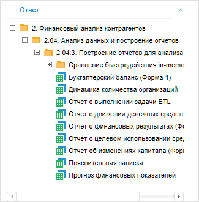

# Вставка и настройка плагинов

Вставка и настройка плагинов
-

# Вставка и настройка плагинов

Плагины - это модули, подключаемые к аналитической панели и используемые
 для расширения её возможностей. Для получения подробной информации обратитесь
 к разделу «[Плагины](DataAnalysis.chm::/Plugins/Plugins.htm)».

В веб-приложении доступна вставка преднастроенных плагинов:

	- [Sankey-диаграмма](Sankey_Chart.htm).
	 Отображает данные в виде потоков и их количественные величины в пропорциональном
	 соотношении друг к другу;

	- [Диаграмма
	 Ганта](Gantt_Chart.htm). Отображает данные в виде гистограммы, которая позволяет
	 выполнять календарно-сетевое планирование;

	- [Индикатор](Indicator.htm).
	 Отображает данные в виде отдельных ключевых показателей.

При необходимости для расширения функциональности преднастроенных плагинов
 измените исходные файлы, содержащиеся в папке Plugins/Dashboard, которая
 расположена в папке установки веб-приложения.

Для вставки пользовательского плагина в веб- или настольном приложении:

	- [Создайте
	 плагин](DataAnalysis.chm::/Plugins/Create_Plugin.htm).

Важно.
 Для преднастроенных плагинов зарезервированы идентификаторы: PP.Ui.Dashboard.Sankey
 - «Sankey-диаграмма»; PP.Ui.Dashboard.Gantt
 - «Диаграмма Ганта»; PP.Ui.Dashboard.Indicator
 - «Индикатор». При создании пользовательского
 плагина используйте идентификатор, отличный от зарезервированных.

	- [Подключите
	 плагин к аналитической панели](DataAnalysis.chm::/Plugins/Connecting_Plugins_Dashboards.htm).

	- Выполните одно из действий в аналитической панели:

		- выполните команду, соответствующую названию плагина, в раскрывающемся
		 меню кнопки  «Плагины» на вкладке ленты «Главная» или «Вставка»;

		- выполните команду «Новый
		 блок > Плагины > <название
		 плагина>» в
		 контекстном меню аналитической панели.

После выполнения действий плагин будет вставлен в аналитическую панель
 отдельным объектом. Для плагинов доступны все операции с объектами, приведенные
 в разделе «[Построение аналитической
 панели](../../Document/Work.htm)». Если плагин поддерживает работу с источниками данных, то
 для него также доступен выбор источника данных.

## Выбор источника данных

Для выбора источника данных используйте вкладку «Отчёт»
 на боковой панели. Для отображения вкладки:

	- Убедитесь, что боковая панель отображается.

	- В рабочей области вставьте новый плагин или выберите существующий.

	- Перейдите на вкладку «Отчёт».

На вкладке отображаются все доступные для плагина источники данных,
 расположенные в репозитории. Для выбора или смены источника данных выберите
 соответствующий объект в дереве объектов:

См. также:

[Построение
 аналитической панели](../../Document/Work.htm)

		Справочная
		 система на версию 10.9
		 от 18/08/2025,
		 © ООО «ФОРСАЙТ»,
