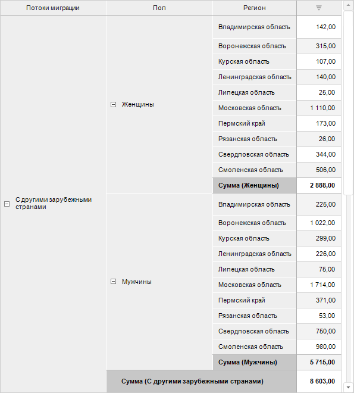
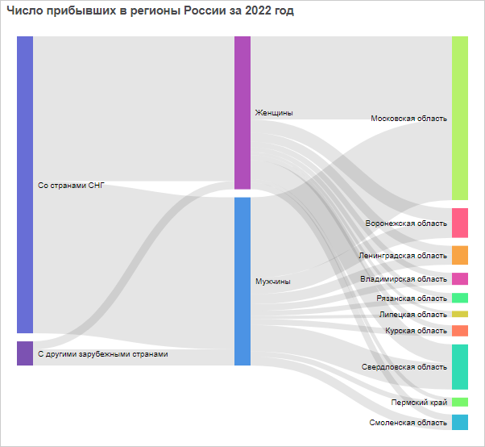
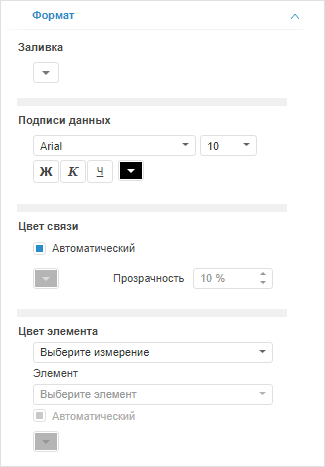

# Настройка Sankey-диаграммы

Настройка Sankey-диаграммы
-

# Настройка Sankey-диаграммы

Плагин «Sankey-диаграмма» предназначен
 для отображения данных в виде потоков и их количественных величин в пропорциональном
 соотношении друг к другу.

Ширина линий (потоков) используется для отображения величин: чем шире
 поток, тем больше его количественное значение. Линии потока могут объединяться
 или разделяться на разных уровнях диаграммы - это позволяет наглядно отобразить
 распределение величин по разным категориям. Потоки и деление на категории
 дополнительно отображаются разными цветами с использованием градиентной
 заливки.

Sankey-диаграммы удобно использовать для визуального отображения распределения
 денежных средств или ресурсов, а также для демонстрации потока любого
 системного процесса.

Элементы измерений диаграммы формируют начальную и конечную точки потока,
 а элементы фактов - «вес» потока, его ширину. Каждая пара измерений формирует
 один уровень диаграммы. Потоки Sankey-диаграммы строятся слева направо.

Примечание.
 Плагин доступен только в веб-приложении.

Для вставки плагина:

	- Выполните одно из действий:

		- выполните команду  «Sankey-диаграмма»
		 в раскрывающемся меню кнопки 
		 «Плагины» на вкладке ленты
		 «Главная» или «Вставка»;

		- выполните команду «Новый
		 блок > Плагины > Sankey-диаграмма» в контекстном
		 меню аналитической панели.

	- Выберите [источник данных](Plugins.htm#select_ds)
	 на вкладке «Отчёт» боковой
	 панели. На вкладке отображаются все доступные для плагина источники
	 данных, расположенные в репозитории. Для выбора или смены источника
	 данных выберите соответствующий объект в дереве объектов.

В качестве источника данных используется
 экспресс-отчёт. При построении экспресс-отчёта учитывайте следующие особенности:

		- расположите измерения [по
		 строкам](UiSelection.chm::/Selection/Dimension.htm#variant_of_location) в том порядке, в котором они должны
		 отображаться в плагине;

		- включите отображение [итогов
		 по столбцам](UiAnalyticalArea.chm::/Totals/Calculate_totals.htm#show_totals) для корректного расчёта суммы значений
		 элементов измерений в плагине;

		- используйте только один факт.

Пример экспресс-отчёта с данными для плагина:

После выполнения действий плагин будет вставлен в аналитическую панель
 отдельным объектом.

Пример аналитической панели с плагином «Sankey-диаграмма»:

## Операции с Sankey-диаграммой

Для Sankey-диаграммы доступны все операции с объектами, приведённые
 в разделе «[Построение аналитической
 панели](../../Document/Work.htm)».

Для настройки оформления плагина «Sankey-диаграмма»
 используйте вкладку «Формат» на
 боковой панели. Для отображения вкладки:

	- Убедитесь, что боковая панель отображается.

	- В рабочей области выберите плагин «Sankey-диаграмма».

	- Перейдите на вкладку «Формат».

Задайте параметры:

	- Заливка. Выберите цвет
	 фона плагина в раскрывающейся палитре цветов. По умолчанию используется
	 белый цвет фона;

	- Подписи данных. Задайте
	 настройки шрифта:

		- Шрифт. Выберите
		 один из шрифтов, установленных в операционной системе, в раскрывающемся
		 списке;

		- Размер шрифта. Установите
		 требуемый размер шрифта. Размер задаётся в пунктах, и его можно
		 выбрать в раскрывающемся списке или ввести вручную. Диапазон допустимых
		 значений: [1, 72];

		- Начертание текста.
		 Нажмите кнопки, задающие начертание шрифта:

			- Ж. Полужирное
			 начертание;

			- К.
			 Курсивное начертание;

			- Ч.
			 Подчеркивание текста.

При нажатой кнопке будет использоваться соответствующий
 стиль начертания. Доступно использование нескольких стилей одновременно,
 например, нажатие кнопок «Ж» и
 «К» даёт полужирное
 курсивное начертание;

		- Цвет шрифта. Выберите
		 цвет шрифта в раскрывающейся палитре цветов;

	- Цвет связи. Выберите
	 способ заливки цвета связи:

		- Автоматический.
		 Снимите флажок для выбора цвета связи вручную. По умолчанию флажок
		 установлен и используется автоматически подобранный цвет связи;

		- Ручной. Выберите
		 цвет связи в раскрывающейся палитре цветов, если флажок «Автоматический» снят. Также
		 укажите степень прозрачности цвета связи в соответствующем параметре
		 (в процентах): 100% - цвет полностью непрозрачен, 0% - цвет невидим;

	- Цвет элемента. Выберите
	 способ заливки цвета элемента. Для этого выберите измерение и его
	 элемент в соответствующих раскрывающихся списках. Цвет задаётся для
	 каждого элемента измерения:

		- Автоматический.
		 Снимите флажок для выбора цвета элемента вручную. По умолчанию
		 флажок установлен и используется автоматически подобранный цвет
		 элемента;

		- Ручной. Выберите
		 цвет элемента в раскрывающейся палитре цветов, если флажок «Автоматический» снят.

См. также:

[Вставка и
 настройка плагинов](Plugins.htm)

		Справочная
		 система на версию 10.9
		 от 18/08/2025,
		 © ООО «ФОРСАЙТ»,
