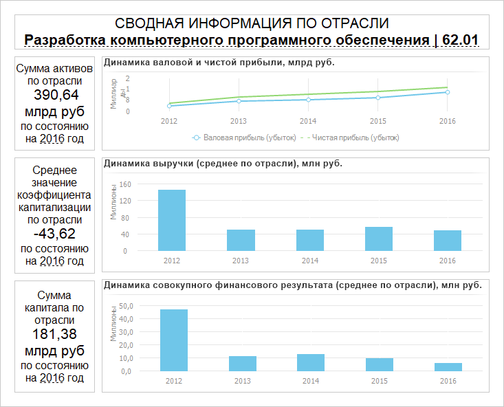

# Настройка отчета «Аналитическая панель»

Настройка отчета «Аналитическая панель»
-

# Настройка отчёта «Аналитическая панель»

Блок строится на базе аналитической панели из репозитория.

Примечание.
 Построение блока типа «Аналитическая
 панель» доступно только в настольном приложении.

Для вставки отчета используйте:

	- команду «Аналитическая панель»
	 в раскрывающемся меню кнопки «Отчёты»
	 на вкладке ленты «Главная»;

	- кнопку «Аналитическая панель»
	 в группе «Отчёты» на вкладке
	 ленты «Вставка»;

	- команду «Аналитическая панель»
	 в раскрывающемся меню пункта «Новый
	 блок» в контекстном меню аналитической панели.

Затем задайте [источник данных](Reports.htm). В качестве
 источника данных может выступать любая аналитическая панель в репозитории,
 кроме текущей аналитической панели, то есть аналитическую панель нельзя
 вставить в саму себя.

Пример блока «Аналитическая панель»:

## Операции с отчётом «Аналитическая панель»

Для отчёта «Аналитическая панель»
 доступны все операции с объектами, приведенные в разделах «[Построение
 аналитической панели](../../Document/Work.htm)» и «[Вставка и настройка
 отчётов](Reports.htm)». Также для отчета доступно:

[Настройка синхронизации
 измерений отчёта](javascript:TextPopup(this))

	Синхронизация измерений позволяет управлять отметкой элементов сразу
	 в нескольких блоках аналитической панели.

	Для настройки синхронизации измерений отчёта используйте вкладку
	 «[Синхронизация
	 измерений](../Dimension_links.htm)» на боковой панели.

См. также:

[Вставка и
 настройка отчётов](Reports.htm)

		Справочная
		 система на версию 10.9
		 от 18/08/2025,
		 © ООО «ФОРСАЙТ»,
