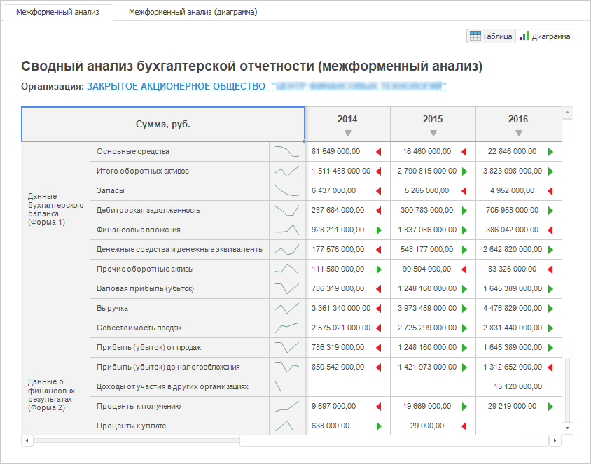

# Настройка экспресс-отчёта

Настройка экспресс-отчёта
-

# Настройка экспресс-отчёта

Блок строится на базе [экспресс-отчета](UiExpress.chm::/purpose/UiExpress_Purpose.htm)
 из репозитория.

Для вставки отчёта используйте:

	- команду «Экспресс-отчёт»
	 в раскрывающемся меню кнопки «Отчёты»
	 на вкладке ленты «Главная»;

	- кнопку «Экспресс-отчёт»
	 в группе «Отчёты» на вкладке
	 ленты «Вставка»;

	- команду «Экспресс-отчёт»
	 в раскрывающемся меню пункта «Новый
	 блок» в контекстном меню аналитической панели.

Затем задайте [источник данных](Reports.htm).

Примечание.
 По умолчанию доступно создание только блоков типа «Регламентный
 отчет» и «Аналитическая панель».
 Для вставки блока «Экспресс-отчет»
 требуются дополнительные настройки. Данные настройки не влияют на доступность
 отчётов в сохраненных аналитических панелях. Подробнее см. раздел: «[Как сделать доступным создание блоков,
 предназначенных для работы с отчетами?](../../FAQ/Reports.htm)».

Пример блока «Экспресс-отчёт»:

## Операции с экспресс-отчётом

Для экспресс-отчёта доступны все операции с объектами, приведенные в
 разделах «[Построение аналитической панели](../../Document/Work.htm)»
 и «[Вставка и настройка отчётов](Reports.htm)». Также для отчёта
 доступно:

[Управление представлениями
 данных](javascript:TextPopup(this))

	Представление - это способ отображение данных экспресс-отчёта. Доступны
	 следующие представления: таблица, диаграмма, карта, пузырьковая диаграмма,
	 пузырьковое и плоское деревья.

	Скрытие/отображение представлений выполняется с помощью группы переключателей,
	 расположенных в правой верхней части отчёта. Название переключателей
	 совпадает с названием представлений данных. Работа с каждой формой
	 представления аналогична работе с одноименным визуализатором.

	Операции, доступные для представлений:

		- [таблица](../Gadgets/Table.htm):

		-

			- сортировка значений;

			- детализация/обобщение данных;

			- исключение данных их таблицы;

			- расчёт статистических характеристик;

			- настройка боковика, шапки и уголка таблицы;

			- применение расширенной аналитики;

		- [диаграмма](../Gadgets/Diagram.htm):

		-

			- скрытие/отображение ряда;

			- отображение скрытых элементов легенды;

			- расчёт статистических характеристик;

			- детализация/обобщение данных;

		- [карта](../Gadgets/Map.htm):

		-

			- детализация/обобщение данных;

			- проигрывание анимации;

		- [пузырьковая
		 диаграмма](../Gadgets/Bubbles.htm), [пузырьковое](../Gadgets/Bubble_Tree.htm)
		 и [плоское](../Gadgets/Map_Tree.htm) деревья:

		-

			- проигрывание анимации.

	Для выполнения операций используйте команды из подменю «Экспресс-отчет»
	 в контекстном меню отчёта.

[Настройка синхронизации
 измерений отчёта](javascript:TextPopup(this))

	Синхронизация измерений позволяет управлять отметкой элементов сразу
	 в нескольких блоках аналитической панели.

	Для настройки синхронизации измерений отчёта используйте вкладку
	 «[Синхронизация
	 измерений](../Dimension_links.htm)» на боковой панели.

См. также:

[Вставка и
 настройка отчётов](Reports.htm) | Аналитические запросы (OLAP): [назначение и
 основные возможности](UiExpress.chm::/purpose/UiExpress_Purpose.htm)

		Справочная
		 система на версию 10.9
		 от 18/08/2025,
		 © ООО «ФОРСАЙТ»,
