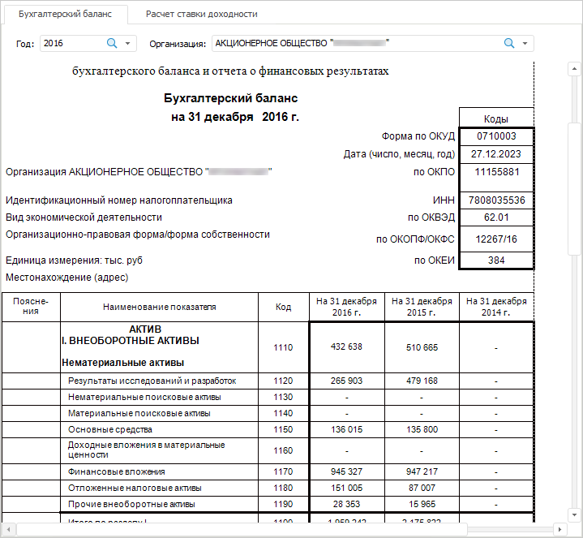

# Настройка регламентного отчёта

Настройка регламентного отчёта
-

# Настройка регламентного отчёта

В продукте «Форсайт. Аналитическая платформа»
 блок строится на базе [регламентного
 отчёта](UiReport.chm::/UiReport_purpose.htm) из репозитория.

Для вставки отчёта используйте:

	- команду «Регламентный отчёт»
	 в раскрывающемся меню кнопки «Отчёты»
	 на вкладке «Главная» ленты
	 инструментов;

	- кнопку «Регламентный отчёт»
	 в группе «Отчёты» на вкладке
	 «Вставка» ленты инструментов;

	- команду «Регламентный отчёт»
	 в раскрывающемся меню пункта «Новый
	 блок» в контекстном меню аналитической панели.

Затем задайте [источник данных](Reports.htm).

Пример блока «Регламентный отчёт»:

## Операции с регламентным отчётом

Для регламентного отчёта доступны все операции с объектами, приведенные
 в разделах «[Построение аналитической
 панели](../../Document/Work.htm)» и «[Вставка и настройка отчётов](Reports.htm)».
 Также для отчёта доступно:

[Переключение
 между листами отчёта](javascript:TextPopup(this))

	Для перехода к нужному листу щёлкните по его вкладке. Если вкладки
	 всех листов не помещаются в блок, то отображаются кнопки для навигации:

		- .
		 Прокручивает вкладки влево;

		- .
		 Отображает список всех листов. Для перехода к требуемому листу
		 щелкните по его наименованию;

		- .
		 Прокручивает вкладки вправо.

[Настройка синхронизации
 измерений отчёта](javascript:TextPopup(this))

	Синхронизация измерений позволяет управлять отметкой элементов сразу
	 в нескольких блоках аналитической панели. Синхронизация доступна,
	 если регламентный отчёт содержит элемент управления, настроенный на
	 измерение источника данных.

	Для настройки синхронизации измерений отчёта используйте вкладку
	 «[Синхронизация
	 измерений](../Dimension_links.htm)» на боковой панели.

См. также:

[Вставка и
 настройка отчётов](Reports.htm) | Инструмент «Отчёты»:
 [назначение
 и основные возможности](UiReport.chm::/UiReport_purpose.htm)

		Справочная
		 система на версию 10.9
		 от 18/08/2025,
		 © ООО «ФОРСАЙТ»,
