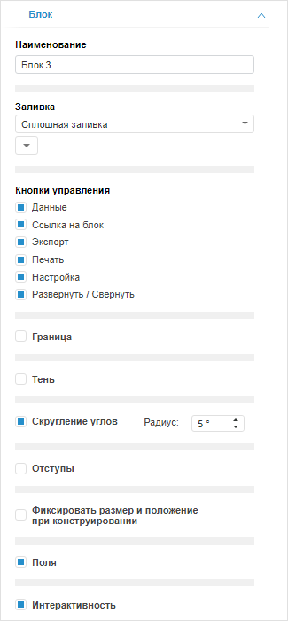
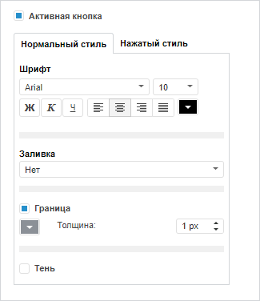
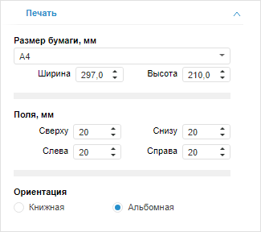

# Настройка формата

Настройка формата
-

# Настройка формата

	Настройка формата может быть выполнена для отдельного [объекта](Block_BaseProps.htm#adjust_base_params)
	 или для всей аналитической панели целиком.

## Настройка формата объекта

	Для настройки формата объекта используйте вкладку «Блок»,
	 расположенную на боковой панели.

	[Для отображения
	 вкладки](javascript:TextPopup(this))

			- Убедитесь, что боковая панель отображается.

			- Выделите объект в рабочей области.

			- Если выделен визуализатор, то установите на боковой
			 панели переключатель «Блок».

			- Перейдите на вкладку «Блок».

	

	Примечание.
	 Набор параметров отличается в зависимости от типа выбранного объекта.

	Для объектов доступна настройка следующих параметров:

	[Наименование](javascript:TextPopup(this))

		Введите наименование объекта. Наименование объекта используется
		 для идентификации объектов в аналитической панели.

	[Кнопки
	 управления](javascript:TextPopup(this))

		Установите флажки около требуемых кнопок управления объектом
		 для их отображения. Кнопки управления объектом [отображаются](../Work/InteractiveElements.htm)
		 в правом верхнем углу объекта и позволяют быстро выполнять базовые
		 операции по управлению объектом, а также расширяют возможности
		 объекта, если аналитическая панель находится в [режиме
		 просмотра](../Launching.htm).

		Примечание.
		 Кнопки управления доступны для всех объектов, кроме блоков «[Надпись](../Blocks/Other/Label.htm)»
		 и «[Текст](../Blocks/Other/Text.htm)».

		Для каждого типа объектов набор доступных кнопок отличается.
		 Возможные кнопки:

			- Данные. Предназначена
			 для [отображения данных](../Blocks/Gadgets/Gadgets.htm),
			 на основании которых строится объект. Доступна только для
			 визуализаторов, кроме визуализатора типа «[Таблица](../Blocks/Gadgets/Table.htm)»;

			- Ссылка на блок.
			 Предназначена для получения ссылки на объект. Доступна только
			 в веб-приложении;

			- Экспорт. Предназначена
			 для [экспорта](Export.htm) объекта. Доступна только
			 для визуализаторов и отчетов;

			- Печать. Предназначена
			 для печати объекта;

			- Настройка. Предназначена
			 для [быстрой настройки
			 объекта](../Blocks/Gadgets/Gadgets.htm). Доступна только для визуализаторов;

			- Развернуть/Свернуть.
			 Предназначена [разворачивания/сворачивания
			 объекта](SizePosition.htm#expand_collapse_block).

	[Заливка](javascript:TextPopup(this))

		Укажите режим заливки фона объекта:

			- Нет. По умолчанию.
			 Заливка фона не применяется;

			- Сплошная заливка.
			 Заливка фона выполняется одним цветом. Доступен дополнительный
			 параметр для указания цвета заливки;

			- Градиентная заливка.
			 Заливка фона выполняется с помощью двуцветного градиента.
			 Доступны дополнительные параметры для указания угла градиента
			 и его начального и конечного цветов.

	[Адаптивность
	 таблицы](javascript:TextPopup(this))

		Установите флажок для изменения размера таблицы в зависимости
		 от размера блока. Флажок доступен только в веб-приложении для
		 блоков «[Таблица](../Blocks/Gadgets/Table.htm)»,
		 «[Регламентный
		 отчёт](../Blocks/Reports/Procedural_report.htm)» и «[Экспресс-отчёт](../Blocks/Reports/Express_Report.htm)».

		Для настройки адаптивности таблицы установите один из переключателей:

			- Автоподгонка.
			 По умолчанию выполняется автоподгонка таблицы по ширине и
			 высоте блока. Для изменения размера таблицы используйте флажки:

				- По ширине.
				 Ширина таблицы автоматически подстраивается по ширине
				 блока;

				- По высоте.
				 Высота таблицы автоматически подстраивается по высоте
				 блока.

		Если флажки «По
		 ширине», «По высоте»
		 сняты, то таблица принимает исходный размер;

			- Масштабировать содержимое
			 таблицы. Размер таблицы и шрифт текста подстраиваются
			 под размеры блока.

		Если содержимое таблицы выходит за границы блока, то при использовании
		 автоподгонки или масштабирования содержимое таблицы отображается
		 в рамках блока без полос прокрутки.

		По умолчанию флажок снят и размер таблицы не зависит от размера
		 блока. В таком случае отображаются полосы прокрутки, если содержимое
		 таблицы выходит за границы блока.

	[Граница](javascript:TextPopup(this))

		Используйте флажок для отображения границы объекта. По умолчанию
		 флажок установлен и граница отображается. Для задания толщины
		 границы используйте соответствующее поле.

	[Тень](javascript:TextPopup(this))

		Установите флажок для отображения тени объекта. При установленном
		 флажке отображаются:

			- кнопка  «Цвет
			 тени» для отображения раскрывающейся палитры и выбора
			 цвета тени объекта;

			- дополнительные параметры тени:

				- Толщина.
				 Толщина тени;

				- Интенсивность.
				 Степень прозрачности тени. Значение в интервале [0, 100].
				 Чем больше значение, тем менее прозрачная тень: 0 - тень
				 полностью прозрачная, 100 - тень полностью непрозрачная.

		По умолчанию флажок снят и тень объекта не отображается.

	[Скругление
	 углов](javascript:TextPopup(this))

		Установите флажок для скругления углов объекта. После установки
		 флажка отображается поле «Радиус»
		 для ввода радиуса скругления углов. Диапазон допустимых значений:
		 [0, 25]. Флажок доступен только в веб-приложении.

		По умолчанию флажок снят и углы объекта не скругляются.

	[Отступы](javascript:TextPopup(this))

		Установите флажок для задания внутренних отступов в объекте.
		 При установленном флажке отображаются поля для ввода размера отступов.

		По умолчанию флажок снят и внутренние отступы не используются.

	[Фиксировать
	 размер и положение при конструировании](javascript:TextPopup(this))

		Примечание.
		 Возможность доступна, если используется [автоматический
		 режим](Layout_mode.htm#automatic_placement) размещения объектов.

		Установите флажок для фиксирования объекта. При добавлении и
		 удалении других блоков размер и положение фиксированного объекта
		 не изменяются. Изменить размер фиксированного объекта можно только
		 вручную. При изменении масштаба родительского объекта размер фиксированного
		 объекта масштабируется пропорционально родительскому объекту.

		По умолчанию флажок снят для всех объектов, кроме [элементов
		 управления](../Blocks/Controls/Controls.htm).

	[Поля](javascript:TextPopup(this))

		Установите флажок для отображения внешних полей объекта. По
		 умолчанию флажок снят и внешние поля не используются.

	[Интерактивность](javascript:TextPopup(this))

		Используйте флажок для настройки интерактивности блоков. Интерактивность
		 - это свойство, позволяющее выделять и изменять область данных
		 в блоке, например, детализация данных.

		По умолчанию флажок установлен и все блоки интерактивны при
		 открытии аналитической панели на просмотр. При открытии аналитической
		 панели на редактирование блоки всегда интерактивны вне зависимости
		 от состояния флажка.

		Примечание.
		 В веб-приложении флажок доступен для всех объектов, кроме блоков
		 «[Кнопка](../Blocks/Controls/Button.htm)» и «[Рисунок](../Blocks/Other/Picture.htm)». Для настройки
		 интерактивности кнопок и рисунков в веб-приложении используйте
		 флажок «[Активная
		 кнопка](#active_button)».

		Для отключения интерактивности откройте аналитическую панель
		 на редактирование и снимите флажок для требуемого блока. При открытии
		 аналитической панели на просмотр блок будет неинтерактивен.

		Примечание.
		 Отключение интерактивности недоступно для [элементов
		 контейнера](../Blocks/Create_markup.htm).

		Для блока с отключенной интерактивностью останутся доступны:

			- [всплывающие
			 подсказки](UiDiagrams.chm::/Params_diagram/Tooltips.htm);

			- [синхронизация
			 измерений](../Blocks/Dimension_links.htm);

			- [кнопки управления](#control_buttons).

		Для отключения вышеуказанных опций откройте аналитическую панель
		 на редактирование и задайте соответствующие настройки.

	[Активная
	 кнопка](javascript:TextPopup(this))

		Установите флажок для настройки поведения и оформления состояний
		 блока. Флажок доступен только в веб-приложении для блоков «[Кнопка](../Blocks/Controls/Button.htm)» и «[Рисунок](../Blocks/Other/Picture.htm)».

		Для настройки состояний блока:

			- Установите флажок «Активная
			 кнопка».

			- Настройте оформление состояний.

			- Добавьте [команды](../Blocks/Controls/Button.htm#button_items_control),
			 которые требуется выполнить при нажатии на блок.

			- Настройте команду «[Деактивировать
			 кнопку/рисунок](../Blocks/Controls/Button.htm#deactivate)» для другого блока типа «[Кнопка](../Blocks/Controls/Button.htm)»
			 или «[Рисунок](../Blocks/Other/Picture.htm)»
			 и свяжите его с исходным блоком. При нажатии на данный блок
			 состояние исходного блока будет возвращаться в нормальное
			 состояние.

		В результате для блока будет настроено поведение состояний.

		Для настройки оформления нормального и нажатого состояний блока
		 предназначены группы параметров «Нормальный
		 стиль» и «Нажатый стиль»
		 соответственно, отображающиеся при установке флажка «Активная
		 кнопка». Под нормальным состоянием понимается ненажатое
		 состояние блока:

		

		По умолчанию флажок снят и блок находится только в нормальном
		 состоянии.

		Набор настроек в группах параметров «Нормальный
		 стиль» и «Нажатый стиль»
		 полностью совпадает и зависит от типа блока. Доступны следующие
		 настройки:

			- [Шрифт](../Blocks/Controls/Button.htm#font).
			 Доступно только для блоков типа «[Кнопка](../Blocks/Controls/Button.htm)»;

			- [Заливка](#fill);

			- [Граница](#border);

			- [Тень](#shadow).

		Примечание.
		 При снятом флажке указанные настройки также доступны и предназначены
		 для настройки только нормального состояния.

		При открытии аналитической панели на просмотр блок, для которого
		 были настроены стили состояний, будет по умолчанию находиться
		 в нормальном состоянии. Нажмите на блок для переключения его в
		 нажатое состояние, при этом его оформление будет изменено в соответствии
		 со стилем, настроенным для данного состояния.

		Для возможности возврата нажатого блока в нормальное состояние
		 настройте команду «[Деактивировать
		 кнопку/рисунок](../Blocks/Controls/Button.htm#deactivate)» для другого блока типа «[Кнопка](../Blocks/Controls/Button.htm)» или
		 «[Рисунок](../Blocks/Other/Picture.htm)».

### Копирование/вставка параметров оформления
	 объекта

	Параметры оформления одного объекта можно скопировать и применить
	 для оформления другого объекта. Например, формат одного блока, скопировать
	 из формата другого блока.

	Для копирования оформления выделите объект и нажмите кнопку  «Формат по образцу» на вкладке «Главная» ленты инструментов.
	 Затем выберите объект, куда нужно скопировать оформление.

## Настройка базовых параметров аналитической
	 панели

	Для настройки формата аналитической панели перейдите на вкладку
	 «Документ» боковой панели.

	[Для отображения
	 вкладки](javascript:TextPopup(this))

			- Убедитесь, что боковая панель отображается.

			- Щелкните по пустому пространству в рабочей области.

			- Перейдите на вкладку «Документ».

	

	Примечание.
	 Набор параметров на вкладке зависит от [режима
	 создания](../Launching.htm#create) и [режима компоновки](Layout_mode.htm#layoutingmode)
	 аналитической панели.

	Параметры, доступные в [любом
	 режиме](Layout_mode.htm#layoutingmode) компоновки аналитической панели:

	[Заливка](javascript:TextPopup(this))

		Выберите из раскрывающегося списка режим заливки фона аналитической
		 панели:

			- Нет. Заливка
			 фона не применяется. Используется по умолчанию;

			- Сплошная заливка.
			 Заливка фона выполняется одним цветом. Доступен дополнительный
			 параметр для указания цвета заливки;

			- Градиентная заливка.
			 Заливка фона выполняется с помощью двуцветного градиента.
			 Доступны дополнительные параметры для указания угла градиента
			 и его начального и конечного цветов.

		Примечание.
		 Возможность доступна везде, кроме аналитической панели в веб-приложении
		 в режиме ручной компоновки.

	[Отступы](javascript:TextPopup(this))

		Установите флажок для задания внутренних отступов в аналитической
		 панели. При установленном флажке отображаются поля для ввода размера
		 отступов.

		По умолчанию флажок снят и внутренние отступы не используются.

		Примечание.
		 Возможность доступна везде, кроме аналитической панели в веб-приложении
		 в режиме ручной компоновки.

	Параметры, доступные только в [ручном
	 режиме](Layout_mode.htm#manual_placement) компоновки аналитической панели:

	[Привязка
	 к сетке](javascript:TextPopup(this))

		Привязка к сетке позволяет привязывать объекты к ячейкам сетки.
		 Для включения привязки:

			- Установите флажок «Привязка
			 к сетке».

			- Задайте размер ячеек сетки в поле «Размер
			 шага сетки».

		В результате в рабочей области будет отображена сетка.

	[Пользовательский
	 размер](javascript:TextPopup(this))

		В настольном приложении доступно задание пользовательского размера
		 рабочей области. Для этого:

			- Установите флажок «Пользовательский
			 размер».

			- В поле «Ширина»
			 и «Высота» задайте
			 размер рабочей области в пикселях. Для установки размера рабочей
			 области по размеру экрана нажмите кнопку «По
			 размеру экрана».

			- Задайте размещение блоков. По умолчанию расположение
			 блоков полностью определяет пользователь. При установке флажка
			 «Друг за другом» блоки
			 будут распределены по следующим правилам:

				- блоки не перекрывают друг друга;

				- размер блоков не изменятся;

				- блоки располагаются подряд по горизонтали, начиная
				 от верхнего левого угла панели. Каждый последующий блок,
				 не помещающийся в ряд, переносится ниже на ближайшую доступную
				 по высоте позицию;

				- при изменении размера рабочей области и при скрытии
				 или удалении блоков положение отображаемых блоков перестраивается
				 в соответствии с вышеперечисленными принципами.

		Если флажок «Друг
		 за другом» установлен, то отображается дополнительный флажок
		 «В ряд», определяющий
		 режим размещения блоков. По умолчанию данный флажок снят.
		 Если флажок установлен, то все блоки размещаются в один вертикальный
		 ряд.

## Параметры печати и экспорта аналитической
	 панели

	Для настройки параметров печати и экспорта аналитической панели
	 перейдите на вкладку «Печать»
	 боковой панели.

	Примечание.
	 Возможность доступна только в веб-приложении.

	[Для отображения
	 вкладки](javascript:TextPopup(this))

			- Убедитесь, что боковая панель отображается.

			- Щелкните по пустому пространству в рабочей области.

			- Перейдите на вкладку «Печать».

	

	Доступные параметры:

	[Размер
	 бумаги, мм](javascript:TextPopup(this))

		Выберите один из предустановленных размеров бумаги из раскрывающегося
		 списка «Размер бумаги, мм»
		 или укажите собственный размер в полях «Ширина»
		 и «Высота».

	[Поля,
	 мм](javascript:TextPopup(this))

		Задайте размер полей аналитической панели.

	[Ориентация](javascript:TextPopup(this))

		Укажите ориентацию аналитической панели: книжная или альбомная.

	Примечание.
	 Параметры печати и экспорта не влияют на отображение аналитической
	 панели в рабочей области.

См. также:

[Настройка
 внешнего вида элемента эскиза](AdjustingAppearance.htm)

		Справочная
		 система на версию 10.9
		 от 18/08/2025,
		 © ООО «ФОРСАЙТ»,
