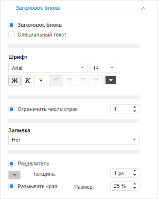
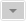

# Настройка заголовка

Настройка заголовка
-

# Настройка заголовка

Для отображения заголовка выделенного объекта установите флажок «Заголовок блока» на вкладке «Заголовок блока» в боковой панели.

По умолчанию флажок снят и заголовок объекта не отображается. После
 установки флажка на вкладке «Заголовок
 блока» в боковой панели доступны дополнительные параметры для настройки
 параметров заголовка.

Примечание.
 Для блоков «Кнопка» и «Надпись» создание заголовка недоступно.

[Для отображения
 вкладки](javascript:TextPopup(this))

		- Убедитесь, что боковая панель отображается.

		- Выделите объект в рабочей области.

		- Если выделен визуализатор, то установите на боковой панели
		 переключатель «Блок».

		- Перейдите на вкладку «Заголовок
		 блока».

Если флажок «Заголовок блока»
 установлен, то заголовок отображается и доступны следующие операции:

[Настройка
 специального текста заголовка](javascript:TextPopup(this))

	По умолчанию заголовок объекта совпадает с наименованием объекта.
	 Для изменения заголовка установите флажок «Специальный
	 текст». Будет отображено поле для редактирования текста заголовка.

	Для возвращения заголовка по умолчанию снимите флажок «Специальный
	 текст».

[Настройка
 шрифта заголовка](javascript:TextPopup(this))

	Для настройки шрифтового оформления заголовка используйте группу
	 параметров «Шрифт»:

		- Шрифт.
		 Выберите один из шрифтов, установленных в операционной системе;

		- Размер
		 шрифта. Установите требуемый размер шрифта. Размер задаётся
		 в пунктах, и его можно выбрать из раскрывающегося списка или ввести
		 вручную. Диапазон допустимых значений: [1, 72];

		- Начертание
		 текста. Нажмите кнопки, задающие начертание шрифта:

			- Ж. Полужирное
			 начертание;

			- К. Курсивное
			 начертание;

			- Ч. Подчеркивание
			 текста.

	При нажатой кнопке будет использоваться
	 соответствующий стиль начертания. Доступно использование нескольких
	 стилей одновременно, например, нажатие кнопок «Ж»
	 и «К» даёт полужирное курсивное
	 начертание;

		- Выравнивание текста заголовка. Задайте выравнивание заголовка
		 относительно объекта:

			-  По левому краю. Используется по
			 умолчанию;

			-  По центру;

			-  По правому краю;

			-  По ширине;

		- Цвет шрифта. Выберите
		 цвет шрифта в раскрывающейся палитре цветов.

[Ограничение
 количества строк в заголовке](javascript:TextPopup(this))

	Ограничением количества строк в заголовке можно управлять с помощью
	 флажка «Ограничить число строк».
	 По умолчанию флажок установлен и количество строк в заголовке ограничено
	 значением, указанным в соответствующем поле. Если весь текст заголовка
	 не помещается в заданное число строк, то в конце последней строки
	 отображается троеточие. Для просмотра полного текста заголовка в виде
	 всплывающей подсказки наведите на него указатель мыши.

	Для автоматического определения количества строк в заголовке, исходя
	 из размера текста, снимите флажок «Ограничить
	 число строк».

[Настройка
 заливки заголовка](javascript:TextPopup(this))

	Для выбора режима заливки заголовка используйте параметр «Заливка». Доступные режимы заливки:

		- Нет. Заливка фона
		 не применяется. Используется по умолчанию;

		- Сплошная заливка.
		 Заливка фона выполняется одним цветом. Доступен дополнительный
		 параметр для указания цвета заливки;

		- Градиентная заливка.
		 Заливка фона выполняется с помощью двуцветного градиента. Доступны
		 дополнительные параметры для указания угла градиента и его начального
		 и конечного цветов.

[Настройка
 разделителя заголовка](javascript:TextPopup(this))

	Разделитель - это линия, которая отделяет заголовок объекта от его
	 содержимого. Для управления отображением разделителя используйте флажок
	 «Разделитель». По умолчанию
	 флажок установлен и разделитель отображается, а также доступны его
	 дополнительные параметры:

		- 
		 Цвет разделителя;

		- Толщина. Толщина
		 линии разделителя;

		- Размывать края.
		 Определяет, размывать ли края линии-разделителя. По умолчанию
		 флажок установлен и края разделителя размываются. Величина зоны
		 размытия указывается в поле «Размер».

	Для скрытия разделителя снимите флажок «Разделитель».

См. также:

[Настройка
 внешнего вида элемента эскиза](AdjustingAppearance.htm)

		Справочная
		 система на версию 10.9
		 от 18/08/2025,
		 © ООО «ФОРСАЙТ»,
