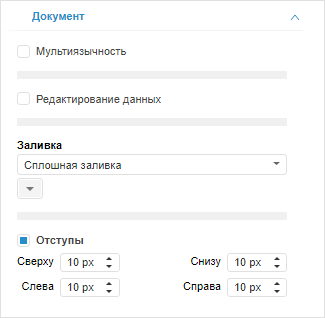

# Включение режима редактирования данных

Включение режима редактирования данных
-

# Включение режима редактирования данных

По умолчанию редактирование табличных данных недоступно.

Для разрешения редактирования табличных данных установите флажок «Редактирование данных» на вкладке
 «Документ» боковой панели. Для
 запрета редактирования снимите флажок «Редактирование
 данных».

Примечание.
 Редактирование данных доступно, если у пользователя есть соответствующие
 права.

[Для отображения
 вкладки](javascript:TextPopup(this))

		- Убедитесь, что боковая панель отображается.

		- Щелкните по пустому пространству в рабочей области.

		- Перейдите на вкладку «Документ».

Для получения подробной информации о редактировании данных обратитесь
 к разделу «[Редактирование
 и сохранение данных](UiAnalyticalArea.chm::/Working_with_table_data/Edit_and_save_data.htm)».

См. также:

[Использование
 дополнительных сервисов в аналитической панели](Document_tuning.htm)

		Справочная
		 система на версию 10.9
		 от 18/08/2025,
		 © ООО «ФОРСАЙТ»,
