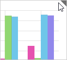

# Экспорт аналитической панели

Экспорт аналитической панели
-

# Экспорт аналитической панели

Для экспорта:

	- аналитической панели.
	 Выполните команду «Экспорт»
	 в главном меню и выберите необходимый формат для экспорта;

	- выбранного объекта:

		- Отобразите кнопки управления объектом:

Наведите указатель мыши на уголок в правом верхнем углу блока:

Будут отображены [кнопки управления](Block_BaseProps.htm)
 объектом, например:

		- Нажмите кнопку  и в раскрывшемся меню
		 выберите пункт «Экспорт».

		- Выберите необходимый формат для экспорта.

В настольном приложении будет открыт диалог для выбора места экспорта
 и задания имени файла, в веб-приложении аналитическая панель будет экспортирована
 в папку загрузок используемого браузера.

Доступные форматы экспорта:

	- книга Excel (*.xlsx);

	- книга Excel 97-2003 (*.xls);

	- электронная таблица OpenDocument (*.ods). Доступно только для
	 экспорта отдельного блока, содержащего инструмент «[Отчёты](../Blocks/Reports/Procedural_report.htm)»,
	 в веб-приложении;

	- документ PDF (*.pdf);

	- документ в формате RTF (*.rtf);

	- веб-страница (*.html);

	- веб-страница, архив в одном файле (*.mht);

	- изображение (*.emf);

	- изображение (*.png);

	- презентация PowerPoint (*.pptx);

	- аналитическая панель (*.ppdash).

Примечание.
 Формат PPDASH является внутренним форматом продукта «Форсайт. Аналитическая платформа»
 и служит для выгрузки аналитической панели в локальный файл для последующей
 работы без связи с репозиторием.

Экспорт в дополнительные форматы может быть реализован на прикладном уровне.

## Особенности экспорта

В зависимости от выбранного формата можно выделить следующие особенности
 экспорта:

	- визуализатор «[Индикатор](../Blocks/Gadgets/Indicator.htm)»,
	 [интерактивные элементы управления](../Blocks/Controls/Controls.htm),
	 [надписи](../Blocks/Other/Label.htm), [рисунки](../Blocks/Other/Picture.htm),
	 [HTML-контент](../Blocks/Other/html_link.htm) и [плагины](../Blocks/Plugins/Plugins.htm)
	 доступны только при экспорте аналитической панели в формат PNG;

	- если блок содержит инструмент «[Аналитическая панель](../Blocks/Reports/Dashboard.htm)»,
	 то экспорт аналитической панели в любой из форматов недоступен;

	- блоки, содержащие инструмент «[Отчёты](../Blocks/Reports/Procedural_report.htm)»,
	 не экспортируются с другими типами блоков;

	- все блоки экспортируются с установленной в них отметкой элементов;

	- если блок содержит заголовок и при экспорте размещается на нескольких
	 страницах, то заголовок блока будет использован в качестве колонтитула;

	- спарклайны экспортируются только в форматы: PDF, EMF, PPDASH;

	- при экспорте аналитической панели в формат PPDASH не экспортируются
	 отчёты «[Временные
	 ряды](../Blocks/Reports/TimeSeries.htm)». При последующем открытии аналитической панели из
	 файла формата PPDASH соответствующие блоки будут пустыми;

	- при экспорте аналитической панели в форматы PDF и PPTX размеры
	 блоков подгоняются в соответствии с установленными параметрами страницы.

Совет.
 Для настройки параметров страницы перейдите на вкладку «[Документ](Block_BaseProps.htm#dashboardformat)» боковой
 панели.

При экспорте аналитической панели, содержащей [сноски](UiAnalyticalArea.chm::/TableView/Table_footnotes.htm)
 в визуализаторе «[Таблица](../Blocks/Gadgets/Table.htm)»,
 необходимо помнить, что:

	- [сноски](UiAnalyticalArea.chm::/TableView/Table_footnotes.htm)
	 экспортируются только в следующие форматы: PDF, EMF, RTF, XLS, XLSX.
	 При экспорте в формат RTF нумерация сносок в документе будет упорядочена
	 по листам: от первого к последнему;

	- при экспорте в XLS или XLSX:

		- по умолчанию сноски не экспортируются. Номера сносок экспортируются,
		 если с помощью Fore заданы соответствующие настройки. Текст сносок
		 не экспортируется;

		- формат ячеек, содержащих сноски, будет изменен на текстовый.
		 В связи с этим:

			- вид диаграммы может отличаться от вида в исходной рабочей
			 книге;

			- формулы, для которых были заданы сноски, будут отображаться
			 в виде текста;

			- не будут рассчитаны формулы, которые ссылаются на ячейки
			 со сносками.

[Экспорт
 в файл формата XLS или XLSX](javascript:TextPopup(this))

	При экспорте в формат XLS и XLSX диаграмма экспортируется как объект,
	 работа с которым осуществляется как с диаграммой средствами Microsoft
	 Excel.

	Примечание.
	 Типы диаграмм, которые не поддерживают форматы XLS и XLSX, экспортируются
	 в виде изображений. При экспорте [каскадной
	 диаграммы](uidiagrams.chm::/Type_diagrams/WaterFall_chart.htm) вид диаграммы будет отличаться от исходного
	 из-за несоответствия настроек. В формат XLSX экспорт выполняется в
	 виде диаграммы, в XLS - изображения.

	В результирующем файле каждый блок аналитической панели располагается
	 на отдельном листе. Если таблица данных скрыта, а диаграмма отображена,
	 то в файле экспорта лист с таблицей данных будет скрыт, о чем будет
	 дополнительно сообщено.

[Экспорт
 в файл формата PDF](javascript:TextPopup(this))

	При экспорте аналитической панели в формат PDF учитывайте следующие
	 особенности:

		- текстура ячеек в аналитической панели и в результирующем
		 файле могут различаться;

		- отображение в легенде обозначений рядов данных диаграммы
		 в аналитической панели и в результирующем файле могут различаться;

		- отображение в легенде названий рядов данных может быть неполным;

		- отображение символов китайского или арабского языка может
		 быть неполным или некорректным;

		- в зависимости от выбранного шрифта отображение текста, написанного
		 с использованием русского алфавита и курсивного начертания, может
		 быть некорректным.

	В настольном приложении и веб-приложении принципы экспорта аналитической
	 панели в формат PDF отличаются. При выполнении экспорта в настольном
	 приложении в результирующем файле блоки аналитической панели будут
	 располагаться на отдельных страницах и отображаться в соответствии
	 с параметрами страницы. При выполнении экспорта в веб-приложении в
	 результирующем файле блоки аналитической панели будут располагаться
	 на отдельных страницах или на одной странице в зависимости от значения
	 атрибута [ClientPDFExport](Setup.chm::/UiWebSetup/03_setup_web/PP_config_Java.htm#modules)
	 в файле [PP.xml](Setup.chm::/UiWebSetup/03_setup_web/PP_config_Java.htm).

[Экспорт
 в файл формата PPTX](javascript:TextPopup(this))

	При экспорте аналитической панели, содержащей оформление ячеек,
	 в презентацию PowerPoint будет выгружен только один тип оформления
	 со следующим приоритетом:

		- Изображение.

		- Условное форматирование.

		- Заливка ячейки.

См. также:

[Работа
 с готовой аналитической панелью](../Work/ViewMode.htm)

		Справочная
		 система на версию 10.9
		 от 18/08/2025,
		 © ООО «ФОРСАЙТ»,
