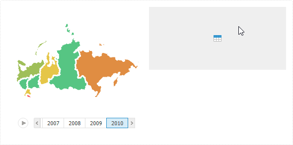
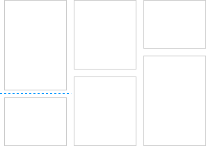
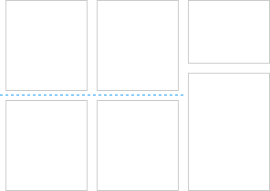

# Проектирование эскиза панели

Проектирование эскиза панели
-

# Проектирование эскиза панели

Этапы проектирования эскиза панели:

	- [Выбор режима компоновки
	 панели](Layout_mode.htm#layoutingmode).

	- [Выбор элементов эскиза
	 для компоновки панели](../Blocks/Create_markup.htm).

	- [Настройка внешнего вида элемента
	 эскиза](AdjustingAppearance.htm).

## Основные операции с объектами аналитической
 панели

На этапах проектирования эскиза также ведётся работа с объектами. Объектами
 аналитической панели являются: [элементы-контейнеры](../Blocks/Create_markup.htm),
 [визуализаторы](../Blocks/Gadgets/Gadgets.htm), [отчёты](../Blocks/Reports/Reports.htm),
 интерактивные [элементы управления](../Blocks/Controls/Controls.htm)
 и [прочие блоки](../Blocks/Other/Other.htm).

[Создание
 объекта](javascript:TextPopup(this))

	В конструкторе аналитических панелей предусмотрены различные способы
	 создания объектов:

		- С помощью ленты инструментов:

			- перейдите на вкладку «Главная»
			 ленты инструментов и используйте кнопки из группы «Вставка»;

			- перейдите на вкладку «Вставка»
			 ленты инструментов и используйте кнопки из групп: «Контейнеры»,
			 «Визуализаторы», «Отчёты», «Управление»,
			 «Другое».

		- С помощью контекстного меню аналитической панели или элемента-контейнера.
		 Вызовите контекстное меню и выберите пункт «Новый
		 блок». В отобразившемся меню выполните команду, соответствующую
		 типу создаваемого объекта.

		- С помощью вкладки «Источники
		 данных» на боковой панели. Выберите требуемый источник
		 данных и нажмите кнопку «Создать
		 объект». Тип создаваемого объекта зависит от выбранного
		 источника данных.

	Объект будет создан в том месте рабочей области, где последний раз
	 щелкнули мышью.

	Примечание.
	 При создании блоков, настроенных на один источник данных, [настройки
	 синхронизации измерений](../Blocks/Dimension_links.htm) отключены.

[Удаление
 объекта](javascript:TextPopup(this))

	Для удаления выделенного объекта:

		- нажмите клавишу DELETE;

		- выполните команду «Удалить»
		 в контекстном меню объекта.

	Объект будет удален без запроса подтверждения выполняемого действия.

[Выделение
 объектов](javascript:TextPopup(this))

	Для выделения одного объекта щелкните по нему мышью.

	Для выделения нескольких объектов:

		- зажмите клавишу CTRL и последовательно щёлкните по каждому
		 выделяемому объекту;

		- в веб-приложении используйте рамку для выделения объектов:

		-

			- Определите группу объектов,
			 которые требуется выделить.

			- Щелкните и зажмите кнопку
			 мыши за пределами группы выделяемых объектов.

			- Начните перемещать указатель
			 мыши. Будет отображена прямоугольная рамка.

			- Перемещайте указатель до
			 тех пор, пока все требуемые объекты не будут помещены в рамку.

			- Отпустите указатель мыши.
			 Все объекты, полностью или частично помещенные в рамку, будут
			 выделены.

[Работа
 с буфером обмена](javascript:TextPopup(this))

	При работе с объектами, расположенными на аналитической панели,
	 доступна работа с буфером обмена.

	Для копирования выделенных объектов в буфер обмена:

		- нажмите сочетание клавиш CTRL+C;

		- выполните команду «Копировать»
		 в контекстном меню объекта;

		- нажмите кнопку  «Копировать»
		 на вкладке «Главная» ленты
		 инструментов.

	Копии объектов будут помещены в буфер обмена.

	Для перемещения выделенных объектов в буфер обмена:

		- нажмите сочетание клавиш CTRL+X;

		- выполните команду «Вырезать»
		 в контекстном меню объекта;

		- нажмите кнопку  «Вырезать»
		 на вкладке «Главная» ленты
		 инструментов.

	Объекты будут перемещены в буфер обмена.

	Для вставки объектов из буфера обмена:

		- нажмите сочетание клавиш CTRL+V;

		- выполните команду «Вставить»
		 в контекстном меню в рабочей области
		 или элемента-контейнера;

		- нажмите кнопку  «Вставить»
		 на вкладке «Главная» ленты
		 инструментов.

	Объекты будут вставлены в то место рабочей области, где последний
	 раз щелкнули мышью.

	При работе с буфером обмена учитывайте следующие особенности:

		- копирование/перемещение/вставка нескольких объектов доступны,
		 если отключен режим [автоматического
		 размещения объектов](Layout_mode.htm#automatic_placement);

		- при копировании/перемещении/вставке блоков сохраняются все
		 [настройки формата](Block_BaseProps.htm#adjust_base_params),
		 в том числе [настройки
		 состояний](Block_BaseProps.htm#active_button);

		- при копировании/перемещении/вставке блоков сохраняются [настройки синхронизации](../Blocks/Dimension_links.htm)
		 связанных измерений.

[Дублирование
 объектов](javascript:TextPopup(this))

	Для создания дубликатов выделенных объектов выполните команду «Дублировать»:

		- в контекстном меню объекта;

		- в раскрывающемся меню кнопки  «Копировать» на вкладке «Главная» ленты инструментов.

	В рабочей области будут созданы дубликаты выделенных объектов.

	При дублировании объектов учитывайте следующие особенности:

		- дублирование нескольких объектов доступно, если отключен
		 режим [автоматического
		 размещения объектов](Layout_mode.htm#automatic_placement);

		- при дублировании блоков:

			- сохраняются все [настройки
			 формата блоков](Block_BaseProps.htm#adjust_base_params), в том числе [настройки
			 состояний](Block_BaseProps.htm#active_button);

			- сохраняются [настройки
			 синхронизации](../Blocks/Dimension_links.htm) связанных измерений;

			- сохраняются [настройки синхронизации](Params_sync.htm)
			 параметров измерений.

[
 Отмена/повтор операции над объектами](javascript:TextPopup(this))

	Для отмены или повтора операции над объектами обратитесь к разделу
	 «[Отмена/повтор операции над объектами
	 аналитической панели](../Work/Undo_Redo.htm)».

## Выбор режима компоновки панели

По умолчанию компоновка аналитической панели выполняется в [автоматическом
 режиме](Layout_mode.htm#automatic_placement), в котором размер блоков автоматически подбирается таким образом,
 чтобы панель размещалась на одном экране без полос прокрутки. Также доступно
 переключение в [ручной режим](Layout_mode.htm#manual_placement),
 в котором размер блоков и их расположение полностью задаются пользователем.
 Обратное переключение из ручного режима в автоматический недоступно.

### Автоматическое размещение объектов

Автоматическое размещение позволяет располагать объекты в рабочей области
 аналитической панели без необходимости выполнять выравнивание, привязку
 и изменение размеров создаваемых объектов.

Автоматическое размещение объектов выполняется по следующим принципам:

	- Первый объект добавляется таким образом, что он занимает всё
	 пространство рабочей области.

	- Добавление второго и последующих объектов выполняется таким
	 образом, что уже существующие объекты делятся пополам: по вертикали
	 или по горизонтали в зависимости от положения указателя мыши. Если
	 объект является элементом управления, то выполняется подгонка под
	 размеры элемента управления.

	Возможное положение объекта будет подсвечено и пользователю будет предложено
	 выбрать положение добавляемого объекта, например:

Для вставки объекта в выбранное положение
 щёлкните по нему.

Особенности автоматического размещения:

	- в автоматическом режиме при изменении размера объекта появляется
	 синяя пунктирная линия:

При совпадении границ объектов в соседних
 рядах такие ряды стыкуются. Пунктирная линия становится общей для этих
 рядов:

Изменение размеров всех объектов в стыкованных
 рядах выполняется вместе. Для изменения размера одного объекта в стыкованном
 ряду без изменения размера других зажмите клавишу SHIFT и потяните за
 границу объекта. Ряды при этом будут расстыкованы;

	- у каждого объекта есть минимальный размер. Если пользователь
	 уменьшает рабочую область, в которой содержится объект минимального
	 размера, то в нём будут отображены полосы прокрутки.

### Ручное размещение объектов

Ручное размещение позволяет располагать объекты в рабочей области аналитической
 панели произвольным образом с возможностью дальнейшего выравнивания, привязки
 и изменения размеров создаваемых объектов.

Для включения ручного размещения нажмите кнопку  «Вручную», расположенную в группе
 «Размещение блоков» на вкладке
 «Главная» ленты инструментов.

Важно. Обратное
 переключение из ручного режима в автоматический недоступно.

При ручном размещении доступна настройка [пользовательского
 размера](Block_BaseProps.htm#manual) рабочей области с помощью флажка «[Пользовательский размер](Block_BaseProps.htm#locate)»,
 расположенного на вкладке «Документ»/«Слайд» боковой панели:

	- если флажок установлен, то возможно выполнение следующих операций:

		- расположение блоков друг за другом;

		- задание фиксированных размеров рабочей области;

		- автоматическое увеличение размеров рабочей области перетаскиванием
		 блока за её пределы. Доступно, если [привязка](SizePosition.htm#bind)
		 блока не выполнена;

	- если флажок снят, то возможно выполнение следующих операций:

		- динамическое изменение размеров блоков при масштабировании
		 рабочей области;

		- произвольное расположение блоков и изменение их размеров
		 в рамках рабочей области.

Для получения подробной информации обратитесь к разделу «[Настройка
 базовых параметров аналитической панели](Block_BaseProps.htm#manual)».

По умолчанию во всех создаваемых аналитических панелях используется
 режим [автоматического размещения](#automatic_placement) объектов.

Совет. О том, какие
 настройки нужны для того чтобы аналитические панели при создании всегда
 использовали режим ручного размещения объектов, написано в разделе «[Как отключить режим автоматического
 размещения объектов, используемый по умолчанию?](../FAQ/Automatic_placement.htm)».

См. также:

[Построение аналитической панели](Work.htm)

		Справочная
		 система на версию 10.9
		 от 18/08/2025,
		 © ООО «ФОРСАЙТ»,
