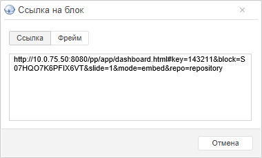

# Получение веб-ссылки

Получение веб-ссылки
-

# Получение веб-ссылки

Ссылка позволяет встроить аналитическую панель или объект из аналитической
 панели в пользовательский сайт, веб-приложение или другую аналитическую
 панель.

Примечание.
 Возможность доступна только в веб-приложении, если в файле «[PP.xml](Setup.chm::/UiWebSetup/03_Setup_Web/PP_config_Java.htm)» в
 разделе <pp> присутствует строка <embed enabled="true" />.
 Также рекомендуется настроить в веб-приложении [гостевой вход](setup.chm::/UiWebSetup/Authentication/Guest_login.htm).
 для отображения встроенной аналитической панели или объекта из неё без
 запроса логина и пароля.

## Получение ссылки на аналитическую панель

Для получения ссылки на аналитическую панель:

	- В главном меню «Документ»
	 выполните команду «Поделиться > Ссылка
	 на документ». Будет отображен диалог:

	- Выберите требуемый вид ссылки:

		- Ссылка. Стандартная
		 ссылка на аналитическую панель;

		- Фрейм. Код для встраивания
		 аналитической панели, например, на веб-страницу или в другую аналитическую
		 панель.

	- Скопируйте текст ссылки. Используйте сочетание клавиш CTRL+C
	 или команду «Копировать» в
	 контекстном меню.

## Получение ссылки на объект

Ссылка позволяет встроить объект из аналитической панели в пользовательский
 сайт, веб-приложение или другую аналитическую панель.

Для получения ссылки на объект:

	- Сохраните аналитическую панель одним из способов:

		- выполните команду «Документ
		 > Сохранить» в [главном меню](../Launching.htm);

		- нажмите сочетание клавиш CTRL+S.

	- Отобразите кнопки управления объектом:

Наведите указатель мыши на уголок в правом верхнем углу блока:

Будут отображены [кнопки управления](Block_BaseProps.htm)
 объектом, например:

	- Нажмите кнопку .

	- В отобразившемся меню выполните команду «Ссылка
	 на блок». Будет отображен диалог:

	- Выберите требуемый вид ссылки:

		- Ссылка. Стандартная
		 ссылка на объект;

		- Фрейм. Код для встраивания
		 объекта, например, на веб-страницу или в аналитическую панель.

	- Скопируйте текст ссылки. Используйте сочетание клавиш CTRL+C
	 или команду «Копировать» в
	 контекстном меню.

Ссылка на объект будет скопирована в буфер обмена.

См. также:

[Использование дополнительных сервисов в
 аналитической панели](Document_tuning.htm)

		Справочная
		 система на версию 10.9
		 от 18/08/2025,
		 © ООО «ФОРСАЙТ»,
