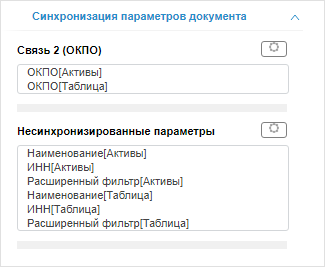

# Настройка синхронизации параметров источников данных

Настройка синхронизации параметров источников данных
-

# Настройка синхронизации параметров источников данных

Синхронизация параметров позволяет управлять значениями параметров источников
 данных сразу в нескольких блоках аналитической панели. Настройка синхронизации
 доступна для всех блоков, использующих параметрические источники данных.
 Синхронизация выполняется с помощью связей между параметрами.

Совет. Для того
 чтобы узнать, является ли источник данных визуализатора параметрическим,
 используйте вкладку «[Параметры источников
 данных](../Blocks/Gadgets/Panels/DataSource_param.htm)» на боковой панели. Для получения информации о параметрах источников
 данных отчётов используйте навигатор объектов.

Для настройки синхронизации всех параметров, используемых в аналитической
 панели, используйте вкладку боковой панели «Синхронизация
 параметров документа».

Для управления значениями параметров используйте вкладку «[Параметры источников
 данных](../Blocks/Gadgets/Panels/DataSource_param.htm)» на боковой панели и элемент управления «[Параметр](../Blocks/Controls/Parameter.htm)».

[Для отображения
 вкладки](javascript:TextPopup(this))

		- Убедитесь, что боковая панель отображается.

		- Щелкните по пустому пространству в рабочей области.

		- Перейдите на вкладку «Синхронизация
		 параметров документа».

	Примечание.
	 Вкладка доступна, если в аналитической панели присутствуют параметрические
	 источники данных.

На вкладке содержится список связей параметров и несинхронизированных
 параметров аналитической панели:

Наименование связи формируется по схеме: Связь
 <номер_связи> (<наименование_параметра>). Для каждой
 связи приведен список блоков, использующих данную связь. Одному измерению
 может быть сопоставлено несколько связей.

Наименование несинхронизированных параметров формируется по схеме: <Наименование_параметра> [<Наименование_блока>].

[Для создания
 новой связи](javascript:TextPopup(this))

	Связь может быть создана:

		- на основе несинхронизированного
		 параметра:

		-

			- Выберите несинхронизированный
			 параметр.

			- Нажмите кнопку . В отобразившемся
			 меню выполните команду «Новая
			 связь».

		- на
		 основе связи, использующейся в нескольких блоках:

		-

			- Выделите блок, использующийся
			 в связи.

			- Нажмите кнопку . В отобразившемся
			 меню выполните команду «Новая
			 связь». Выделенный блок будет исключён из связи.

	Созданная связь будет отображена на вкладке.

[Для удаления
 связи](javascript:TextPopup(this))

		- Выделите все блоки в связи.

		- Нажмите кнопку ,
		 соответствующую связи.

	Связь будет удалена из всех блоков, в которых она используется.
	 Параметр, соответствующий связи, будет добавлен в список несинхронизированных
	 параметров.

[Для исключения
 блока из связи](javascript:TextPopup(this))

		- Выделите исключаемый блок.

		- Нажмите кнопку .
		 В отобразившемся меню выполните команду «Убрать
		 из связи».

	Блок будет исключен из связи. Параметр блока, соответствующий связи,
	 будет добавлен в список несинхронизированных параметров.

[Для добавления
 несинхронизированного параметра в существующую связь](javascript:TextPopup(this))

	Возможность доступна, если существует связь, соответствующая данному
	 параметру.

		- Выделите несинхронизированный параметр.

		- Нажмите кнопку .
		 В отобразившемся меню выполните команду «Связать».

		- Будет отображен список доступных связей, в котором выберите
		 требуемую связь.

	Параметр будет исключен из списка несинхронизированных, блок, использующий
	 параметр, будет добавлен к выбранной связи.

[Для подсветки
 блока, использующего связь/параметр](javascript:TextPopup(this))

	На вкладке выделите блок, использующий связь/параметр. Соответствующий
	 блок будет подсвечен в рабочей области.

См. также:

[Построение аналитической
 панели](Work.htm)

		Справочная
		 система на версию 10.9
		 от 18/08/2025,
		 © ООО «ФОРСАЙТ»,
