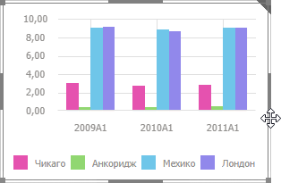
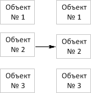
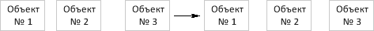

# Настройка размера и положения

Настройка размера и положения
-

# Настройка размера и положения

[Изменение
 размера объекта](javascript:TextPopup(this))

	Для изменения размера объекта:

		- Наведите курсор мыши на границу объекта. Указатель мыши
		 примет вид двунаправленной стрелки.

		- Зажмите кнопку мыши и растяните/сожмите объект до необходимого
		 размера.

	Размер объекта будет изменён.

	Если используется режим [автоматического
	 размещения](Layout_mode.htm#automatic_placement) объектов, то размер окружающих объектов будет изменён
	 таким образом, чтобы сохранилось прежнее расстояние между изменяемым
	 объектом и окружающими объектами.

	Если используется режим [ручного
	 размещения](Layout_mode.htm#manual_placement), то для изменения размера объекта таким образом, чтобы
	 он занимал все доступное пространство аналитической панели, выполните
	 команду «Привязка > Растянуть»
	 в контекстном меню объекта.

	Совет. Для выбора
	 оптимального размера объекта в режиме [ручного
	 размещени](Layout_mode.htm#manual_placement)я используйте линейки, отображаемые при приближении границы
	 активного объекта к границам и центральным осям других объектов.

[Перемещение
 объекта в пространстве](javascript:TextPopup(this))

	Для перемещения объекта:

		- наведите курсор на границу объекта. Указатель мыши примет
		 вид четырехнаправленной стрелки. Зажмите кнопку мыши и перетащите
		 объект в нужную позицию. Например:

	

		- выделите объект и используйте клавиши со стрелками.

	Если используется режим [автоматического
	 размещения объектов](Layout_mode.htm#automatic_placement), то перемещение объекта выполняется путем
	 обмена местами его и объекта, на который навели исходный выделенный
	 блок. Перемещение объекта с помощью клавиш со стрелками недоступно.

	Если используется режим [ручного
	 размещения](Layout_mode.htm#manual_placement), то объект будет перемещен в указанное положение.

	Совет. Для выбора
	 оптимального положения объекта в режиме [ручного
	 размещения](Layout_mode.htm#manual_placement) используйте линейки, отображаемые при приближении границы
	 активного объекта к границам и центральным осям других объектов.

[Выравнивание
 размеров выделенных объектов](javascript:TextPopup(this))

	Для выравнивания размеров нескольких объектов выполните команду
	 «Одинаковый размер» в контекстном
	 меню и выберите способ выравнивания размеров объектов:

		- По высоте и ширине.
		 Все объекты будут одинаковой ширины и высоты;

		- По ширине. Все объекты
		 будут одинаковой ширины;

		- По высоте. Все объекты
		 будут одинаковой высоты.

[Выравнивание
 границ выделенных объектов](javascript:TextPopup(this))

	Примечание.
	 Возможность доступна только в веб-приложении.

	Для выравнивания границ нескольких объектов выполните команду «Выровнять» в контекстном меню и
	 выберите способ выравнивания границ объектов:

		- По верхнему краю.
		 Все объекты будут выровнены по верхнему краю самого верхнего объекта;

		- По нижнему краю.
		 Все объекты будут выровнены по нижнему краю самого нижнего объекта;

		- По левому краю.
		 Все объекты будут выровнены по левому краю самого левого объекта;

		- По правому краю.
		 Все объекты будут выровнены по правому краю самого правого объекта.

[Настройка
 порядка расположения объекта в пространстве](javascript:TextPopup(this))

	Для изменения порядка расположения объектов используйте команды
	 в контекстном меню объекта:

		- На передний план > На
		 передний план. Размещает объект на переднем плане аналитической
		 панели;

		- На задний план > На
		 задний план. Размещает объект на заднем плане аналитической
		 панели;

		- На передний план > Поместить
		 вперёд. Перемещает объект на один уровень ближе к переднему
		 плану аналитической панели;

		- На задний план > Поместить
		 назад. Перемещает объект на один уровень ближе к заднему
		 плану аналитической панели.

	Примечание.
	 Команды доступны только в [ручном
	 режиме](Layout_mode.htm#manual_placement) размещения объектов.

[Распределение
 объектов в рабочей области](javascript:TextPopup(this))

	Распределение объектов в рабочей области позволяет выровнять объекты
	 относительно друг друга при ручном размещении объектов.

	Примечание.
	 Операция распределения объектов доступна при выделении трёх и более
	 объектов рабочей области.

	Для распределения выделенных объектов выполните команду «Привязка»
	 в контекстном меню объектов и выберите необходимый способ распределения
	 объектов:

		- распределить по вертикали.
		 Выделенные объекты будут распределены вертикально на одинаковом
		 расстоянии друг от друга. Расстояние рассчитывается исходя из
		 положения крайнего верхнего и крайнего нижнего объектов среди
		 выделенных и размеров самих объектов. Например:

	

		- распределить по горизонтали.
		 Выделенные объекты будут распределены горизонтально на одинаковом
		 расстоянии друг от друга. Расстояние рассчитывается аналогично
		 предыдущему способу. Например:

	

	Расстояния между объектами выравниваются независимо от того, пересекаются
	 границы объектов или нет.

[Группировка
 объектов](javascript:TextPopup(this))

	Объекты аналитической панели можно группировать.

	Для создания группы объектов:

		- [Выделите](Layout_mode.htm#select_objects) два
		 или более объекта.

		- Выполните команду «Группировать
		 > Группировать» в контекстном меню выделенных объектов.

	Объекты будут объединены в группу, с которой можно работать как
	 с единым объектом.

	При объединении объектов в группу её порядок расположения в пространстве
	 соответствует объекту группы, расположенному ближе всего к переднему
	 плану аналитической панели. Объекты внутри группы сохраняют прежние
	 [настройки расположения](#location) в пространстве.

	Для группы объектов доступны следующие операции:

		- [работа
		 с буфером обмена](Layout_mode.htm#working_with_clipboard);

		- [настройка расположения](#location) объектов
		 в группе;

		- [перемещение](#moveobj) группы объектов;

		- [изменение размеров](#resize_object) группы объектов.
		 При изменении размеров группы происходит пропорциональное изменение
		 размеров объектов, входящих в группу.

	Для разгруппировки выделенной
	 группы объектов выполните команду «Группировать
	 > Разгруппировать» в контекстном меню группы объектов. В
	 результате разгруппировки объекты сохраняют текущие настройки (размер,
	 положение и др.).

[Привязка
 границ объекта к границам родительского элемента](javascript:TextPopup(this))

	Примечание.
	 Возможность доступна, если используется ручной [режим
	 размещения](Layout_mode.htm#manual_placement) объектов в рабочем пространстве и используется [пользовательский
	 размер](Block_BaseProps.htm#locate) рабочего пространства.

	Если привязка границы объекта выполнена, то при изменении размеров
	 родительского элемента граница объекта останется на прежней позиции
	 относительно границы родительского элемента.

	Для выполнения привязки установите флажок, соответствующий привязываемой
	 границе:

		- Сверху. Слева.
		 Справа. Снизу.
		 Для выполнения привязки установите флажок, соответствующий привязываемой
		 границе. Если привязка границы объекта выполнена, то при изменении
		 размеров родительского элемента граница объекта останется на прежней
		 позиции относительно границы родительского элемента. Параметры
		 привязки:

			- %. Определяет,
			 используется ли относительная привязка.

			По умолчанию флажок снят и используется абсолютная привязка,
			 то есть при изменении размеров родительского элемента расстояние
			 между границей объекта и границей родительского элемента не
			 изменяется.

			Если флажок установлен, то используется относительная привязка,
			 то есть расстояние между границей объекта и границей родительского
			 элемента изменяется пропорционально изменению размеров родительского
			 элемента.

	Флажки расположены:

		- в подменю «Привязка»
		 в контекстном меню объекта;

		- на вкладке боковой панели «Блок».

[Сворачивание/разворачивание
 объекта](javascript:TextPopup(this))

	Для разворачивания выбранного объекта на всю рабочую область:

		- Отобразите кнопки управления объектом:

Наведите указатель мыши на уголок в правом верхнем углу блока:

Будут отображены [кнопки управления](Block_BaseProps.htm)
 объектом, например:

		- Нажмите кнопку .

	Выбранный объект будет развернут.

	Для сворачивания развернутого объекта:

		- Отобразите кнопки управления объектом.

		- Нажмите кнопку .

	Объект будет возвращен к исходному размеру.

См. также:

[Настройка внешнего вида элемента эскиза](AdjustingAppearance.htm)

		Справочная
		 система на версию 10.9
		 от 18/08/2025,
		 © ООО «ФОРСАЙТ»,
