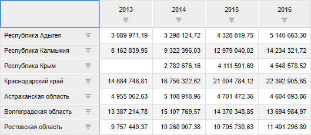
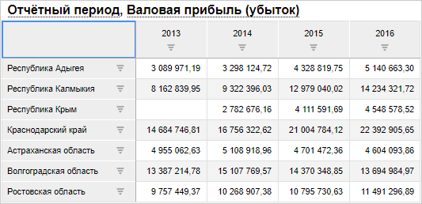
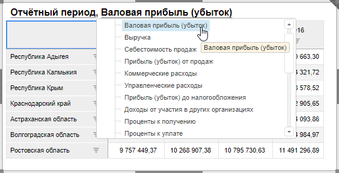

# Как использовать заголовок визуализатора для управления отметкой элементов измерения?

Как использовать заголовок визуализатора для управления отметкой элементов измерения?
-

# Как использовать заголовок визуализатора для управления отметкой элементов
 измерения?

Заголовок визуализатора может быть использован для управления отметкой
 элементов измерения, т.е. выступать в качестве элемента управления
 визуализатором.

## Исходные данные

Аналитическая панель, содержащая визуализатор. Для визуализатора выбран
 источник данных. Например:

## Решение

Для управления отметкой элементов измерения визуализатора с помощью
 его заголовка выполните следующие шаги:

	- Включите отображение заголовка.
	 Вызовите контекстное меню визуализатора и установите в нём флажок
	 «Заголовок»;

	- Установите для заголовка режим
	 отображения «Элемент управления». Перейдите на вкладку ленты
	 «Заголовок». В раскрывающемся
	 меню кнопки «Заголовок» установите
	 переключатель «Элемент управления».

	- Выберите управляемые измерения.
	 Перейдите на вкладку «[Заголовок](../Blocks/Gadgets/Panels/Caption.htm)»
	 ленты инструментов. В раскрывающемся меню кнопки «Отметка»
	 содержатся все измерения источника данных визуализатора. Выберите
	 те измерения, в которых с помощью заголовка необходимо управлять
	 отметкой элементов.

После выполненных настроек в заголовок будут выведены наименования требуемых
 измерений, подчёркнутые пунктирной линией. Например:

Наименования измерений являются элементами управления и с их помощью
 можно изменять отметку элементов:

Для [работы
 с отметкой](UiSelection.chm::/Selection/Selection_of_the_dimension_elements.htm) элементов измерения используйте команды
 контекстного меню.

Таким образом, выполняется управление данными, отображаемыми визуализатором.

См. также:

[Вопросы и ответы](FAQ.htm)
 | [Построение аналитической панели](../Document/Work.htm) |
 [Настройка заголовка визуализатора](../Blocks/Gadgets/Panels/Caption.htm)

		Справочная
		 система на версию 10.9
		 от 18/08/2025,
		 © ООО «ФОРСАЙТ»,
