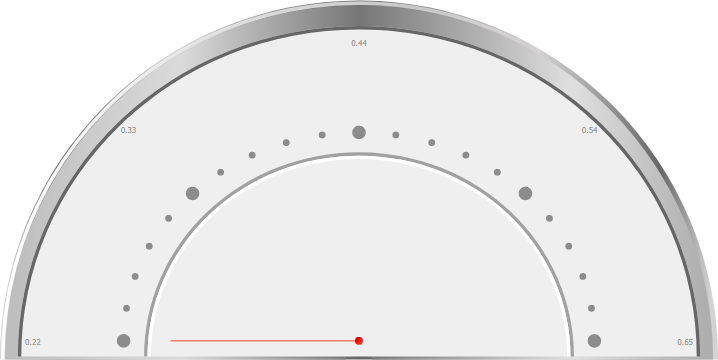

# Как настроить визуализатор «Индикатор»?

Как настроить визуализатор «Индикатор»?
-

# Как настроить визуализатор «Индикатор»?

По умолчанию визуализатор «Индикатор»
 имеет вид:

Для приведения визуализатора «Индикатор»
 к требуемому виду выполните следующие шаги:

	- Задайте параметры [шкалы](../Blocks/Gadgets/Panels/Scale.htm)
	 Scale1 и выполните настройку
	 [секторов](../Blocks/Gadgets/Panels/Sectors.htm), связанных
	 с ней:

	- Задайте параметры [шкалы](../Blocks/Gadgets/Panels/Scale.htm)
	 Scale2 и выполните настройку
	 [секторов](../Blocks/Gadgets/Panels/Sectors.htm), связанных
	 с ней:

	- Задайте параметры [шкалы](../Blocks/Gadgets/Panels/Scale.htm)
	 Scale3, [стрелки](../Blocks/Gadgets/Panels/Arrow.htm)
	 и [динамической
	 подсветки](../Blocks/Gadgets/Panels/DynamicHighlight.htm):

	- Задайте параметры [центра
	 индикатора](../Blocks/Gadgets/Panels/Center.htm):

В результате будет настроен визуализатор «Индикатор»:

См. также:

[Вопросы и ответы](FAQ.htm)
 | [Настройка визуализатора «Индикатор»](../Blocks/Gadgets/Indicator.htm)

		Справочная
		 система на версию 10.9
		 от 18/08/2025,
		 © ООО «ФОРСАЙТ»,
