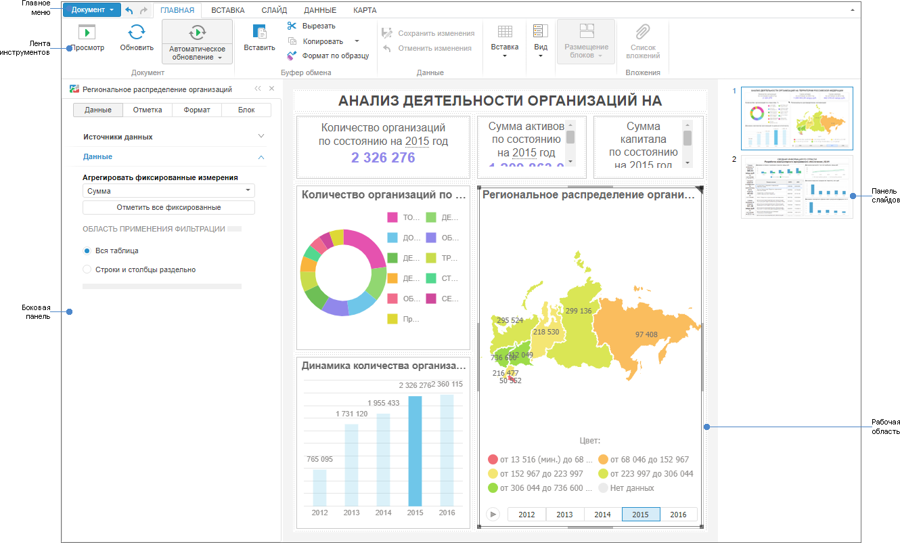

# Начало работы с инструментом «Аналитические панели»

Начало работы с инструментом «Аналитические панели»
-

# Начало работы с инструментом «Аналитические
 панели»

Для начала работы с инструментом создайте новую или откройте готовую
 аналитическую панель.

[Создание
 новой аналитической панели](javascript:TextPopup(this))

	Для создания новой аналитической панели:

		- в [навигаторе
		 объектов](GetStarted.chm::/Interface/Interface_Navigator.htm):

			- в веб-приложении нажмите кнопку 
			 «Создать» в главном
			 меню и выберите тип объекта на боковой панели «[Новый объект](UiNav.chm::/02_Navigator/General_Principles_of_Work.htm#add_object)»;

			- в настольном приложении выполните одно из действий:

				- нажмите кнопку «Новый
				 объект > Аналитическая панель» в группе «Создать» на вкладке
				 «Главная» ленты
				 инструментов;

				- выполните команду «Создать
				 > Аналитическая панель» в контекстном меню навигатора
				 объектов;

				- выберите куб или базу данных временных рядов и нажмите
				 кнопку «Открыть >
				 В аналитической панели» в группе «Открыть»
				 на вкладке «Главная»
				 ленты инструментов;

				- выберите куб или базу данных временных рядов и выполните
				 команду «Открыть с помощью
				 > Конструктор аналитических панелей» в контекстном
				 меню аналитической панели.

	При создании аналитической панели через
	 куб или базу данных временных рядов будет добавлена [таблица](Blocks/Gadgets/Table.htm),
	 построенная на срезе выбранного объекта;

		- в инструменте «Аналитические
		 панели» выполните команду «Новый
		 документ» в главном меню «Документ».

[Открытие
 готовой аналитической панели](javascript:TextPopup(this))

	Для открытия готовой аналитической панели на редактирование:

		- в [навигаторе
		 объектов](GetStarted.chm::/Interface/Interface_Navigator.htm) выделите аналитическую панель и выполните
		 одно из действий:

			- в веб-приложении:

				- выполните команду «Редактировать»
				 в контекстном меню аналитической панели;

				- выполните команду «Редактировать
				 в новом окне» в контекстном меню аналитической
				 панели;

				- нажмите клавишу F4;

			- в настольном приложении:

				- нажмите кнопку 
				 «Редактировать»
				 в группе «Открыть»
				 на вкладке «Главная»
				 ленты инструментов;

				- выполните команду «Редактировать»
				 в контекстном меню аналитической панели;

				- нажмите клавишу F4;

		- в инструменте «Аналитические
		 панели» откройте главное меню «Документ»
		 и выберите вариант открытия аналитической панели:

			- Открыть. В открывшемся
			 диалоге выберите аналитическую панель из навигатора объектов;

			- Открыть > Открыть
			 из файла. При выполнении команды будет открыт стандартный
			 диалог выбора файла. Укажите файл с расширением *.ppdash.
			 Если открываемая аналитическая панель содержит отчёт типа
			 «[Временные
			 ряды](Blocks/Reports/TimeSeries.htm)», то он будет пустым, так как не поддерживается
			 его экспорт в формат *.ppdash.

	Для открытия готовой аналитической панели на просмотр:

		- в [навигаторе
		 объектов](GetStarted.chm::/Interface/Interface_Navigator.htm) выделите аналитическую панель
		 и выполните одно из действий:

			- в веб-приложении:

				- выполните команду «Открыть»
				 в контекстном меню аналитической панели;

				- выполните команду «Открыть
				 в новом окне» в контекстном меню аналитической
				 панели;

				- дважды щёлкните по аналитической панели;

				- нажмите клавишу ENTER;

			- в настольном приложении:

				- нажмите кнопку 
				 «Просмотр» в группе
				 «Открыть» на вкладке
				 «Главная» ленты
				 инструментов;

				- выполните команду «Просмотр»
				 в контекстном меню аналитической панели;

				- дважды щёлкните по аналитической панели;

		- в инструменте «Аналитические
		 панели»:

			- Выполните команду «Документ
			 > Открыть» в главном меню. В открывшемся диалоге
			 выберите аналитическую панель.

			- Нажмите кнопку 
			 «Просмотр», расположенную
			 на вкладке «Главная»
			 или «Вставка» ленты
			 инструментов.

	В веб-приложении доступно открытие на просмотр готовой аналитической
	 панели без отображения ленты инструментов.

	Для скрытия ленты инструментов при открытии на просмотр аналитической
	 панели:

		- задайте параметр [ViewModePreview](Setup.chm::/UiWebSetup/03_Setup_Web/PP_config_Java.htm#modules)
		 со значением True в файле
		 [PP.xml](Setup.chm::/UiWebSetup/03_Setup_Web/PP_config_Java.htm).
		 При открытии на просмотр не будет отображаться лента инструментов
		 для всех аналитических панелей;

		- задайте параметр mode
		 со значением «preview» в адресной строке браузера при открытой
		 аналитической панели на просмотр. Лента инструментов не будет
		 отображаться только для открытой аналитической панели.

	Примечание.
	 При заданном значении параметра недоступен просмотр [слайдов](Presentation/Presentation.htm).

	После выполнения одного из действий при просмотре аналитической
	 панели в основном окне инструмента будет отображаться только аналитическая
	 панель без ленты инструментов.

Для построения аналитических панелей
 смотрите статью «[Построение
 аналитической панели](Document/Work.htm)».

Для работы с готовыми аналитическими
 панелями смотрите статью «[Работа
 с готовой аналитической панелью](Work/ViewMode.htm)».

Если остались вопросы, смотрите
 статью «[Вопросы
 и ответы](FAQ/FAQ.htm)».

Основное окно инструмента «Аналитические
 панели»:

[Аналитическая
 панель в режиме просмотра](javascript:TextPopup(this))

	

[Элементы
 окна аналитической панели](javascript:TextPopup(this))

		- [Главное меню](GetStarted.chm::/interface/interface_description.htm#main_menu).
		 Содержит список команд, предназначенных для выполнения различных
		 операций над аналитической панелью.

		- [Лента инструментов](GetStarted.chm::/interface/interface_description.htm#customize_ribbon).
		 Содержит кнопки для построения и настройки аналитической панели.

		- [Боковая панель](GetStarted.chm::/interface/interface_description.htm#side_panel).
		 Содержит настройки параметров аналитической панели и управления
		 измерениями источников данных.

		- Рабочая область.
		 Предназначена для построения аналитической панели.

		- [Панель
		 слайдов](UI/Slaide_Panel.htm). Предназначена для работы со слайдами.

## Настройка инструмента «Аналитические панели»

Для настройки инструмента «Аналитические
 панели» используйте диалог «Параметры».

Примечание.
 Диалог «Параметры» доступен только
 в настольном приложении.

[Для открытия
 диалога «Параметры](javascript:TextPopup(this))»

	Выполните команду «Сервис >
	 Параметры» в главном меню аналитической панели.

Доступны следующие группы настроек:

[Настройки стилей
 оформления аналитической панели](javascript:TextPopup(this))

	Используйте группу вкладок «Текущий
	 документ».

	В раскрывающемся списке «Набор
	 стилей оформления» выберите [таблицу стилей](UiNav.chm::/StylesTable/StylesTablePurpose.htm),
	 стили которой будут использоваться для оформления визуализаторов в
	 текущей аналитической панели.

[Настройки интерфейса
 инструмента «Аналитические панели»](javascript:TextPopup(this))

	Используйте группу вкладок «Аналитическая
	 панель».

	Задайте [сочетания
	 клавиш](GetStarted.chm::/Interface/Interface_Description.htm#shortcut_keys) для быстрого доступа к командам главного
	 меню и ленты инструментов с помощью вкладки «Интерфейс».

[Настройки платформы](javascript:TextPopup(this))

	Задайте настройки платформы, используя следующие вкладки:

		- [подключаемые модули](UiNav.Chm::/02_Navigator/CommonSettings/Integration.htm).
		 Задайте программные модули, расширяющие возможности «Форсайт. Аналитическая платформа»;

		- [обновление](Setup.chm::/Update/Update.htm).
		 Задайте параметры обновления версии программных файлов продукта
		 «Форсайт. Аналитическая платформа»;

		- [языковые
		 параметры](GetStarted.chm::/Interface/Intro_Language.htm). Выберите язык интерфейса
		 и язык справочной системы продукта «Форсайт. Аналитическая платформа»;

		- [подключение](UiNav.chm::/02_Navigator/CommonSettings/ProxyServer.htm).
		 Задайте настройки прокси-сервера для доступа «Форсайт. Аналитическая платформа»
		 к сети Internet;

		- [справка](UiNav.chm::/02_Navigator/UiNav_RepoConfig_Help.htm).
		 Задайте тип справки, используемой «Форсайт. Аналитическая платформа».

См. также:

[Построение
 аналитической панели](Document/Work.htm)

		Справочная
		 система на версию 10.9
		 от 18/08/2025,
		 © ООО «ФОРСАЙТ»,
