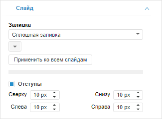
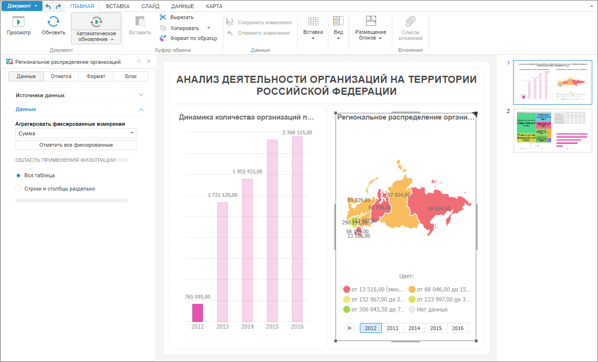

# Работа со слайдами

Работа со слайдами
-

# Работа со слайдами

Слайд - это отдельная страница аналитической панели, наполненная различными
 блоками и иллюстрирующая отдельный раздел информации. Последовательный
 просмотр слайдов позволяет осветить представляемый объект со всех сторон.

Использование слайдов позволяет создать многостраничную аналитическую
 панель.

Примечание.
 Работа со слайдами доступна, если аналитическая панель создана в веб-приложении.
 При открытии аналитической панели со слайдами в настольном приложении
 будет доступно содержимое только первого слайда.

Для создания слайда:

	- Убедитесь, что [панель слайдов](../UI/Slaide_Panel.htm)
	 отображается.

	- Выполните команду:

		- «Добавить слайд»
		 в контекстном меню панели слайдов;

		- «Слайды > Добавить слайд»
		 в контекстном меню рабочей области;

		- «Добавить слайд»
		 в группе «Действия» на
		 вкладке «Слайд» ленты
		 инструментов.

Слайд будет добавлен в конец аналитической панели. [Настройки
 оформления слайда](Presentation.htm#slide_setup) будут взяты от предыдущего слайда.

[Проектирование эскиза](../Document/Layout_mode.htm) слайда,
 вставка и настройка [визуализаторов](../Blocks/Gadgets/Gadgets.htm),
 [отчётов](../Blocks/Reports/Reports.htm), [интерактивных
 элементов управления](../Blocks/Controls/Controls.htm), [плагинов](../Blocks/Plugins/Plugins.htm)
 и [прочих блоков](../Blocks/Other/Other.htm) на слайд выполняется
 аналогично данным операциям с [аналитической
 панелью](../Document/Work.htm).

Совет. Для добавления
 слайда в заданное место выполните команду «Добавить
 слайд» в контекстном меню слайда, после которого требуется добавить
 слайд.

## Основные операции со слайдами

[Настройка
 оформления слайда](javascript:TextPopup(this))

	Для настройки оформления слайда используйте вкладку «Слайд»
	 на боковой панели. Для отображения вкладки:

		- Убедитесь, что боковая панель отображается.

		- Установите на боковой панели переключатель «Слайд».

	Будет отображена вкладка «Слайд»:

	

	Задайте следующие параметры слайда:

		- Заливка. Укажите
		 режим заливки фона слайда. Режимы заливки:

			- Нет. Заливка
			 фона не применяется. Используется по умолчанию;

			- Сплошная заливка.
			 Заливка фона выполняется одним цветом. Доступен дополнительный
			 параметр для указания цвета заливки;

			- Градиентная заливка.
			 Заливка фона выполняется с помощью двуцветного градиента.
			 Доступны дополнительные параметры для указания угла градиента
			 и его начального и конечного цветов;

	Для применения настроек заливки ко всем
	 слайдам нажмите кнопку «Применить
	 ко всем слайдам». Возможность доступна только в настольном
	 приложении.

		- Отступы. Определяет,
		 используются ли внутренние отступы в слайде. По умолчанию флажок
		 снят и внутренние отступы не используются. Если флажок установлен,
		 то отображаются дополнительные поля для ввода размера отступов.
		 Диапазон допустимых значений отступов: от 0 до 100.

		- Пользовательский размер.
		 Параметр доступен только в [ручном
		 режиме](../Document/Layout_mode.htm#manual_placement) компоновки аналитической панели. Для задания пользовательского
		 размера слайда:

			- Установите флажок «Пользовательский
			 размер».

			- В поле «Ширина»
			 и «Высота» задайте
			 размер рабочей области в пикселях. Для установки размера рабочей
			 области по размеру экрана нажмите кнопку «По
			 размеру экрана».

			- Задайте размещение блоков. По умолчанию расположение
			 блоков полностью определяет пользователь. При установке флажка
			 «Друг за другом» блоки
			 будут распределены по следующим правилам:

				- блоки не перекрывают друг друга;

				- размер блоков не изменяется;

				- блоки располагаются подряд по горизонтали, начиная
				 от верхнего левого угла панели. Каждый последующий блок,
				 не помещающийся в ряд, переносится ниже на ближайшую доступную
				 по высоте позицию;

				- при изменении размера рабочей области и при скрытии
				 или удалении блоков положение отображаемых блоков перестраивается
				 в соответствии с вышеперечисленными принципами.

	Если флажок «Друг
	 за другом» установлен, то отображается дополнительный флажок
	 «В ряд», определяющий режим
	 размещения блоков. По умолчанию данный флажок снят. Если флажок
	 установлен, то все блоки размещаются в один вертикальный ряд.

[Копирование
 слайда](javascript:TextPopup(this))

	Для создания копии слайда:

		- Убедитесь, что [панель слайдов](../UI/Slaide_Panel.htm)
		 отображается.

		- Выполните команду:

			-  «Дублировать»
			 в контекстном меню слайда;

			- «Слайды
			 > Дублировать» в контекстном меню рабочей области.
			 Команда доступна только в веб-приложении;

			- «Дублировать» в
			 группе «Действия»
			 на вкладке «Слайд»
			 ленты инструментов.

	Копия слайда будет добавлена после копируемого слайда.

[Изменение
 порядка следования слайдов](javascript:TextPopup(this))

	Для изменения порядка следования слайдов:

		- Убедитесь, что [панель слайдов](../UI/Slaide_Panel.htm)
		 отображается.

		- Выберите требуемый слайд. Для перемещения слайда:

			- на одну позицию вверх.
			 Выполните команду:

				- «На передний план
				 > Поместить вперёд» в контекстном меню панели
				 слайдов;

				- «Слайды >
				 На передний план >
				 Поместить вперёд» в контекстном меню рабочей области.
				 Команда доступна только в веб-приложении;

			- на одну позицию вниз. Выполните
			 команду:

				-  «На задний
				 план > Поместить назад» в контекстном меню
				 панели слайдов;

				- «Слайды >
				 На задний план > Поместить
				 назад» в контекстном меню рабочей области. Команда
				 доступна только в веб-приложении;

			- в начало аналитической
			 панели. Выполните команду:

				-  «На передний
				 план > На передний план» в контекстном
				 меню панели слайдов;

				- «Слайды >
				 На передний план >
				 На передний план» в контекстном меню рабочей области.
				 Команда доступна только в веб-приложении;

			- в конец аналитической
			 панели. Выполните команду:

				-  «На задний
				 план > На задний план» в контекстном меню
				 панели слайдов;

				- «Слайды >
				 На задний план > На
				 задний план» в контекстном меню рабочей области.
				 Команда доступна только в веб-приложении.

[Настройка
 отображения слайда](javascript:TextPopup(this))

	Для отображения слайда на всю рабочую
	 область нажмите кнопку 
	 «По окну» на вкладке «Слайд» на ленте инструментов.

	Для отображения слайда в соответствии с настройками [размера
	 бумаги](../Document/Block_BaseProps.htm#paper) аналитической панели переведите кнопку 
	 «По окну» в ненажатое состояние.

[Переход
 между слайдами](javascript:TextPopup(this))

	Для перехода между слайдами:

		- щелкните по требуемому слайду на [панели
		 слайдов](../UI/Slaide_Panel.htm);

		- используйте кнопки на вкладке «Слайд»
		 на ленте инструментов:

			- . Для перехода к предыдущему
			 слайду;

			- . Для перехода к следующему
			 слайду.

	Примечание.
	 Если кнопка  или 
	 недоступна, то достигнут начало/конец аналитической панели.

	В рабочей области будет отображен слайд, к которому выполнен переход.

[Удаление
 слайда](javascript:TextPopup(this))

	Для удаления слайда:

		- Убедитесь, что [панель слайдов](../UI/Slaide_Panel.htm)
		 отображается.

		- Выполните команду:

			-  «Удалить слайд»
			 в контекстном меню требуемого слайда;

			- «Слайды > Удалить
			 слайд» в контекстном меню рабочей области. Команда
			 доступна только в веб-приложении;

			- «Удалить» в
			 группе «Действия»
			 на вкладке «Слайд»
			 ленты инструментов.

	Будет запрошено подтверждение выполняемого действия.

Пример аналитической панели со слайдами:

См. также:

[Построение
 аналитической панели](../Document/Work.htm) | [Экспорт
 аналитической панели в режиме слайдов](../Document/Export.htm#slide)

		Справочная
		 система на версию 10.9
		 от 18/08/2025,
		 © ООО «ФОРСАЙТ»,
