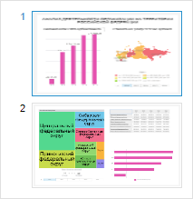

# Панель слайдов

Панель слайдов
-

# Панель слайдов

Панель слайдов отображается справа от рабочей
 области. Панель предназначена для работы со слайдами и отображает
 все слайды, содержащиеся в аналитической панели. С помощью панели доступно
 создание, удаление, настройка порядка следования слайдов и прочие действия
 со слайдами.

[Для отображения
 панели слайдов](javascript:TextPopup(this))

		- Нажмите кнопку  «Панель
		 слайдов» на вкладке «Главная»
		 на ленте инструментов.

		- Установите флажок «Панель
		 слайдов» в контекстном меню панели слайдов.

		- Установите флажок «Панель
		 слайдов» в контекстном меню рабочей области отчёта.

[Для скрытия
 панели слайдов](javascript:TextPopup(this))

		- Переведите кнопку  «Панель
		 слайдов» в ненажатое состояние;

		- Снимите флажок «Панель
		 слайдов» в контекстном меню панели слайдов.

		- Снимите флажок «Панель
		 слайдов» в контекстном меню рабочей области отчёта.

Пример панели слайдов:

Каждый слайд, отображаемый на панели, является уменьшенным изображением
 слайда в аналитической панели. Все слайды отображаются в порядке следования
 в аналитической панели.

См. также:

[Построение
 аналитической панели](../Document/Work.htm) | [Работа
 со слайдами](../Presentation/Presentation.htm)

		Справочная
		 система на версию 10.9
		 от 18/08/2025,
		 © ООО «ФОРСАЙТ»,
