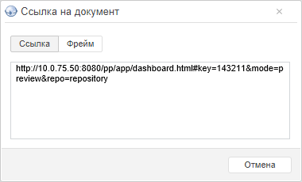

# Использование дополнительных сервисов при работе с готовой аналитической панелью

Использование дополнительных сервисов при работе с готовой аналитической панелью
-

# Использование дополнительных сервисов при работе с готовой аналитической
 панелью

Готовая аналитическая панель предоставляет разнообразные дополнительные
 возможности.

## Использование встроенной расширенной аналитики

При работе с готовой аналитической панелью доступно использование встроенной
 расширенной аналитики.

Для применения расширенной аналитики к данным в выделенной таблице используйте
 вкладку «Расширенная аналитика»
 ленты инструментов.

Для получения подробной информации обратитесь к разделу «[Расширенная
 аналитика](UiAnalyticalArea.chm::/Analysis/AdvancedAnalytics.htm)».

## Переход между слайдами в аналитической панели

Если аналитическая панель содержит несколько слайдов, то в режиме просмотра
 доступна дополнительная возможность: переход между слайдами.

Для перехода между слайдами используйте кнопки на ленте инструментов:

	- . Для перехода к предыдущему
	 слайду;

	- . Для перехода к следующему
	 слайду.

Будет отображен слайд, к которому выполнен переход.

Примечание.
 Если кнопка  или 
 недоступна, то достигнут начало или конец аналитической панели.

## Получение ссылки на аналитическую панель

Ссылка позволяет встроить аналитическую панель в пользовательский сайт,
 веб-приложение или другую аналитическую панель.

Примечание.
 Возможность доступна только в веб-приложении, если в файле «[PP.xml](Setup.chm::/UiWebSetup/03_Setup_Web/PP_config_Java.htm)» в
 разделе <pp> присутствует строка <embed enabled="true" />.
 Также рекомендуется настроить в веб-приложении [гостевой вход](setup.chm::/UiWebSetup/Authentication/Guest_login.htm).
 для отображения встроенной аналитической панели или объекта из неё без
 запроса логина и пароля.

Для получения ссылки на аналитическую панель:

	- В главном меню «Документ»
	 выполните команду «Поделиться > Ссылка
	 на документ». Будет отображен диалог:

	- Выберите требуемый вид ссылки:

		- Ссылка. Стандартная
		 ссылка на аналитическую панель;

		- Фрейм. Код для встраивания
		 аналитической панели, например, на веб-страницу или в другую аналитическую
		 панель.

	- Скопируйте текст ссылки. Используйте сочетание клавиш CTRL+C
	 или команду «Копировать» в
	 контекстном меню.

Ссылка на аналитическую панель будет скопирована в буфер обмена.

См. также:

[Работа с готовой аналитической панелью](ViewMode.htm)

		Справочная
		 система на версию 10.9
		 от 18/08/2025,
		 © ООО «ФОРСАЙТ»,
