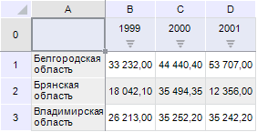
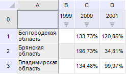

# Преобразование данных

Преобразование данных
-

# Преобразование данных

Преобразование данных - операция,
 позволяющая представить данные таблицы в различных представлениях.

Примечание.
 Преобразование данных недоступно в инструменте «Отчеты».

Для преобразования выбранных данных:

	- Нажмите кнопку  «Преобразовать данные», расположенную
	 на вкладке «Данные» ленты
	 инструментов.

	- Из раскрывающегося меню кнопки выберите один из доступных вариантов
	 преобразования для строк/столбцов:

		- Рост, %. Будет отображаться
		 изменение значения в процентах;

		- Прирост, %. Будет
		 отображаться процент прироста;

		- Изменение. Будет
		 отображаться разница между текущим и предыдущим значением;

		- Доля, %. Будет отображаться
		 доля значения ячейки от суммы значений всей строки/столбца;

		- Доля по всей таблице, %.
		 Будет отображаться доля значения ячейки от суммы всех значений
		 таблицы.

## Пример преобразования данных

Исходные данные таблицы:

Данные после преобразования «Рост по
 строкам, %»:

Чтобы отменить преобразование данных выполните команду «Сбросить»
 раскрывающегося меню кнопки 
 «Преобразовать данные» на вкладке
 «Данные» ленты инструментов.

См. также:

[Анализ
 данных в таблице](Data_analysis_in_a_table.htm)

		Справочная
		 система на версию 10.9
		 от 18/08/2025,
		 © ООО «ФОРСАЙТ»,
