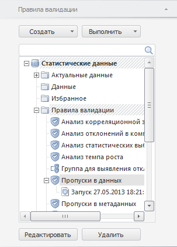
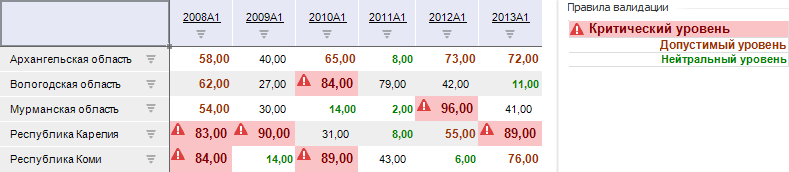

# Валидация данных

Валидация данных
-

# Валидация данных

Валидация - это проверка данных временных рядов на соответствие
 заданным условиям и ограничениям.

Валидация данных выполняется с помощью правил валидации. Для последовательного
 выполнения нескольких правил валидации они могут быть объединены в группу.

Примечание.
 Валидация доступна для экспресс-отчетов, таблиц в аналитических панелях,
 областей данных в регламентных отчётах, если источником данных является
 база данных временных рядов, [стандартный](UiNavObj.chm::/Cube/CreateCube/Master_Standart/UiMd_Cube_CreateCube_Master_Standart.htm)
 или [автоматический](UiNavObj.chm::/Cube/CreateCube/Master_Auto/UiMd_Cube_CreateCube_Master_Auto.htm)
 куб с календарным измерением. При работе с [глобальным кешем](UiNav.chm::/02_Navigator/Cache_In_Blob.htm)
 валидация данных недоступна.

Все правила и группы валидации отображаются на вкладке боковой панели
 «Правила валидации».

[Для отображения
 вкладки](javascript:TextPopup(this))

		- Убедитесь, что [боковая
		 панель](GetStarted.chm::/Interface/Interface_Description.htm#side_panel) отображается.

		- Установите переключатель на боковой панели:

			- Источник. Переключатель
			 в [экспресс-отчёте](UIExpress.chm::/purpose/UiExpress_Organizational_Starting.htm);

			- Данные. Переключатель в
			 [аналитической
			 панели](UIAdhoc.chm::/Launching.htm);

			- Документ. Переключатель
			 в [регламентном
			 отчёте](UIReport.chm::/desktop/organizational_management/Starting.htm).

		- Перейдите на вкладку «Правила
		 валидации».

Пример результата валидации данных:

## Работа с правилами валидации

Работа с правилами валидации осуществляется с помощью:

	- вкладки «Правила валидации»
	 на боковой панели для создания и редактирования правил валидации.

Для отображения вкладки «Правила
 валидации» убедитесь, что [боковая
 панель](GetStarted.chm::/Interface/Interface_Description.htm#side_panel) отображена и выполните одно из действий:

		- выберите вкладку в группе вкладок «Источник»/«Данные» боковой панели;

		- нажмите на кнопку «Валидация
		 > Настроить правила валидации» на вкладке «Расширенная
		 аналитика» ленты инструментов.

Работа с вкладкой подобна работе с вкладкой «[Правила
 валидации](UiDw.chm::/Workbook/Data_validation.htm)» анализа временных рядов;

	- группы «Валидация данных»
	 на вкладке «Расширенная аналитика»
	 ленты инструментов для выполнения и просмотра итогов применения правил
	 валидации.

Примечание.
 При открытии отчета в «Режиме просмотра» работа с правилами
 валидации возможна только через ленту инструментов.

### Основные операции с правилами/группами правил валидации

[Создание
 правила валидации](javascript:TextPopup(this))

	Для создания правила валидации:

		- нажмите кнопку «Создать > Правило
		 валидации» на вкладке «Правила
		 валидации» на боковой панели;

		- выполните команду «Создать > Правило
		 валидации» в контекстном меню объекта репозитория на вкладке
		 боковой панели «Правила валидации».

	Будет открыт диалог «[Правило
	 валидации](UiValidation.chm::/Data_Validation_Types.htm)». Созданное правило будет сохранено
	 в БД временных рядов, но не будет выполнено.

[Настройка
 параметров правила валидации](javascript:TextPopup(this))

	Используйте вкладку боковой панели «Правила
	 валидации». Для настройки параметров выбранного правила валидации:

		- нажмите кнопку «Редактировать»;

		- выполните команду «Редактировать»
		 в контекстном меню правила;

		- дважды щелкните по правилу валидации;

		- нажмите клавишу F4. Возможность доступна только в настольном
		 приложении.

	Будет открыт диалог «[Правило
	 валидации](UiValidation.chm::/Data_Validation_Types.htm)».

[Создание
 группы правил валидации](javascript:TextPopup(this))

	Для создания группы правил валидации:

		- нажмите кнопку «Создать > Группа
		 правил валидации»;

		- выполните команду «Создать
		 > Группа правил валидации» в контекстном меню объекта
		 репозитория на вкладке боковой панели.

	Будет открыт диалог «[Новая
	 группа валидации](UiValidation.chm::/Grouping_types.htm)».

[Редактирование
 группы правил валидации](javascript:TextPopup(this))

	Используйте вкладку боковой панели «Правила
	 валидации». Для настройки параметров выбранной группы правил
	 валидации:

		- нажмите кнопку «Редактировать»;

		- выполните команду «Редактировать»
		 в контекстном меню группы;

		- дважды щелкните по группе правил валидации;

		- нажмите клавишу F4. Возможность доступна только в настольном
		 приложении.

	Будет открыт [диалог
	 для редактирования](UiValidation.chm::/Grouping_types.htm) выбранной группы.

[Выполнение
 правила/группы правил](javascript:TextPopup(this))

	Правило/группа правил валидации может быть выполнена:

		- в аналитической панели в текущем блоке;

		- в экспресс-отчета на текущем листе;

		- в регламентном отчете в текущей области данных.

	Для выполнения правила/группы правил валидации используйте:

		- вкладку боковой панели «Правила
		 валидации»:

			- Выберите правило/группу правил.

			- Нажмите кнопку «Выполнить»
			 или выполните одноименную команду в контекстном меню.

		- вкладку «Расширенная аналитика»
		 на ленте инструментов:

			- Нажмите кнопку 
			 «Валидация».

			- В отобразившемся меню выберите требуемое правило/группу.

	Валидация данных будет выполнена в указанной области.

	Совет. Для выполнения
	 правила/группы правил на текущем листе экспресс-отчета в веб-приложении
	 перетащите правило/группу правил на лист.

[Работа с результатами
 валидации](javascript:TextPopup(this))

	Для [работы с результатами валидации](#validation_result)
	 используйте вкладку «Расширенная
	 аналитика» на ленте инструментов.

[Удаление правила/группы
 правил валидации](javascript:TextPopup(this))

	Для удаления правила/группы правил, выделенной на вкладке боковой
	 панели «Правила валидации»:

		- нажмите кнопку «Удалить»;

		- выполните команду «Удалить»
		 в контекстном меню;

		- нажмите сочетание клавиш CTRL+DELETE. Возможность
		 доступна только в настольном приложении.

	Будет запрошено подтверждение выполняемого действия.

[Структурирование
 правил/групп правил валидации](javascript:TextPopup(this))

	Для перемещения правил/группы правил валидации:

		- Выделите правило/группу правил на вкладке боковой панели
		 «Правила валидации».

		- Используйте команды в контекстном меню: «Копировать»,
		 «Вырезать», «Вставить».

	Для создания папки, в которой могут храниться правила/группы правил
	 валидации:

		- Перейдите на вкладку «Правила
		 валидации» на боковой панели.

		- Выделите элемент, внутри которого должна быть создана папка.

		- Нажмите кнопку «Создать > Папку»
		 или выполните одноименную команду в контекстном меню.

	Папка будет создана внутри выделенного элемента.

[Поиск правила/группы
 правил валидации](javascript:TextPopup(this))

	Для поиска правила/группы правил валидации используйте строку поиска,
	 расположенную в верхней части вкладки «Правила
	 валидации» на боковой панели. Введите наименование искомого
	 правила/группы правил в строку поиска. На вкладке останутся лишь правила/группы
	 правил, соответствующие условиям поиска.

	Для сброса результатов поиска очистите строку поиска.

[Переименование
 правила/группы правил валидации](javascript:TextPopup(this))

	Для переименования правила/группы правил, выделенной на вкладке
	 боковой панели «Правила валидации»:

		- выполните команду «Переименовать»
		 в контекстном меню;

		- щелкните по выделенному правилу/группе правил;

		- нажмите клавишу F2. Возможность доступна только в
		 настольном приложении и в экспресс-отчете в веб-приложении.

	Название правила/группы правил будет переведено в режим редактирования.
	 Для завершения редактирования нажмите клавишу ENTER.

## Работа с результатами валидации

В процессе выполнения правила валидации выявляются исключения. Исключения
 - это наблюдения или временные ряды, не соответствующие условиям правила
 валидации.

Если правило валидации выполнялось, то исключения будут отображены в
 области выполнения валидации. [Стиль оформления
 исключений](UiValidation.chm::/Data_Validation_Types.htm#style) зависит от настроек правила валидации.

После выполнения валидации для работы с исключениями предназначена вкладка
 «Расширенная аналитика» на ленте
 инструментов.

[Перемещение
 по исключениям](javascript:TextPopup(this))

	Для быстрого перемещения между исключениями в таблице данных используйте
	 кнопки на вкладке ленты «Расширенная
	 аналитика»:

		- .
		 Выделяет предыдущее исключение;

		- .
		 Выделяет следующее исключение;

		- .
		 Выделяет первое исключение;

		- .
		 Выделяет последнее исключение.

	Перемещение выполняется относительно текущей выделенной ячейки.

[Отображение/скрытие
 легенды валидации](javascript:TextPopup(this))

	Легенда предназначена для демонстрации стиля оформления исключений
	 в правилах валидации.

	Для отображения легенды нажмите кнопку  «Легенда» на вкладке ленты «Расширенная аналитика». Легенда
	 содержит стили оформления исключений и названия только тех правил,
	 которые выявили исключения.

	Для скрытия легенды переведите кнопку  «Легенда» в ненажатое состояние.

	Примечание.
	 В инструменте «Отчёты» настройка
	 доступна только в настольном приложении.

[Очистка
 результатов валидации](javascript:TextPopup(this))

	Нажмите кнопку  «Очистить» группы
	 кнопок «Валидация данных»
	 на вкладке ленты инструментов «Расширенная
	 аналитика».

	Список запущенных валидаций и их результаты будут очищены.

См. также:

[Анализ
 данных в таблице](Data_analysis_in_a_table.htm)

		Справочная
		 система на версию 10.9
		 от 18/08/2025,
		 © ООО «ФОРСАЙТ»,
