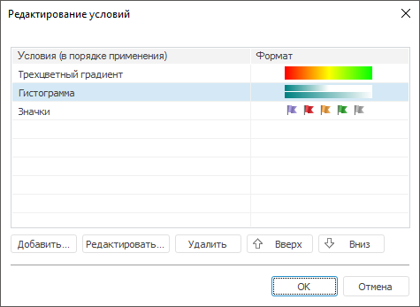
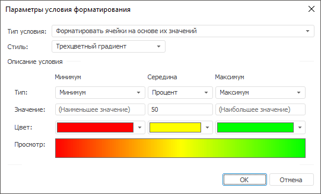

# Расширенная настройка условного форматирования

Расширенная настройка условного форматирования
-

# Расширенная настройка условного
	 форматирования

	Для настройки условного форматирования используйте вкладку «Условное форматирование» на боковой
	 панели или диалог «Редактирование
	 условий».

[Для открытия
 вкладки](javascript:TextPopup(this))

	Для отображения вкладки:

		- Убедитесь, что [боковая
		 панель](GetStarted.chm::/Interface/Interface_Description.htm#side_panel) отображается.

		- На боковой панели установите переключатель «Таблица»,
		 «Измерение», «Уровень»,
		 «Данные», «Формат»
		 или «Итоги». Название
		 переключателя зависит от области, выделенной в таблице.

		- Перейдите на вкладку «Условное
		 форматирование».

	[Для открытия
	 диалога](javascript:TextPopup(this))

		В раскрывающемся меню кнопки  «Условное форматирование» на
		 ленте инструментов выполните команду «Редактировать
		 условия».

		В зависимости от инструмента кнопка находится:

			- на вкладке «Главная»,
			 на вкладке «Конструктор»,
			 на вкладке «Формат»
			 в инструменте «Аналитические
			 запросы (OLAP)»;

			- на вкладке «Главная»,
			 на вкладке «Формат»
			 в инструменте «Отчёты»;

		Примечание.
		 При работе с инструментом «Отчёты», если
		 условное форматирование настроено с помощью вкладки «Главная»
		 на ленте инструментов, то оно применяется для листа отчета, а
		 если с помощью вкладки «Формат»
		 - то для таблицы.

		Работа с условным форматированием для инструмента «Отчёты»
		 доступна только в настольном приложении.

			- на вкладке «Конструктор»,
			 на вкладке «Формат»
			 в инструменте «Аналитические
			 панели»;

			- на вкладке «Таблица»
			 в инструменте «Анализ временных
			 рядов».

	Доступные для настройки параметры зависят от типа настраиваемого
	 условия форматирования, например:

		 Вкладка Диалог

			

			

## Создание условия форматирования

	Для добавления условного форматирования нажмите кнопку «Добавить»:

		- на вкладке «Условное форматирование».
		 По умолчанию будет добавлен тип «Трехцветный
		 градиент»;

		- в диалоге «Редактировать
		 условия». Будет открыт диалог «Параметры
		 условия форматирования».

	Примечание.
	 В настольной версии инструмента «Отчёты»
	 также доступна команда «Создать условие»
	 в раскрывающемся меню кнопки  «Условное форматирование» на вкладке
	 «Главная» ленты инструментов.

## Редактирование условия форматирования

	Для редактирования условного форматирования выберите требуемое условие:

		- выполните команду «Редактировать»
		 контекстного меню;

		- на вкладке «Условное форматирование»
		 в области «Свойства выбранного»
		 и задайте доступные параметры условия. Доступные параметры зависят
		 от типа настраиваемого условия;

		- в диалоге «Редактировать
		 условия» и нажмите кнопку «Редактировать»
		 или дважды щёлкните по условию. Будет открыт диалог «Параметры
		 условия форматирования»:

	

	Настройте в нём созданное условие форматирования.
	 С помощью данного диалога доступна настройка всех типов условий форматирования,
	 кроме заливки по группам ячеек на основе их значений.

	Примечание.
	 В веб-приложении будет открыта вкладка «Условное
	 форматирование» на боковой панели.

## Изменение порядка условия форматирования

	Для изменения порядка условий форматирования выделите требуемое
	 условие и:

		- используйте кнопки 
		 и  ;

		- зажав кнопку мыши, перетащите условие в требуемую позицию;

		- выполните команду «Вверх»/«Вниз» контекстного меню;

		- нажмите сочетание клавиш ALT+DOWN для перемещения условия
		 на одну позицию вниз или ALT+UP для перемещения условия на одну
		 позицию вверх.

## Удаление условия форматирования

	Для удаления условия форматирования выделите условие и:

		- нажмите кнопку «Удалить»;

		- нажмите клавишу DELETE;

		- выполните команду «Удалить»
		 контекстного меню.

	Для удаления всех условий форматирования выполните команду «Очистить» в раскрывающемся меню
	 кнопки  «Условное
	 форматирование» на ленте инструментов.

	Примечание.
	 В инструменте «Отчёты» используйте
	 меню кнопки  «Условное форматирование» на вкладке
	 «Формат» ленты инструментов.

	В инструменте «Отчёты»:

		- Выполните команду «Удалить
		 условия» в раскрывающемся меню кнопки  «Условное форматирование» на
		 вкладке «Главная» ленты
		 инструментов.

		- Выберите вариант удаления условий:

			- Удалить условия из
			 выделенных ячеек. Удаление всех условий форматирования
			 из выделенного диапазона таблицы;

			- Удалить условия с листа.
			 Удаление всех условий форматирования с листа.

## Доступные типы условия
	 форматирования

		- [Форматировать
		 ячейки на основе их значений](uireport_table_attribute_format_condition_1.htm).

		- [Форматировать
		 ячейки с определенным значением](uireport_table_attribute_format_condition_2.htm).

		- [Форматировать
		 ячейки с наибольшими/наименьшими значениями](uireport_table_attribute_format_condition_3.htm).

		- [Форматировать
		 ячейки со значениями больше/меньше среднего](uireport_table_attribute_format_condition_4.htm).

		- [Форматировать
		 ячейки с уникальными/повторяющимися значениями](uireport_table_attribute_format_condition_5.htm).

		- [Форматировать
		 ячейки, удовлетворяющие формуле](uireport_table_attribute_format_condition_6.htm).

	Примечание.
	 Учитывайте следующую особенность шкал, используемых для условного
	 форматирования: граничные значения всегда входят в меньший интервал
	 шкалы. Например, есть шкала с тремя интервалами: меньше 25, от 25
	 до 50, больше 50. Значение 25 будет входить в интервал «меньше 25»,
	 а значение 50 - в интервал «от 25 до 50».

См. также:

[Быстрая
 настройка условного форматирования](Working_with_conditional_formatting.htm) | [Условное
 форматирование](../Conditional_formatting.htm)

		Справочная
		 система на версию 10.9
		 от 18/08/2025,
		 © ООО «ФОРСАЙТ»,
