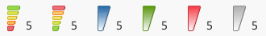
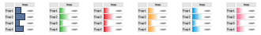
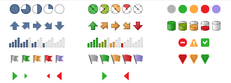

# Быстрая настройка условного форматирования

Быстрая настройка условного форматирования
-

# Быстрая настройка условного форматирования

Для быстрой настройки условного форматирования:

	- Нажмите кнопку  «Условное форматирование» на ленте
	 инструментов:

		- на вкладке «Главная»,
		 на вкладке «Конструктор»,
		 на вкладке «Формат» в
		 инструменте «Аналитические запросы
		 (OLAP)»;

		- на вкладке «Главная»,
		 на вкладке «Формат» в
		 инструменте «Отчёты»;

Примечание.
 При работе с инструментом «Отчёты», если
 условное форматирование настроено с помощью вкладки «Главная»
 на ленте инструментов, то оно применяется для листа отчета, а если с помощью
 вкладки «Формат» - то для таблицы.

Настройка условного форматирования для инструмента «Отчёты»
 доступна только в настольном приложении.

		- на вкладке «Конструктор»,
		 на вкладке «Формат» в
		 инструменте «Аналитические панели»;

		- на вкладке «Таблица»
		 в инструменте «Анализ временных
		 рядов».

Условное форматирование будет применено для
 [выбранного
 элемента таблицы](../Conditional_formatting.htm#formatting_elements).

	- Выберите один из вариантов условного форматирования в раскрывающемся
	 меню кнопки  «Условное форматирование»:

		- цветовые шкалы:

		- гистограммы:

		- значки:

См. также:

[Условное
 форматирование](../Conditional_formatting.htm) | [Расширенная
 настройка условного форматирования](UiReport_Table_Attribute_Format_conditionParams.htm)

		Справочная
		 система на версию 10.9
		 от 18/08/2025,
		 © ООО «ФОРСАЙТ»,
