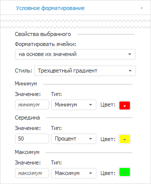
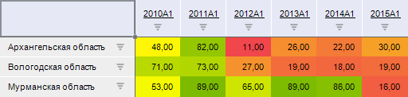
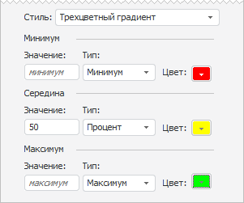
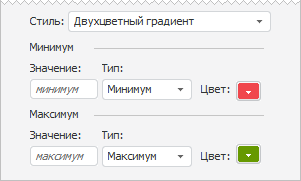
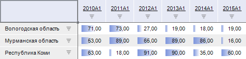
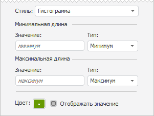
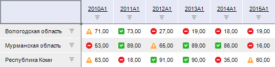
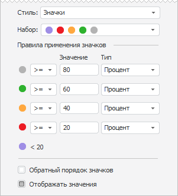
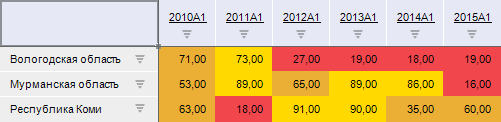
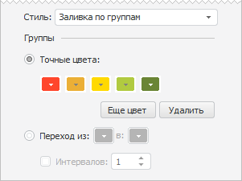

# Форматировать ячейки на основе их значений

Форматировать ячейки на основе их значений
-

# Форматировать ячейки на основе их значений

	Данный тип условия форматирования предназначен для форматирования
	 всех выделенных ячеек на основании их значений.

	Для настройки форматирования ячеек на основе их значений используйте
	 вкладку «Условное форматирование»
	 на боковой панели или диалог «Параметры
	 условия форматирования».

[Для открытия
 вкладки](javascript:TextPopup(this))

	Для отображения вкладки:

		- Убедитесь, что [боковая
		 панель](GetStarted.chm::/Interface/Interface_Description.htm#side_panel) отображается.

		- На боковой панели установите переключатель «Таблица»,
		 «Измерение», «Уровень»,
		 «Данные», «Формат»
		 или «Итоги». Название
		 переключателя зависит от области, выделенной в таблице.

		- Перейдите на вкладку «Условное
		 форматирование».

[Для открытия
 диалога](javascript:TextPopup(this))

		- Выполните команду «Редактировать
		 условия» в раскрывающемся меню кнопки  «Условное форматирование» на
		 ленте инструментов.

	В зависимости от инструмента кнопка находится:

			- на вкладке «Главная»,
			 на вкладке «Конструктор»,
			 на вкладке «Формат»
			 в инструменте «Аналитические
			 запросы (OLAP)»;

			- на вкладке «Главная»,
			 на вкладке «Формат»
			 в инструменте «Отчёты»;

	Примечание.
	 При работе с инструментом «Отчёты», если
	 условное форматирование настроено с помощью вкладки «Главная»
	 на ленте инструментов, то оно применяется для листа отчета, а если
	 с помощью вкладки «Формат»
	 - то для таблицы.

	Работа с условным форматированием для инструмента «Отчёты»
	 доступна только в настольном приложении.

			- на вкладке «Конструктор»,
			 на вкладке «Формат»
			 в инструменте «Аналитические
			 панели»;

			- на вкладке «Таблица»
			 в инструменте «Анализ временных
			 рядов».

		- В открывшемся диалоге «Редактировать
		 условия»:

			- нажмите кнопку «Добавить»
			 для создания нового условия;

			- выделите требуемое условие
			 и нажмите кнопку «Редактировать»;

			- дважды щелкните по требуемому
			 условию.

		 Вкладка Диалог

			

			

	Набор настроек зависит от выбранного стиля форматирования. Для выбора
	 стиля используйте раскрывающийся список «Стиль».

	Доступные стили:

		- [трехцветный градиент](#panel_gradient_3);

		- [двухцветный градиент](#panel_gradient_2);

		- [гистограммы](#panel_histogram);

		- [значки](#panel_icons);

		- [заливка по группам](#panel_groups).

## Трехцветный градиент

	Форматирует значения в ячейках на основе трех цветов: цвета для
	 минимального значения, цвета для среднего значения и цвета для максимального
	 значения. Промежуточные цвета вычисляются автоматически, исходя из
	 значений в ячейках.

	Пример условного форматирования, в котором ячейки с минимальными
	 значениями красные, со средними желтые, а с максимальными зеленые.
	 Цвета для значений выше и ниже среднего вычисляются автоматически:

	

	Настройки стиля:

	

	Задайте три точки оценки: «Минимум»,
	 «Середина», «Максимум».
	 Данные точки зададут диапазон значений, подлежащих форматированию.
	 Таким образом, форматирование будет применено для тех ячеек таблицы,
	 значения в которых расположены в заданном диапазоне.

	Для каждой точки укажите:

		- Значение. Значение,
		 соответствующее точке. Формат значения зависит от его типа;

		- Цвет. Цвет, соответствующий
		 точке;

	- Тип. Тип значения:

	-

		- Минимум. Доступен
		 только для точки «Минимум».
		 Данный тип автоматически определяет минимальное значение, содержащееся
		 в форматируемой таблице. Ручной ввод значения недоступен;

		- Число. Значение
		 точки задается в виде конкретного числа;

		- Процент. Значение
		 точки задается в виде процента от максимального значения, содержащегося
		 в форматируемой таблице. Диапазон допустимых значений: [0, 100];

		- Формула. Значение
		 точки задается в виде формулы. В формуле допускается использование
		 цифр, круглых скобок и знаков арифметических операций. Если в
		 поле «Значение» введена
		 неверная формула, то оно будет подсвечено.

Примечание.
 Ознакомьтесь с правилами составления формулы в разделе «[Правила
 составления формулы](uireport_table_attribute_format_condition_6.htm#formula_creation)».

	-

		- Процентиль. Значение
		 точки задается в виде процентиля. Например, процентиль, равный
		 75 - это такое значение, ниже которого попадают 75% значений в
		 форматируемой таблице;

		- Максимум. Доступен
		 только для точки «Максимум».
		 Данный тип автоматически определяет максимальное значение, содержащееся
		 в форматируемой таблице. Ручной ввод значения недоступен.

## Двухцветный градиент

	Форматирует значения в ячейках на основе двух цветов: цвета для
	 максимального значения и цвета для минимального значения. Промежуточные
	 цвета вычисляются автоматически, исходя из значений в ячейках.

	Пример условного форматирования, в котором ячейки с минимальными
	 значениями красные, а с максимальными желтые. Цвета для промежуточных
	 значений вычисляются автоматически:

	

	Настройки стиля:

	

	Задайте две точки оценки: «Минимум»
	 и «Максимум». Данные точки
	 зададут диапазон значений, подлежащих форматированию. Таким образом,
	 форматирование будет применено для тех ячеек таблицы, значения в которых
	 расположены в заданном диапазоне.

	Для каждой точки укажите:

		- Значение. Значение,
		 соответствующее точке. Формат значения зависит от его типа;

		- Цвет. Цвет, соответствующий
		 точке;

	- Тип. Тип значения:

	-

		- Минимум. Доступен
		 только для точки «Минимум».
		 Данный тип автоматически определяет минимальное значение, содержащееся
		 в форматируемой таблице. Ручной ввод значения недоступен;

		- Число. Значение
		 точки задается в виде конкретного числа;

		- Процент. Значение
		 точки задается в виде процента от максимального значения, содержащегося
		 в форматируемой таблице. Диапазон допустимых значений: [0, 100];

		- Формула. Значение
		 точки задается в виде формулы. В формуле допускается использование
		 цифр, круглых скобок и знаков арифметических операций. Если в
		 поле «Значение» введена
		 неверная формула, то оно будет подсвечено.

Примечание.
 Ознакомьтесь с правилами составления формулы в разделе «[Правила
 составления формулы](uireport_table_attribute_format_condition_6.htm#formula_creation)».

	-

		- Процентиль. Значение
		 точки задается в виде процентиля. Например, процентиль, равный
		 75 - это такое значение, ниже которого попадают 75% значений в
		 форматируемой таблице;

		- Максимум. Доступен
		 только для точки «Максимум».
		 Данный тип автоматически определяет максимальное значение, содержащееся
		 в форматируемой таблице. Ручной ввод значения недоступен.

## Гистограммы

	Отображает в ячейках гистограммы, соответствующие значению: чем
	 больше значение, тем больше гистограмма. Например:

	

	Настройки стиля:

	

	Задайте две точки оценки: «Минимум»
	 и «Максимум». Данные точки
	 зададут диапазон значений, подлежащих форматированию. Таким образом,
	 форматирование будет применено для тех ячеек таблицы, значения в которых
	 расположены в заданном диапазоне.

	Для каждой точки укажите:

		- Значение. Значение,
		 соответствующее точке. Формат значения зависит от его типа;

	- Тип. Тип значения:

	-

		- Минимум. Доступен
		 только для точки «Минимум».
		 Данный тип автоматически определяет минимальное значение, содержащееся
		 в форматируемой таблице. Ручной ввод значения недоступен;

		- Число. Значение
		 точки задается в виде конкретного числа;

		- Процент. Значение
		 точки задается в виде процента от максимального значения, содержащегося
		 в форматируемой таблице. Диапазон допустимых значений: [0, 100];

		- Формула. Значение
		 точки задается в виде формулы. В формуле допускается использование
		 цифр, круглых скобок и знаков арифметических операций. Если в
		 поле «Значение» введена
		 неверная формула, то оно будет подсвечено.

Примечание.
 Ознакомьтесь с правилами составления формулы в разделе «[Правила
 составления формулы](uireport_table_attribute_format_condition_6.htm#formula_creation)».

	-

		- Процентиль. Значение
		 точки задается в виде процентиля. Например, процентиль, равный
		 75 - это такое значение, ниже которого попадают 75% значений в
		 форматируемой таблице;

		- Максимум. Доступен
		 только для точки «Максимум».
		 Данный тип автоматически определяет максимальное значение, содержащееся
		 в форматируемой таблице. Ручной ввод значения недоступен.

	Задайте общие настройки стиля форматирования:

		- Цвет. Цвет гистограмм;

		- Отображать значение.
		 По умолчанию флажок установлен и в ячейках отображаются гистограммы
		 и значения. Если флажок снят, то в ячейках отображаются только
		 гистограммы.

## Значки

	Разделяют значения в ячейках по нескольким группам. Принадлежность
	 к какой-либо группе обозначается значком.

	Пример форматирования, в котором ячейки разделены на три группы:
	 средние значения, значения выше среднего, значения ниже среднего:

	

	Настройки стиля:

	

	Задайте следующие параметры:

		- Набор. Выберите
		 используемый набор значков;

		- Правила применения значков.
		 Задайте точки для оценки. Количество точек совпадает с количеством
		 значков в выбранном наборе.

	Примечание.
	 Применение правил осуществляется сверху вниз.

	Для каждой точки укажите:

		-

			- Условие. Задайте
			 условие для определения значений, соответствующих точке;

			- Значение. Значение,
			 соответствующее точке. Формат значения зависит от его типа;

			- Тип. Тип значения:

				- Число. Значение
				 точки задается в виде конкретного числа;

				- Процент.
				 Значение точки задается в виде процента от максимального
				 значения, содержащегося в форматируемой таблице. Диапазон
				 допустимых значений: [0, 100];

				- Формула.
				 Значение точки задается в виде формулы. В формуле допускается
				 использование цифр, круглых скобок и знаков арифметических
				 операций. Если в поле «Значение»
				 введена неверная формула, то оно будет подсвечено.

				- Примечание.
				 Ознакомьтесь с правилами составления формулы в разделе
				 «[Правила
				 составления формулы](uireport_table_attribute_format_condition_6.htm#formula_creation)».

				- Процентиль. Значение
				 точки задается в виде процентиля. Например, процентиль,
				 равный 75 - это такое значение, ниже которого попадают
				 75% значений в форматируемой таблице.

			- Для стиля
			 «Значки» недоступны
			 типы «Минимум» и
			 «Максимум».

	Примечание.
	 Правило применения для последней точки оценки формируется автоматически.

		- Обратный порядок значков.
		 По умолчанию флажок снят и значки применяются в заданном порядке.
		 При установке флажка значки будут применяться в обратном порядке;

		- Отображать значения.
		 По умолчанию флажок установлен и в ячейках отображаются значки
		 и значения. Если флажок снят, то в ячейках отображаются только
		 значки.

## Заливка по группам

	Разделяет значения в ячейках по нескольким группам. Принадлежность
	 к какой-либо группе обозначается цветом.

	Пример форматирования, в котором ячейки разделены на три группы:
	 средние значения обозначены желтым цветом, значения выше среднего
	 - оранжевым, значения ниже среднего - красным:

	

	Настройки стиля:

	

	Задайте режим выбора цвета для групп значений:

		- Точные цвета. Цвет
		 для каждой группы задается вручную с помощью раскрывающейся палитры.

		Для добавления новой группы нажмите кнопку «Еще
		 цвет». Будет добавлена новая палитра. Выберите в ней требуемый
		 цвет.

		Для удаления последней группы нажмите кнопку «Удалить».
		 Группа будет удалена без запроса подтверждения выполняемого действия;

		- Переход из. Цвета
		 групп задаются с помощью двухцветного градиента. В раскрывающихся
		 палитрах укажите начальный и конечный цвета градиента. Для задания
		 количества групп установите флажок «Интервалов»
		 и укажите требуемое количество групп. Если флажок снят, то количество
		 групп определяется автоматически.

См. также:

[Расширенная
 настройка условного форматирования](UiReport_Table_Attribute_Format_conditionParams.htm)

		Справочная
		 система на версию 10.9
		 от 18/08/2025,
		 © ООО «ФОРСАЙТ»,
