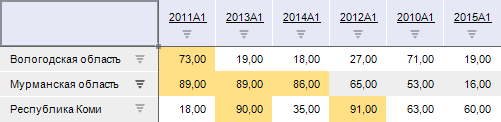
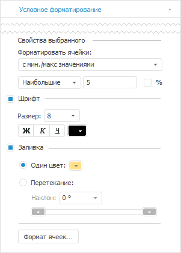
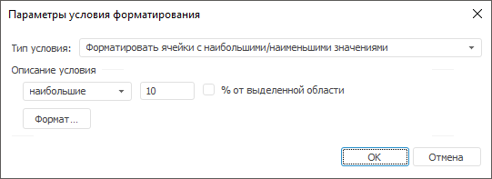

# Форматировать ячейки с наибольшими/наименьшими значениями

Форматировать ячейки с наибольшими/наименьшими значениями
-

# Форматировать ячейки с наибольшими/наименьшими значениями

Данный тип условия форматирования предназначен для форматирования ячеек,
 содержащих наибольшие или наименьшие значения.

Например, отформатированы пять наибольших значений в таблице:

Для настройки форматирования ячеек с наибольшими или наименьшими значениями
 используйте вкладку «Условное форматирование»
 на боковой панели или диалог «Параметры
 условия форматирования».

[Для открытия
 вкладки](javascript:TextPopup(this))

	Для отображения вкладки:

		- Убедитесь, что [боковая
		 панель](GetStarted.chm::/Interface/Interface_Description.htm#side_panel) отображается.

		- На боковой панели установите переключатель «Таблица»,
		 «Измерение», «Уровень»,
		 «Данные», «Формат»
		 или «Итоги». Название
		 переключателя зависит от области, выделенной в таблице.

		- Перейдите на вкладку «Условное
		 форматирование».

[Для открытия
 диалога](javascript:TextPopup(this))

		- Выполните команду «Редактировать
		 условия» в раскрывающемся меню кнопки  «Условное форматирование» на
		 ленте инструментов.

	В зависимости от инструмента кнопка находится:

			- на вкладке «Главная»,
			 на вкладке «Конструктор»,
			 на вкладке «Формат»
			 в инструменте «Аналитические
			 запросы (OLAP)»;

			- на вкладке «Главная»,
			 на вкладке «Формат»
			 в инструменте «Отчёты»;

	Примечание.
	 При работе с инструментом «Отчёты», если
	 условное форматирование настроено с помощью вкладки «Главная»
	 на ленте инструментов, то оно применяется для листа отчета, а если
	 с помощью вкладки «Формат»
	 - то для таблицы.

	Работа с условным форматированием для инструмента «Отчёты»
	 доступна только в настольном приложении.

			- на вкладке «Конструктор»,
			 на вкладке «Формат»
			 в инструменте «Аналитические
			 панели»;

			- на вкладке «Таблица»
			 в инструменте «Анализ временных
			 рядов».

		- В открывшемся диалоге «Редактировать
		 условия»:

			- нажмите кнопку «Добавить»
			 для создания нового условия;

			- выделите требуемое условие
			 и нажмите кнопку «Редактировать»;

			- дважды щелкните по требуемому
			 условию.

	Вкладка Диалог

		

		

Задайте следующие настройки:

	- Форматировать ячейки.
	 Выберите тип форматируемых значений: наибольшие или наименьшие. Затем
	 задайте количество значений, которые требуется отформатировать. Для
	 задания количества значений в процентном соотношении установите флажок
	 «%»;

	- Шрифт. Установите флажок
	 для задания настроек шрифта в ячейках с форматируемыми значениями.
	 В соответствующих полях задайте размер, начертание и цвет шрифта в
	 ячейках;

	- Заливка. Установите
	 флажок для задания настроек заливки в ячейках с форматируемыми значениями.
	 Задайте режим заливки:

		- Один цвет. Однотонная
		 заливка фона ячеек. Выберите цвет заливки в раскрывающейся палитре;

		- Перетекание. Для
		 заливки фона ячеек применяется двухцветный градиент. В соответствующих
		 раскрывающихся палитрах выберите начальный и конечный цвета градиента.
		 В поле «Наклон» задайте
		 угол наклона градиента;

	- Формат ячеек. Нажмите
	 кнопку для настройки дополнительных параметров форматирования ячеек
	 с определенными значениями. Будет открыт диалог «[Форматирование](uinav.chm::/GUI/format.htm)».

Примечание.
 Возможность доступна только в настольном приложении.

См. также:

[Расширенная
 настройка условного форматирования](UiReport_Table_Attribute_Format_conditionParams.htm)

		Справочная
		 система на версию 10.9
		 от 18/08/2025,
		 © ООО «ФОРСАЙТ»,
