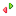
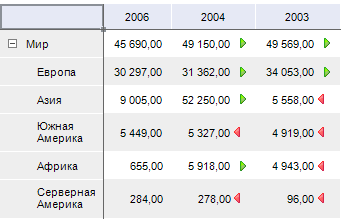
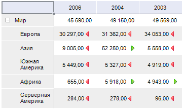

# Индикатор роста

Индикатор роста
-

# Индикатор роста

Индикатор роста позволяет отобразить
 характер изменения значения в ячейке относительно других значений.

Примечание.
 Отображение индикаторов роста недоступно в инструменте «Отчеты».

## Отображение индикатора роста в таблице

Для отображения в таблице индикаторов роста для строк или столбцов:

	- Нажмите кнопку  «Индикатор
	 роста», расположенную на
	 вкладках «Главная» или «Конструктор» ленты инструментов.

	- В раскрывающемся меню кнопки установите переключатель для отображения
	 индикатора роста «По строкам»
	 или «По столбцам».

Индикаторы роста будут отображены в таблице по строкам или по столбцам.
 Одновременное отображение индикаторов роста для строк и столбцов недоступно.

Особенности отображения индикаторов роста в инструментах «Аналитические
 панели» и «Аналитические запросы
 (OLAP)»:

	- если по столбцам расположено несколько измерений и в любом из
	 них, кроме первого, отмечено несколько элементов, то отображение индикаторов
	 роста по строкам недоступно;

	- если по строка расположено несколько измерений и в любом из
	 них, кроме первого, отмечено несколько элементов, то отображение индикаторов
	 роста по столбцам недоступно;

	- если предыдущие пункты выполняются одновременно, то кнопка  «Индикатор
	 роста» недоступна.

	- если индикаторы роста отображается, а отметка измерений была
	 изменена так, как описано выше, то индикаторы роста будут скрыты.
	 При установке отметки, позволяющей отобразить индикаторы, они будут
	 отображены, если их не отключил пользователь.

Пример отображения индикатора роста для строк:

Зеленая стрелка показывает, что значение в ячейке больше, чем значение
 в ячейке слева. Красная стрелка показывает, что значение в ячейке меньше,
 чем значение в ячейке слева.

Пример отображения индикатора роста для столбцов:

Зеленая стрелка показывает, что значение в ячейке больше, чем значение
 в ячейке сверху. Красная стрелка показывает, что значение в ячейке меньше,
 чем значение в ячейке сверху.

## Скрытие индикатора роста в таблице

Для скрытия индикаторов роста:

	- Нажмите кнопку  «Индикатор
	 роста», расположенную на вкладках «Главная»
	 или «Конструктор» ленты инструментов.

	- В раскрывающемся меню кнопки выберите пункт «Сбросить».

См. также:

[Анализ
 данных в таблице](Data_analysis_in_a_table.htm)

		Справочная
		 система на версию 10.9
		 от 18/08/2025,
		 © ООО «ФОРСАЙТ»,
