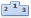
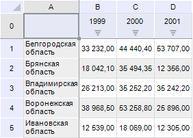
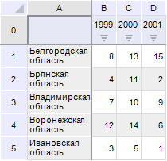

# Ранжирование данных

Ранжирование данных
-

# Ранжирование данных

Ранжирование данных - это определение
 порядка элементов по их значению.

Примечание.
 Ранжирование данных недоступно в инструменте «Отчеты».

Для таблицы данных доступно ранжирование по возрастанию и убыванию.
 Ранжирование может применяться по строкам, по столбцам и по всей таблице.

Для выбора направления и области применения ранжирования:

	- Нажмите кнопку  «Отобразить
	 как ранги», расположенную на вкладке «Данные»
	 ленты инструментов.

	- В раскрывающемся меню кнопки выберите один из следующих вариантов:

		- По убыванию по строкам;

		- По возрастанию по строкам;

		- По убыванию по столбцам;

		- По возрастанию по столбцам;

		- По убыванию по всей таблице;

		- По возрастанию по всей таблице.

Чтобы отменить ранжирование, выполните команду «Сбросить»
 раскрывающегося меню кнопки  «Отобразить
 как ранги».

## Пример применения ранжирования

Исходные данные таблицы:

Ранжирование по возрастанию по всей таблице:

См. также:

[Анализ
 данных в таблице](Data_analysis_in_a_table.htm)

		Справочная
		 система на версию 10.9
		 от 18/08/2025,
		 © ООО «ФОРСАЙТ»,
