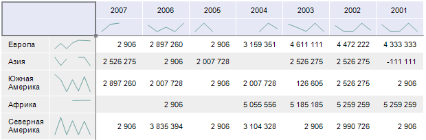

# Спарклайны

Спарклайны
-

# Спарклайны

Спарклайны - это небольшие диаграммы,
 которые помещаются внутри отдельных ячеек. С помощью спарклайнов можно
 показывать тенденции в рядах данных.

Примечание.
 Спарклайны доступны во всех инструментах, кроме инструмента «Отчёты».

Спарклайны применяются для более наглядного представления больших наборов
 данных. Спарклайны могут отображаться для столбцов, строк и итогов таблицы.

## Отображение спарклайнов

Для отображения спарклайнов по строкам/столбцам установите флажок «По строкам»/«По
 столбцам» в раскрывающемся меню кнопки 
 «Спарклайны», расположенной в
 группе «Элементы» на вкладке «Таблица» ленты инструментов. Если
 флажок «По строкам»/«По
 столбцам» установлен, доступно отображение спарклайнов для
 итогов. Для отображения спарклайнов для итогов установите флажок
 «Отображать для итогов».

Примечание.
 Для отображения спарклайнов для итогов должны быть отображены [итоги
 для строк/столбцов](../Totals/Calculate_totals.htm).

Пример применения спарклайнов для строк и столбцов:

## Скрытие спарклайнов

Для скрытия спарклайнов откройте раскрывающееся меню кнопки  «Спарклайны»,
 расположенной на вкладке «Таблица»
 ленты инструментов:

	- выполните команду «Сбросить»;

Примечание.
 Если одновременно установлены флажки «По
 строкам», «По столбцам»,
 «Отображать для итогов», то будут
 сняты флажки «По строкам» и «По столбцам», флажок «Отображать
 для итогов» станет неактивным, но спарклайны для итогов также будут
 скрыты. При повторной установке одного из флажков «По
 строкам»/«По столбцам»
 флажок «Отображать для итогов»
 станет активным и в таблице автоматически отобразятся спарклайны для итогов
 по строкам или столбцам. Снятие флажка «Отображать
 для итогов» возможно только при одном из установленных флажков
 «По строкам»/«По
 столбцам».

	- снимите флажок «По строкам»/«По столбцам»/«Отображать
	 для итогов».

См. также:

[Анализ
 данных в таблице](Data_analysis_in_a_table.htm)

		Справочная
		 система на версию 10.9
		 от 18/08/2025,
		 © ООО «ФОРСАЙТ»,
