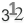
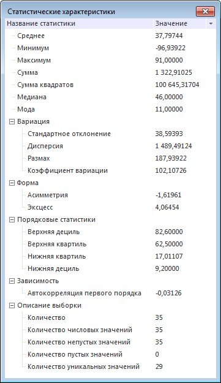

# Статистические характеристики

Статистические характеристики
-

# Статистические характеристики

Таблица данных позволяет отображать статистические характеристики, вычисленные
 для выбранных диапазонов таблицы. Набор рассчитываемых характеристик зависит
 от значений в выбранном диапазоне.

Статистические характеристики могут быть отображены:

	- [В строке статуса](GetStarted.chm::/Interface/Interface_Description.htm#status_line). Позволяет рассчитать базовые
	 агрегаты для выделенного диапазона ячеек. Возможность доступна только
	 в настольном приложении;

	- В отдельном окне. Позволяет
	 рассчитать полный набор статистических характеристик. Возможность
	 доступна в инструментах «Аналитические
	 запросы (OLAP)» и «Аналитические
	 панели».

Для отображения статистических характеристик в отдельном окне:

	- [Выделите часть таблицы](../Select_areas.htm), для
	 которой необходимо отобразить статистику. Если выделена одна ячейка
	 с данными, будут вычислены статистические характеристики для всей
	 таблицы.

	- Выполните команду «Статистические
	 характеристики» в контекстном меню или нажмите кнопку 
	 «Статистические характеристики»
	 на вкладке ленты «Данные».

Примечание.
 В инструменте «Аналитические панели»
 выполните команду «Таблица > Статистические
 характеристики» в контекстном меню.

Статистика по выбранному диапазону будет отображена в окне «Статистические
 характеристики»:

Более подробное описание рассчитанных характеристик приведено в разделе
 «[Библиотека
 методов и моделей](lib.chm::/uimodelling_lib_common.htm)».

См. также:

[Анализ
 данных в таблице](Data_analysis_in_a_table.htm)

		Справочная
		 система на версию 10.9
		 от 18/08/2025,
		 © ООО «ФОРСАЙТ»,
