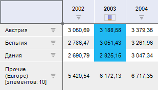
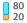
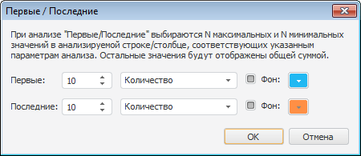

# Распределение

Распределение
-

# Распределение

Распределение позволяет оставить
 в таблице набор значений, которые составят определенный процент (или число)
 от общей суммы. Остальные значения будут агрегированы в один элемент.

Распределение осуществляется только для значений в одном столбце или
 в одной строке таблицы. Если настроить распределение для другого столбца/строки
 таблицы, текущее распределение будет снято.

Распределение задается
 по количеству, процентам
 или сумме, для первых
 или последних элементов:

	- Количество. Оставляет
	 в таблице первые/последние N
	 элементов столбца/строки.

	Например, «Первые 10 элементов»
	 оставит 10 элементов с наибольшими значениями. Остальные элементы
	 будут отображены общей суммой.

	- Проценты. Оставляет
	 в таблице набор значений, которые составляют N%
	 от общей суммы всех значений выбранного столбца/строки.

	Например, «Первые 80%» оставит
	 элементы, сумма значений которых составляет 80% от суммы всех значений.
	 Остальные элементы (20%) будут отображены общей суммой.

	- Сумма. Оставляет в таблице
	 набор значений, сумма которых меньше или равна заданному числу N.

	Например, «Сумма последних элементов
	 <= 100» оставит наименьшие элементы, сумма которых не превышает
	 100. Остальные элементы будут отображены общей суммой.

	- Первые. Распределение
	 будет отображать элементы с наибольшими значениями. По умолчанию заливка
	 имеет синий цвет.

	- Последние. Распределение
	 будет отображать элементы с наименьшими значениями. По умолчанию заливка
	 имеет красный цвет.

Пример таблицы с распределением:

## Настройка распределения

Чтобы выбрать столбец/строку, для которого будет применено распределение:

	- выделите заголовок столбца/строки;

	- выделите несколько ячеек столбца/строки.

Если выбрана одна ячейка, распределение будет настроено для столбца,
 содержащего данную ячейку.

Для настройки распределения для выбранного диапазона данных нажмите
 кнопку  «Распределение»,
 расположенную на вкладке «Конструктор» ленты инструментов, в раскрывающемся
 меню выберите метод распределения:

[Распределение
 по заданным параметрам](javascript:TextPopup(this))

		- Первые 10 элементов.
		 Выбираются 10 максимальных значений в анализируемом столбце/строке;

		- Первые 80%. Выбираются
		 максимальные значения в анализируемом столбце/строке, сумма которых
		 составляет 80% от общей суммы;

		- Последние 10 элементов.
		 Выбираются 10 минимальных значений в анализируемом столбце/строке;

		- Последние 20%. Выбираются
		 минимальные значения в анализируемом столбце/строке, сумма которых
		 составляет 20% от общей суммы.

[Распределение
 по пользовательским параметрам](javascript:TextPopup(this))

		- Первые N элементов. Выбираются N максимальных значений в анализируемом
		 столбце/строке;

		- Первые N%.
		 Выбираются максимальные значения в анализируемом столбце/строке,
		 сумма которых составляет N%
		 от общей суммы;

		- Сумма первых
		 элементов <=N. Выбираются максимальные значения
		 в анализируемом столбце/строке, сумма которых меньше или равна
		 N;

		- Последние N элементов. Выбираются N минимальных значений
		 в анализируемом столбце/строке;

		- Последние N%.
		 Выбираются минимальные значения в анализируемом столбце/строке,
		 сумма которых составляет N%
		 от общей суммы;

		- Сумма последних
		 элементов <=N. Выбираются
		 минимальные значения в анализируемом столбце/строке, сумма которых
		 меньше или равна N.

	В открывшемся диалоге введите значение для параметра N.

[Распределение
 N первых и N последних одновременно](javascript:TextPopup(this))

	Для настройки выборки по первым и последним значениям одновременно
	 в раскрывающемся меню кнопки 
	 «Распределение» выберите пункт
	 «Первые / Последние», будет
	 открыто окно:

	

	Задайте значения параметра и [тип
	 распределения](distribution.htm#type) для первых и последних значений.

	В раскрывающейся палитре задайте цвет заливки выбранных значений.
	 Если необходимо, чтобы к выбранным значениям не применялась заливка,
	 снимите флажок рядом с надписью «Фон».

[Выключение распределения](javascript:TextPopup(this))

	Для выключения распределения выполните команду «Сбросить»
	 раскрывающегося меню кнопки  «Распределение» на вкладке «Конструктор» ленты инструментов.

## Агрегация прочих элементов

Элементы таблицы, не соответствующие условию распределения, будут агрегированы
 и отображены в отдельный элемент «Прочие».

По умолчанию все прочие элементы будут суммированы.

Для изменения метода агрегации прочих элементов выполните следующие
 действия:

	- Выделите строку/столбец с элементом «Прочие».

	- Перейдите на вкладку боковой панели «Распределение»,
	 расположенную на группе вкладок «Формат».

	- Выберите метод агрегации элементов.

См. также:

[Анализ
 данных в таблице](Data_analysis_in_a_table.htm)

		Справочная
		 система на версию 10.9
		 от 18/08/2025,
		 © ООО «ФОРСАЙТ»,
